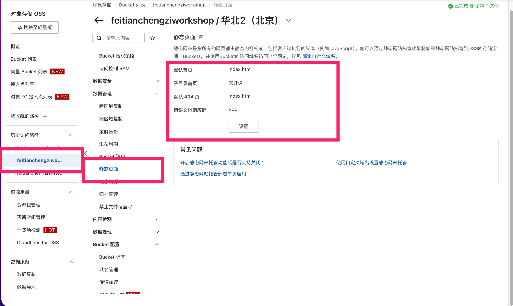

# 待办管理系统 - 技术架构与部署方案

## 文档概述

本文档详细记录了待办管理系统（Workshop Todo Website）从前端到后端、再到 OSS 部署的完整技术架构方案和实施内容。

**项目地址**: https://workshop.feitianchengzi.com/  
**最后更新**: 2026-01-16

---

## 目录

1. [系统架构概览](#系统架构概览)
2. [前端技术栈](#前端技术栈)
3. [后端技术栈](#后端技术栈)
4. [部署架构](#部署架构)
5. [关键问题与解决方案](#关键问题与解决方案)
6. [OSS 配置详解](#oss-配置详解)
7. [开发与构建流程](#开发与构建流程)
8. [最佳实践](#最佳实践)
9. [故障排查指南](#故障排查指南)

---

## 系统架构概览

### 整体架构图

```
┌─────────────────────────────────────────────────────────────┐
│                         用户浏览器                            │
└────────────────────────┬────────────────────────────────────┘
                         │
                         │ HTTPS
                         ↓
┌─────────────────────────────────────────────────────────────┐
│              阿里云 OSS (静态网站托管)                        │
│  - 域名: workshop.feitianchengzi.com                         │
│  - 托管: index.html + 静态资源 (JS/CSS/图片)                 │
│  - 配置: SPA 路由支持 (错误文档 → index.html)                │
└────────────────────────┬────────────────────────────────────┘
                         │
                         │ API 请求
                         ↓
┌─────────────────────────────────────────────────────────────┐
│                   API Gateway (网关层)                        │
│  - 域名: api.feitianchengzi.com                              │
│  - 功能: JWT 认证、请求转发、用户信息注入                     │
│  - 注入 Header: X-User-ID                                    │
└────────────────────────┬────────────────────────────────────┘
                         │
                         │ 服务调用
                         ↓
┌─────────────────────────────────────────────────────────────┐
│                    后端微服务集群                             │
│                                                               │
│  ┌──────────────┐  ┌──────────────┐  ┌──────────────┐      │
│  │  Auth Service │  │ User Service │  │ Workshop Svc │      │
│  │  (认证服务)   │  │  (用户服务)  │  │ (业务服务)   │      │
│  └──────────────┘  └──────────────┘  └──────────────┘      │
│                                                               │
│         Go + Gin + GORM + PostgreSQL                         │
└─────────────────────────────────────────────────────────────┘
```

### 技术选型总览

| 层级 | 技术栈 | 说明 |
|------|--------|------|
| **前端框架** | React 18.2.0 | UI 构建 |
| **构建工具** | Vite 5.0.8 | 快速开发和构建 |
| **路由管理** | React Router 6.21.1 | 客户端路由 |
| **状态管理** | Zustand 4.4.7 | 全局状态（认证、UI） |
| **服务端状态** | React Query 5.17.9 | 数据获取和缓存 |
| **样式方案** | Tailwind CSS 3.4.0 | 原子化 CSS |
| **表单处理** | React Hook Form 7.49.3 + Zod 3.22.4 | 表单验证 |
| **HTTP 客户端** | Axios 1.6.5 | API 请求 |
| **国际化** | react-i18next 14.0.0 | 多语言支持 |
| **后端语言** | Go 1.21+ | 高性能后端服务 |
| **后端框架** | Gin | Web 框架 |
| **ORM** | GORM | 数据库操作 |
| **数据库** | PostgreSQL | 关系型数据库 |
| **静态托管** | 阿里云 OSS | 前端资源托管 |
| **API 网关** | 自研网关 | 统一认证和路由 |

---

## 前端技术栈

### 技术演进历程

#### Phase 1: Next.js 14 App Router（已弃用）

**初始选型**：
- Next.js 14.2.35
- App Router (file-system routing)
- Server Components + Client Components

**遇到的问题**：
1. **静态导出限制**：`output: 'export'` 模式下，动态路由需要 `generateStaticParams()`
2. **路由组冲突**：Route Groups `(dashboard)` 与动态路由 `[id]` 在静态导出时存在 Bug
3. **Middleware 不工作**：静态导出模式下 `middleware.ts` 不执行
4. **构建复杂度高**：需要手动处理多个动态路由的静态导出配置

**决策**：迁移到 Vite + React

#### Phase 2: Vite + React（当前方案）✅

**迁移原因**：
1. ✅ 更简单的静态部署（无 SSR 复杂性）
2. ✅ 更快的开发体验（HMR 更快）
3. ✅ 更灵活的路由配置（React Router）
4. ✅ 避免 Next.js 静态导出的 Bug

**迁移内容**：
- 移除 Next.js 及相关依赖
- 添加 React Router、Vite 及插件
- 重构入口文件（`main.tsx`、`App.tsx`）
- 调整环境变量（`NEXT_PUBLIC_*` → `VITE_*`）
- 更新构建脚本和配置

### 核心技术细节

#### 1. 项目结构

```
frontend/
├── index.html              # 入口 HTML
├── vite.config.ts          # Vite 配置
├── tsconfig.json           # TypeScript 配置
├── tailwind.config.ts      # Tailwind CSS 配置
├── package.json            # 依赖管理
├── .env.local              # 本地环境变量
├── env.production.template # 生产环境变量模板
│
├── src/
│   ├── main.tsx            # 应用入口
│   ├── App.tsx             # 路由配置
│   ├── globals.css         # 全局样式
│   ├── vite-env.d.ts       # Vite 类型声明
│   │
│   ├── pages/              # 页面组件
│   │   ├── LoginPage.tsx
│   │   ├── ProjectsPage.tsx
│   │   ├── TaskDetailPage.tsx
│   │   └── ...
│   │
│   ├── components/         # UI 组件
│   │   ├── ui/             # 基础 UI 组件
│   │   │   ├── Button.tsx
│   │   │   ├── TextField.tsx
│   │   │   └── ...
│   │   ├── layout/         # 布局组件
│   │   │   ├── Sidebar.tsx
│   │   │   └── ...
│   │   ├── features/       # 功能组件
│   │   │   ├── SubtaskList.tsx
│   │   │   └── ...
│   │   └── auth/           # 认证组件
│   │       └── AuthGuard.tsx
│   │
│   ├── hooks/              # 自定义 Hooks
│   │   ├── useProjects.ts
│   │   ├── useTasks.ts
│   │   └── ...
│   │
│   ├── store/              # Zustand 状态管理
│   │   ├── authStore.ts    # 认证状态
│   │   └── uiStore.ts      # UI 状态
│   │
│   ├── lib/                # 工具库
│   │   ├── api/            # API 客户端
│   │   │   ├── client.ts
│   │   │   └── endpoints/
│   │   │       ├── auth.ts
│   │   │       ├── projects.ts
│   │   │       ├── tasks.ts
│   │   │       └── ...
│   │   ├── utils/          # 工具函数
│   │   │   ├── tokenManager.ts
│   │   │   └── ...
│   │   ├── i18n/           # 国际化
│   │   │   └── index.ts
│   │   └── design-tokens/  # 设计令牌
│   │       └── tokens.css
│   │
│   ├── types/              # TypeScript 类型
│   │   ├── index.ts
│   │   └── auth.ts
│   │
│   └── layouts/            # 布局组件
│       └── DashboardLayout.tsx
│
├── scripts/                # 构建脚本
│   ├── build-vite.sh       # Vite 构建脚本
│   └── diagnose-online-issue.sh
│
└── dist/                   # 构建输出（自动生成）
    ├── index.html
    ├── assets/
    │   ├── index-xxx.js
    │   ├── index-xxx.css
    │   └── ...
    └── DEPLOY.md
```

#### 2. 路由配置

**React Router 配置** (`src/App.tsx`)：

```typescript
import { Routes, Route, Navigate } from 'react-router-dom'
import { useAuthStore } from '@/store/authStore'
import AuthGuard from '@/components/auth/AuthGuard'
import DashboardLayout from '@/layouts/DashboardLayout'

function App() {
  const { initialize, checkAuth } = useAuthStore()

  useEffect(() => {
    initialize()
    checkAuth()
  }, [initialize, checkAuth])

  return (
    <Routes>
      {/* 公开路由 */}
      <Route path="/login" element={<LoginPage />} />
      <Route path="/register" element={<RegisterPage />} />
      <Route path="/join/:code" element={<JoinProjectPage />} />

      {/* 受保护的路由 */}
      <Route element={<AuthGuard><DashboardLayout /></AuthGuard>}>
        <Route path="/" element={<Navigate to="/projects" replace />} />
        <Route path="/projects" element={<ProjectsPage />} />
        <Route path="/projects/new" element={<NewProjectPage />} />
        <Route path="/projects/:id" element={<ProjectDetailPage />} />
        <Route path="/projects/:id/members" element={<ProjectMembersPage />} />
        <Route path="/projects/:id/invite" element={<InviteMemberPage />} />
        <Route path="/projects/:id/tasks/new" element={<NewTaskPage />} />
        <Route path="/projects/:id/tasks/:taskId" element={<TaskDetailPage />} />
        <Route path="/tasks" element={<TasksPage />} />
        <Route path="/settings" element={<SettingsPage />} />
      </Route>

      {/* 404 路由 */}
      <Route path="*" element={<Navigate to="/projects" replace />} />
    </Routes>
  )
}
```

**特点**：
- 清晰的公开路由 vs 受保护路由分离
- 使用 `AuthGuard` 统一处理认证检查
- 嵌套布局（`DashboardLayout`）
- 客户端处理所有路由逻辑

#### 3. 认证流程

**认证状态管理** (`src/store/authStore.ts`)：

```typescript
interface AuthState {
  isAuthenticated: boolean
  user: TodoUser | null
  isLoading: boolean
  setAuth: (tokens: TokenInfo) => void
  setUser: (user: TodoUser) => void
  logout: () => void
  checkAuth: () => boolean
  initialize: () => void
  checkAndRefreshAuth: () => Promise<boolean>
}
```

**认证流程**：

```
1. 应用启动
   ↓
2. initialize() - 从 localStorage 恢复状态
   ↓
3. checkAuth() - 检查 token 是否过期
   ↓
4. 如果过期 → checkAndRefreshAuth()
   ├─ 成功 → 更新 token，继续访问
   └─ 失败 → 清除状态，跳转登录
   ↓
5. AuthGuard 保护路由
   ├─ 已认证 → 渲染页面
   └─ 未认证 → 重定向到 /login?redirect=原路径
```

**Token 管理** (`src/lib/utils/tokenManager.ts`)：

```typescript
interface AuthInfo {
  accessToken: string
  refreshToken: string
  tokenObtainedAt: number
  tokenExpiresIn: number
  username?: string
  avatarUrl?: string
}

// 核心功能
- saveAuthInfo(): 保存认证信息到 localStorage
- getAuthInfo(): 从 localStorage 读取
- clearAuthInfo(): 清除认证信息
- isTokenExpired(): 检查 token 是否过期
- getAccessToken(): 获取访问令牌
- getRefreshToken(): 获取刷新令牌
```

#### 4. API 客户端设计

**统一 API 响应格式**：

```typescript
// 成功响应
{
  "code": "OK",
  "data": { /* 业务数据 */ }
}

// 错误响应
{
  "code": "ERROR_CODE",
  "error": {
    "message": "错误描述",
    "details": { /* 详细信息 */ }
  }
}
```

**API 客户端** (`src/lib/api/client.ts`)：

```typescript
const workshopClient = axios.create({
  baseURL: import.meta.env.VITE_API_URL || 'https://api.feitianchengzi.com/workshop/v1',
  timeout: 30000,
})

// 请求拦截器：自动添加 Authorization
workshopClient.interceptors.request.use((config) => {
  const token = getAccessToken()
  if (token) {
    config.headers.Authorization = `Bearer ${token}`
  }
  return config
})

// 响应拦截器：统一处理错误
workshopClient.interceptors.response.use(
  (response) => response,
  (error) => {
    if (error.response?.status === 401) {
      // Token 过期，尝试刷新
      // 或清除认证信息，跳转登录
    }
    return Promise.reject(error)
  }
)
```

**统一响应处理** (`src/lib/api/interceptors/response.ts`)：

```typescript
export function handleResponse<T>(response: AxiosResponse): T {
  const { code, data, error } = response.data

  if (code === 'OK' && data !== undefined) {
    return data as T
  }

  throw new ApiError(
    error?.message || '请求失败',
    code || 'UNKNOWN_ERROR',
    error?.details
  )
}
```

#### 5. 环境变量配置

**Vite 环境变量** (`.env.local` / `.env.production`)：

```bash
# API 基础 URL
VITE_API_URL=https://api.feitianchengzi.com/workshop/v1

# 网关 URL
VITE_GATEWAY_URL=https://api.feitianchengzi.com
```

**使用方式**：

```typescript
const API_URL = import.meta.env.VITE_API_URL
const GATEWAY_URL = import.meta.env.VITE_GATEWAY_URL
```

**注意事项**：
- ⚠️ 必须以 `VITE_` 开头才能被客户端访问
- ⚠️ `.env.local` 不会被 Git 跟踪
- ⚠️ 生产构建需要创建 `.env.production` 或通过 CI/CD 注入

---

## 后端技术栈

### 整体架构

#### 微服务划分

```
┌─────────────────────────────────────────────────────────┐
│                    API Gateway                           │
│  - JWT 验证                                              │
│  - 请求路由                                              │
│  - 用户信息注入 (X-User-ID header)                       │
└────────────────────┬────────────────────────────────────┘
                     │
        ┌────────────┼────────────┐
        │            │            │
        ↓            ↓            ↓
┌──────────┐  ┌──────────┐  ┌──────────┐
│  Auth    │  │  User    │  │ Workshop │
│ Service  │  │ Service  │  │ Service  │
│          │  │          │  │          │
│ - 登录   │  │ - 用户   │  │ - 项目   │
│ - 注册   │  │   管理   │  │ - 任务   │
│ - Token  │  │ - 个人   │  │ - 成员   │
│   刷新   │  │   信息   │  │ - 邀请   │
└──────────┘  └──────────┘  └──────────┘
```

#### API 路由规范

```
/{service}/v1/{resource}/{action}
```

**示例**：
- 认证服务：`/auth-server/v1/public/login`
- 用户服务：`/user-service/v1/user/profile`
- 业务服务：`/workshop/v1/user/projects`

### 技术选型

| 组件 | 技术 | 说明 |
|------|------|------|
| 语言 | Go 1.21+ | 高性能、并发友好 |
| Web 框架 | Gin | 轻量、快速 |
| ORM | GORM | 类型安全、易用 |
| 数据库 | PostgreSQL | 关系型数据库 |
| 认证 | JWT | 无状态认证 |
| 配置管理 | Viper | 灵活的配置加载 |

### 认证机制

#### JWT Token 结构

**Access Token**（短期，15分钟）：
```json
{
  "user_id": "uuid",
  "username": "string",
  "exp": 1234567890
}
```

**Refresh Token**（长期，7天）：
```json
{
  "user_id": "uuid",
  "token_id": "uuid",
  "exp": 1234567890
}
```

#### 认证流程

```
1. 用户登录
   ↓
2. 验证邮箱/手机号 + 验证码
   ↓
3. 返回 Access Token + Refresh Token
   ↓
4. 客户端存储到 localStorage
   ↓
5. 后续请求携带 Access Token
   ↓
6. API Gateway 验证 Token
   ↓
7. 注入 X-User-ID header 到下游服务
   ↓
8. 下游服务通过 header 获取用户信息
```

#### Token 刷新流程

```
1. Access Token 即将过期
   ↓
2. 前端检测到过期（tokenObtainedAt + expiresIn）
   ↓
3. 调用 /auth-server/v1/public/refresh
   ↓
4. 携带 Refresh Token
   ↓
5. 验证 Refresh Token
   ↓
6. 返回新的 Access Token + Refresh Token
   ↓
7. 前端更新存储
```

### 数据库设计

#### 核心表结构

**用户表** (`users`)：
```sql
CREATE TABLE users (
    id UUID PRIMARY KEY,
    username VARCHAR(50) UNIQUE NOT NULL,
    email VARCHAR(100) UNIQUE,
    phone VARCHAR(20) UNIQUE,
    avatar TEXT,
    created_at TIMESTAMP DEFAULT NOW(),
    updated_at TIMESTAMP DEFAULT NOW()
);
```

**项目表** (`projects`)：
```sql
CREATE TABLE projects (
    id SERIAL PRIMARY KEY,
    name VARCHAR(100) NOT NULL,
    git_url TEXT,
    creator_id UUID REFERENCES users(id),
    created_at TIMESTAMP DEFAULT NOW(),
    updated_at TIMESTAMP DEFAULT NOW()
);
```

**项目成员表** (`project_members`)：
```sql
CREATE TABLE project_members (
    id SERIAL PRIMARY KEY,
    project_id INT REFERENCES projects(id),
    user_id UUID REFERENCES users(id),
    role VARCHAR(20) CHECK (role IN ('owner', 'admin', 'member')),
    created_at TIMESTAMP DEFAULT NOW(),
    UNIQUE(project_id, user_id)
);
```

**任务表** (`tasks`)：
```sql
CREATE TABLE tasks (
    id SERIAL PRIMARY KEY,
    project_id INT REFERENCES projects(id),
    parent_id INT REFERENCES tasks(id),
    content TEXT NOT NULL,
    state VARCHAR(20) DEFAULT 'todo',
    creator_id UUID REFERENCES users(id),
    assignee_id UUID REFERENCES users(id),
    created_at TIMESTAMP DEFAULT NOW(),
    updated_at TIMESTAMP DEFAULT NOW()
);
```

**邀请表** (`invitations`)：
```sql
CREATE TABLE invitations (
    id SERIAL PRIMARY KEY,
    project_id INT REFERENCES projects(id),
    invite_code VARCHAR(50) UNIQUE NOT NULL,
    invite_link TEXT,
    role VARCHAR(20) DEFAULT 'member',
    inviter_id UUID REFERENCES users(id),
    expires_at TIMESTAMP,
    used_at TIMESTAMP,
    created_at TIMESTAMP DEFAULT NOW(),
    updated_at TIMESTAMP DEFAULT NOW()
);
```

---

## 部署架构

### 阿里云 OSS 静态网站托管

#### 为什么选择 OSS？

1. ✅ **高可用**：99.9% SLA 保障
2. ✅ **低成本**：按流量计费，成本低
3. ✅ **CDN 加速**：可选 CDN，全球加速
4. ✅ **HTTPS 支持**：免费 SSL 证书
5. ✅ **自定义域名**：支持 CNAME 绑定

#### OSS Bucket 配置

**基础设置**：
- Bucket 名称：`workshop-frontend`（示例）
- 区域：`oss-cn-beijing`（或就近选择）
- 读写权限：**公共读**
- 版本控制：可选（方便回滚）

#### 静态网站托管配置

**配置路径**：基础设置 → 静态页面

```yaml
默认首页（Index Document）: index.html
默认 404 页（Error Document）: index.html
HTTP 响应码: 200
子目录首页: 不开通（或选择 NoSuchKey）
```

**实际配置截图说明**（阿里云 OSS 控制台）：

根据实际部署的配置，OSS 静态页面设置如下：



**配置项说明**：

| 配置项 | 值 | 说明 |
|-------|-----|------|
| **默认首页** | `index.html` | 访问根路径时返回的文件 |
| **子目录首页** | `未开通` | SPA 不需要子目录首页功能 |
| **默认 404 页** | `index.html` | ⭐ 核心配置：任何 404 都返回 index.html |
| **错误文档响应码** | `200` | ⭐ 返回 200 状态码，而不是 404 |

这个配置确保了：
1. ✅ 访问 `/join/ABC123` 等动态路由时，OSS 返回 `index.html`（200）
2. ✅ React Router 在客户端匹配路由并显示对应组件
3. ✅ 地址栏保持原始 URL 不变
4. ✅ 浏览器不会缓存 404 响应
5. ✅ SEO 友好，搜索引擎认为这是有效页面

**关键说明**：

1. **默认首页 = `index.html`**
   - 访问 `/` 时返回 `index.html`

2. **默认 404 页 = `index.html`** ⭐️ 核心配置
   - 访问不存在的路径（如 `/projects/123`）时返回 `index.html`
   - React Router 在客户端匹配路由

3. **HTTP 响应码 = `200`** ⭐️ 推荐
   - 返回 `index.html` 时状态码为 200（而不是 404）
   - 避免浏览器缓存 404 响应
   - 更好的 SEO 和用户体验

4. **子目录首页 = 不开通（或 NoSuchKey）**
   - 不需要子目录独立首页功能
   - NoSuchKey 模式：直接返回 404，不检查子目录首页
   - 避免 Redirect 模式（会产生 302 重定向）

#### 配置对比

| 配置项 | 错误配置 | 正确配置 |
|-------|---------|---------|
| 默认 404 页 | ❌ 未配置 | ✅ index.html |
| HTTP 响应码 | ❌ 404 | ✅ 200 |
| 子目录首页 | ❌ Redirect | ✅ 不开通 / NoSuchKey |
| 地址栏行为 | ❌ 变化（重定向） | ✅ 保持不变 |
| SPA 支持 | ❌ 失败 | ✅ 完美支持 |

### 自定义域名配置

#### 1. 域名绑定

**OSS 控制台操作**：
1. 进入 Bucket → 域名管理
2. 绑定用户域名：`workshop.feitianchengzi.com`
3. 选择 CNAME 记录

#### 2. DNS 配置

**添加 CNAME 记录**：
```
类型: CNAME
主机记录: workshop
记录值: [bucket-name].oss-[region].aliyuncs.com
TTL: 600（10分钟）
```

#### 3. HTTPS 配置

**证书配置**：
1. 申请 SSL 证书（阿里云免费证书或 Let's Encrypt）
2. 上传证书到 OSS
3. 开启 HTTPS 访问
4. 可选：强制 HTTPS（HTTP → HTTPS 重定向）

### 部署流程

#### 自动化部署脚本

**构建脚本** (`frontend/scripts/build-vite.sh`)：

```bash
#!/bin/bash

# 清理旧构建
rm -rf dist node_modules/.cache

# 安装依赖
npm ci

# 构建生产版本
npm run build

# 生成部署文档
cat > dist/DEPLOY.md << EOF
# 部署说明

构建时间: $(date)
构建环境: Production

## 上传到 OSS

\`\`\`bash
# 使用 ossutil 上传
ossutil cp -r dist/ oss://your-bucket/ --update
\`\`\`

## 验证

- 主页: https://workshop.feitianchengzi.com/
- 邀请链接: https://workshop.feitianchengzi.com/join/TESTCODE
EOF

echo "✅ 构建完成！产物在 dist/ 目录"
```

#### OSS 上传

**方式 1：使用 ossutil 命令行工具**

```bash
# 安装 ossutil
wget http://gosspublic.alicdn.com/ossutil/1.7.18/ossutil64
chmod +x ossutil64

# 配置
./ossutil64 config

# 上传（增量更新）
./ossutil64 cp -r dist/ oss://your-bucket/ --update

# 清除 CDN 缓存（如果使用）
./ossutil64 sign --timeout 3600 oss://your-bucket/index.html
```

**方式 2：OSS 控制台上传**

1. 登录 OSS 控制台
2. 选择 Bucket
3. 文件管理 → 上传文件
4. 选择 `dist/` 目录下的所有文件上传

**方式 3：CI/CD 自动部署**

```yaml
# GitHub Actions 示例
name: Deploy to OSS

on:
  push:
    branches: [ main ]

jobs:
  deploy:
    runs-on: ubuntu-latest
    steps:
      - uses: actions/checkout@v2
      
      - name: Setup Node.js
        uses: actions/setup-node@v2
        with:
          node-version: '18'
      
      - name: Install dependencies
        run: cd frontend && npm ci
      
      - name: Build
        run: cd frontend && npm run build
        env:
          VITE_API_URL: ${{ secrets.VITE_API_URL }}
          VITE_GATEWAY_URL: ${{ secrets.VITE_GATEWAY_URL }}
      
      - name: Deploy to OSS
        uses: manyuanrong/setup-ossutil@v2.0
        with:
          endpoint: oss-cn-beijing.aliyuncs.com
          access-key-id: ${{ secrets.OSS_ACCESS_KEY_ID }}
          access-key-secret: ${{ secrets.OSS_ACCESS_KEY_SECRET }}
      
      - name: Upload files
        run: ossutil cp -r frontend/dist/ oss://your-bucket/ --update
```

---

## 关键问题与解决方案

### 问题 1: 邀请链接返回 404

#### 问题描述

**现象**：
- 访问 `https://workshop.feitianchengzi.com/join/DE5EC737C37047B5BC819A4F579DC10E`
- 返回 XML 格式的 OSS 错误：`NoSuchKey`
- 主页访问正常，只有动态路由失败

#### 诊断过程

**测试结果**：
```
URL: /join/DE5EC737C37047B5BC819A4F579DC10E
Status: 404 Not Found
Content-Type: application/xml
Response:
<?xml version="1.0" encoding="UTF-8"?>
<Error>
  <Code>NoSuchKey</Code>
  <Message>The specified key does not exist.</Message>
  <Key>join/DE5EC737C37047B5BC819A4F579DC10E</Key>
</Error>
```

**关键发现**：
1. ✅ 地址栏保持不变（没有 HTTP 重定向）
2. ❌ 返回 XML 错误（不是 HTML）
3. ❌ OSS 直接返回 404
4. ❌ OSS 没有返回 `index.html`

#### 根本原因

**OSS 的"错误文档"配置缺失或未生效**

**工作流程对比**：

错误流程（当前）：
```
访问 /join/xxx
  ↓
OSS 查找文件
  ↓
文件不存在
  ↓
返回 404 错误（XML）❌
  ↓
显示 NoSuchKey 错误
```

正确流程（期望）：
```
访问 /join/xxx
  ↓
OSS 查找文件
  ↓
文件不存在
  ↓
返回 index.html（200）✅
  ↓
React Router 匹配路由
  ↓
显示 JoinProjectPage
```

#### 解决方案

**OSS 配置修改**：

```yaml
静态页面配置：
  默认首页: index.html
  默认 404 页: index.html  ← 关键！
  HTTP 响应码: 200
  子目录首页: 不开通
```

**验证方法**：
1. 访问 `/join/TESTCODE`
2. 浏览器 F12 → Network 标签
3. 检查第一个请求：
   - ✅ Status: `200 OK`（绿色）
   - ✅ Content-Type: `text/html`
   - ✅ Response: HTML 内容

#### 相关配置说明

**子目录首页的三种模式**：

| 模式 | 行为 | 适用场景 | 推荐 |
|------|------|---------|------|
| **Redirect** | 302 重定向到 `/subdir/` | 多页应用 | ❌ |
| **NoSuchKey** | 直接返回 404，检查错误文档 | SPA 应用 | ✅ |
| **Index** | 返回子目录首页内容 | 多子应用 | ⚠️ |

**HTTP 响应码选择**：

| 响应码 | 优点 | 缺点 | 推荐 |
|-------|------|------|------|
| **200** | SEO 友好，无缓存问题 | 不严格符合 HTTP 语义 | ✅ |
| **404** | 符合 HTTP 语义 | 可能被缓存，SEO 不友好 | ❌ |

### 问题 2: Next.js 静态导出 Bug

#### 问题描述

**遇到的错误**：
```
Error: Page "/projects/[id]" is missing "generateStaticParams()" 
so it cannot be used with "output: export" config.
```

**尝试的解决方案**：
1. ❌ 添加 `generateStaticParams() { return [] }`
2. ❌ 添加 `export const dynamicParams = true`
3. ❌ 创建 server-side wrapper 文件
4. ❌ 移除 Route Groups
5. ❌ 降级到 Next.js 14.0.4
6. ❌ 升级到 Next.js 16.1.2
7. ❌ 清除缓存重新构建

**结论**：Next.js 14/16 的静态导出功能在处理动态路由时存在 Bug

#### 解决方案

**迁移到 Vite + React**

**迁移步骤**：
1. 移除 Next.js 依赖
2. 安装 Vite + React Router
3. 创建 `index.html` 入口
4. 重构 `main.tsx` 和 `App.tsx`
5. 更新环境变量命名
6. 调整构建脚本
7. 更新 API 客户端（`process.env` → `import.meta.env`）

**迁移效果**：
- ✅ 构建速度更快（Vite）
- ✅ 开发体验更好（HMR 更快）
- ✅ 配置更简单（无 SSR 复杂性）
- ✅ 避免 Next.js 静态导出的 Bug
- ✅ 路由配置更灵活（React Router）

### 问题 3: 环境变量在生产环境缺失

#### 问题描述

- `.env.local` 被 `.gitignore` 过滤
- 线上构建时缺少 API URL 配置
- 导致 API 请求失败

#### 解决方案

**方案 A：创建 `.env.production`**

```bash
# frontend/.env.production
VITE_API_URL=https://api.feitianchengzi.com/workshop/v1
VITE_GATEWAY_URL=https://api.feitianchengzi.com
```

**方案 B：构建时注入**

```bash
VITE_API_URL=https://api.feitianchengzi.com/workshop/v1 \
VITE_GATEWAY_URL=https://api.feitianchengzi.com \
npm run build
```

**方案 C：CI/CD 注入**

```yaml
- name: Build
  run: npm run build
  env:
    VITE_API_URL: ${{ secrets.VITE_API_URL }}
    VITE_GATEWAY_URL: ${{ secrets.VITE_GATEWAY_URL }}
```

### 问题 4: Token 过期导致白屏

#### 问题描述

- 用户长时间未操作
- Access Token 过期
- 刷新页面后显示白屏或登录页
- 体验不佳

#### 解决方案

**实现自动刷新机制**：

```typescript
// authStore.ts
checkAndRefreshAuth: async () => {
  const authInfo = getAuthInfo()
  if (!authInfo || !isTokenExpired(authInfo)) {
    return get().isAuthenticated
  }

  try {
    const response = await gatewayApi.refreshToken({
      refresh_token: authInfo.refreshToken,
    })

    saveAuthInfo({
      accessToken: response.data.tokens.access_token,
      refreshToken: response.data.tokens.refresh_token,
      tokenObtainedAt: Date.now(),
      tokenExpiresIn: response.data.tokens.expires_in,
    })
    
    set({ isAuthenticated: true })
    return true
  } catch (error) {
    get().logout()
    return false
  }
}
```

**在 AuthGuard 中使用**：

```typescript
useEffect(() => {
  const hasAuth = checkAuth()
  
  if (!hasAuth) {
    const checkRefresh = async () => {
      const refreshed = await checkAndRefreshAuth()
      if (!refreshed) {
        navigate('/login?redirect=' + encodeURIComponent(location.pathname))
      }
    }
    checkRefresh()
  }
}, [])
```

---

## OSS 配置详解

### SPA 路由的工作原理

#### 传统多页应用 vs SPA

**传统多页应用**：
```
/page1 → 服务器返回 page1.html
/page2 → 服务器返回 page2.html
/page3 → 服务器返回 page3.html
```

**SPA（单页应用）**：
```
/page1 → 服务器返回 index.html → React Router 渲染 Page1
/page2 → 服务器返回 index.html → React Router 渲染 Page2
/page3 → 服务器返回 index.html → React Router 渲染 Page3
```

**关键点**：
- 所有路径都返回同一个 `index.html`
- JavaScript 加载后，React Router 根据 URL 决定显示哪个组件
- 路由在客户端完成，服务器只负责返回 HTML

### OSS 错误文档的作用

#### 工作流程

```
1. 用户访问 /projects/123
      ↓
2. OSS 尝试查找文件 projects/123
      ↓
3. 文件不存在，返回 404
      ↓
4. 检查"错误文档"配置
      ↓
5. 返回 index.html（状态码可配置）
      ↓
6. 浏览器加载 index.html
      ↓
7. React Router 读取 URL: /projects/123
      ↓
8. 匹配路由配置: <Route path="/projects/:id" />
      ↓
9. 渲染 ProjectDetailPage 组件
```

#### 配置示例

**正确配置**：
```yaml
默认 404 页: index.html
HTTP 响应码: 200
```

**效果**：
```http
GET /projects/123 HTTP/1.1
Host: workshop.feitianchengzi.com

HTTP/1.1 200 OK
Content-Type: text/html
Content-Length: 1234

<!DOCTYPE html>
<html>
  <head>...</head>
  <body>
    <div id="root"></div>
    <script src="/assets/index-xxx.js"></script>
  </body>
</html>
```

### 子目录首页的三种模式

#### 模式对比表

| 特性 | Redirect | NoSuchKey | Index |
|------|----------|-----------|-------|
| **检查子目录首页** | ✅ | ❌ | ✅ |
| **HTTP 重定向** | ✅ 302 | ❌ 无 | ❌ 无 |
| **地址栏变化** | ✅ 变化 | ❌ 不变 | ❌ 不变 |
| **性能** | ⚠️ 慢（多次请求） | ✅ 快 | ⚠️ 一般 |
| **SPA 支持** | ❌ 不支持 | ✅ 完美支持 | ⚠️ 看情况 |
| **适用场景** | 多页应用 | SPA 应用 | 多子应用 |

#### 详细说明

**Redirect 模式**（不推荐）：
```
访问: /join/ABC123
  ↓
检查: join/ABC123/index.html 是否存在
  ↓
不存在 → 302 重定向到 /join/ABC123/
  ↓
地址栏变化：/join/ABC123 → /join/ABC123/
  ↓
React Router 匹配失败（多了斜杠）
```

**NoSuchKey 模式**（推荐）：
```
访问: /join/ABC123
  ↓
直接返回 404，不检查子目录首页
  ↓
继续检查错误文档：index.html
  ↓
返回 index.html（200）
  ↓
地址栏保持：/join/ABC123
  ↓
React Router 成功匹配
```

**Index 模式**（谨慎使用）：
```
访问: /join/ABC123
  ↓
检查: join/ABC123/index.html 是否存在
  ↓
不存在 → 返回 404
  ↓
继续检查错误文档：index.html
  ↓
返回 index.html（200）

⚠️ 问题：会增加一次文件检查，降低性能
```

### HTTP 响应码的选择

#### 200 vs 404

**使用 200 的理由**：

1. **语义正确性**
   - 服务器确实成功返回了 `index.html`（200）
   - 至于路由是否存在，由客户端 React Router 判断

2. **避免缓存问题**
   - 浏览器可能缓存 404 响应
   - 导致刷新后仍显示 404

3. **更好的用户体验**
   - 开发者工具显示绿色（成功）
   - 不会触发浏览器的原生 404 页面

4. **SEO 友好**
   - 搜索引擎认为这是有效页面
   - 不会影响网站的 SEO 评分

5. **业界标准**
   - Netlify、Vercel、Firebase 都使用 200
   - React 官方文档推荐使用 200

**使用 404 的场景**：

1. 需要严格遵守 HTTP 规范
2. 内部管理系统（不需要 SEO）
3. 需要明确区分服务端 404 和客户端 404

**推荐配置**：
```yaml
HTTP 响应码: 200  ← 推荐
```

---

## 开发与构建流程

### 本地开发

#### 启动开发服务器

```bash
cd frontend

# 安装依赖（首次）
npm install

# 启动开发服务器
npm run dev

# 访问
http://localhost:3000
```

**特性**：
- ✅ 热模块替换（HMR）
- ✅ 快速刷新
- ✅ 错误提示
- ✅ 代理配置（解决 CORS）

#### Vite 代理配置

```typescript
// vite.config.ts
export default defineConfig({
  server: {
    port: 3000,
    proxy: {
      '/api-proxy': {
        target: 'https://api.feitianchengzi.com',
        changeOrigin: true,
        rewrite: (path) => path.replace(/^\/api-proxy/, ''),
      },
    },
  },
})
```

**使用方式**：
```typescript
// 开发环境可以使用代理
const response = await axios.get('/api-proxy/workshop/v1/user/projects')

// 或直接使用完整 URL（需要后端配置 CORS）
const response = await axios.get('https://api.feitianchengzi.com/workshop/v1/user/projects')
```

### 生产构建

#### 构建命令

```bash
cd frontend

# 清理并构建
npm run build

# 或使用自定义脚本
npm run build:export
```

#### 构建产物

```
frontend/dist/
├── index.html           # 入口文件
├── assets/
│   ├── index-B70Qae8x.js       # 主包
│   ├── react-vendor-BDjJ6pKf.js # React 包
│   ├── ui-vendor-5aoJHJQD.js    # UI 库包
│   └── index-D7LuqJED.css       # 样式
└── vite.svg             # 图标（可选）
```

**优化配置**：

```typescript
// vite.config.ts
export default defineConfig({
  build: {
    outDir: 'dist',
    assetsDir: 'assets',
    sourcemap: false,  // 生产环境不生成 sourcemap
    rollupOptions: {
      output: {
        manualChunks: {
          // 代码分割
          'react-vendor': ['react', 'react-dom', 'react-router-dom'],
          'ui-vendor': ['zustand', '@tanstack/react-query', 'axios'],
        },
      },
    },
  },
})
```

### 本地预览

#### 预览命令

```bash
cd frontend

# 构建（如果还没构建）
npm run build

# 预览
npm run preview

# 访问
http://localhost:3000
```

**用途**：
- 验证构建产物
- 模拟线上环境
- 测试静态路由

**注意事项**：
- ⚠️ 使用 3000 端口（与开发环境一致，便于网关认证）
- ⚠️ 不能同时运行 `npm run dev` 和 `npm run preview`（端口冲突）

### 部署检查清单

#### 构建前检查

- [ ] 环境变量已配置（`.env.production`）
- [ ] 依赖版本已锁定（`package-lock.json`）
- [ ] 代码已通过 Lint（`npm run lint`）
- [ ] 本地构建成功（`npm run build`）
- [ ] 本地预览正常（`npm run preview`）

#### 构建产物检查

- [ ] `dist/index.html` 存在
- [ ] 静态资源路径正确（绝对路径 `/assets/...`）
- [ ] 文件大小合理（主包 < 500KB）
- [ ] Gzip 压缩已启用

#### OSS 配置检查

- [ ] 默认首页：`index.html`
- [ ] 默认 404 页：`index.html`
- [ ] HTTP 响应码：`200`
- [ ] 子目录首页：不开通或 NoSuchKey
- [ ] 自定义域名已绑定
- [ ] HTTPS 已配置

#### 上传后验证

- [ ] 主页访问正常（`/`）
- [ ] 登录页访问正常（`/login`）
- [ ] 邀请链接访问正常（`/join/TESTCODE`）
- [ ] 静态资源加载成功（Network 标签无 404）
- [ ] 控制台无错误（Console 标签）
- [ ] API 请求正常（Network 标签）

---

## 最佳实践

### 前端开发

#### 1. 组件设计原则

**组件分层**：
```
src/components/
├── ui/          # 基础 UI 组件（Button、Input）
├── layout/      # 布局组件（Sidebar、Header）
├── features/    # 功能组件（SubtaskList、StatusHistory）
└── auth/        # 认证组件（AuthGuard）
```

**原则**：
- ✅ UI 组件应该是纯粹的、无业务逻辑
- ✅ 功能组件可以包含业务逻辑和数据获取
- ✅ 布局组件负责页面结构和样式
- ✅ 认证组件处理权限和路由保护

#### 2. 状态管理原则

**Zustand for UI/Auth State**：
```typescript
// 全局 UI 状态（侧边栏展开/折叠）
const useUIStore = create((set) => ({
  sidebarExpanded: true,
  toggleSidebar: () => set((state) => ({ 
    sidebarExpanded: !state.sidebarExpanded 
  })),
}))

// 认证状态（登录/登出）
const useAuthStore = create((set) => ({
  isAuthenticated: false,
  user: null,
  login: (user) => set({ isAuthenticated: true, user }),
  logout: () => set({ isAuthenticated: false, user: null }),
}))
```

**React Query for Server State**：
```typescript
// 服务端数据（项目列表、任务详情）
const { data: projects } = useQuery({
  queryKey: ['projects'],
  queryFn: () => projectsApi.list(),
})

const { data: task } = useQuery({
  queryKey: ['projects', projectId, 'tasks', taskId],
  queryFn: () => tasksApi.get(projectId, taskId),
})
```

**原则**：
- ✅ Zustand：客户端状态（UI、认证）
- ✅ React Query：服务端状态（API 数据）
- ❌ 避免：将服务端数据存储在 Zustand

#### 3. API 客户端设计

**统一错误处理**：
```typescript
export function handleResponse<T>(response: AxiosResponse): T {
  const { code, data, error } = response.data

  if (code === 'OK' && data !== undefined) {
    return data as T
  }

  throw new ApiError(
    error?.message || '请求失败',
    code || 'UNKNOWN_ERROR',
    error?.details
  )
}
```

**使用示例**：
```typescript
export const projectsApi = {
  async list() {
    const response = await workshopClient.get('/user/projects')
    return handleResponse<Project[]>(response)
  },
  
  async create(input: CreateProjectInput) {
    const response = await workshopClient.post('/user/projects', input)
    return handleResponse<Project>(response)
  },
}
```

#### 4. 路由设计

**路由结构清晰**：
```typescript
<Routes>
  {/* 公开路由 */}
  <Route path="/login" element={<LoginPage />} />
  <Route path="/join/:code" element={<JoinProjectPage />} />

  {/* 受保护的路由 */}
  <Route element={<AuthGuard><DashboardLayout /></AuthGuard>}>
    <Route path="/projects" element={<ProjectsPage />} />
    <Route path="/projects/:id" element={<ProjectDetailPage />} />
  </Route>

  {/* 404 */}
  <Route path="*" element={<Navigate to="/projects" />} />
</Routes>
```

**原则**：
- ✅ 公开路由在前，受保护路由在后
- ✅ 使用嵌套路由共享布局
- ✅ 使用 `*` 路由捕获 404
- ✅ 404 重定向到有意义的页面

#### 5. 环境变量管理

**命名规范**：
```bash
# ✅ 正确：VITE_ 前缀
VITE_API_URL=https://api.feitianchengzi.com/workshop/v1
VITE_GATEWAY_URL=https://api.feitianchengzi.com

# ❌ 错误：没有前缀（无法在客户端访问）
API_URL=https://api.feitianchengzi.com/workshop/v1
```

**文件分离**：
```bash
.env.local          # 本地开发（不提交）
.env.production     # 生产环境（不提交）
env.production.template  # 生产环境模板（提交）
```

### 后端开发

#### 1. API 设计原则

**统一响应格式**：
```go
// 成功响应
type SuccessResponse struct {
    Code string      `json:"code"`
    Data interface{} `json:"data"`
}

// 错误响应
type ErrorResponse struct {
    Code  string       `json:"code"`
    Error ErrorDetail `json:"error"`
}

type ErrorDetail struct {
    Message string                 `json:"message"`
    Details map[string]interface{} `json:"details,omitempty"`
}
```

**RESTful 规范**：
```
GET    /projects          # 列表
GET    /projects/:id      # 详情
POST   /projects          # 创建
PUT    /projects/:id      # 更新
DELETE /projects/:id      # 删除
```

#### 2. 认证设计

**网关注入 Header**：
```go
// 从 Header 获取用户 ID
userID := c.GetHeader("X-User-ID")

// 业务逻辑使用
task := Task{
    CreatorID: userID,
    // ...
}
```

**原则**：
- ✅ 下游服务信任网关注入的 User ID
- ✅ 不在下游服务重复验证 JWT
- ✅ 通过 User ID 实现多租户隔离

#### 3. 数据库设计

**字段规范**：
```sql
-- ✅ 推荐
id         # 主键（SERIAL 或 UUID）
created_at # 创建时间（TIMESTAMP）
updated_at # 更新时间（TIMESTAMP）

-- ❌ 避免
createTime # 驼峰命名
create_date # 使用 date 而不是 timestamp
```

**索引设计**：
```sql
-- 外键索引
CREATE INDEX idx_tasks_project_id ON tasks(project_id);
CREATE INDEX idx_tasks_creator_id ON tasks(creator_id);

-- 复合索引
CREATE INDEX idx_tasks_project_state ON tasks(project_id, state);

-- 唯一索引
CREATE UNIQUE INDEX idx_invitations_code ON invitations(invite_code);
```

### OSS 部署

#### 1. 文件组织

**目录结构**：
```
OSS Bucket 根目录/
├── index.html
├── assets/
│   ├── index-xxx.js
│   ├── index-xxx.css
│   └── ...
├── favicon.ico
└── robots.txt
```

**原则**：
- ✅ 扁平化结构（不使用子目录）
- ✅ 资源文件统一放在 `assets/` 目录
- ✅ 使用内容哈希命名（`index-B70Qae8x.js`）

#### 2. 缓存策略

**HTML 文件**：
```
Cache-Control: no-cache
```
- 理由：HTML 是入口文件，需要实时更新

**静态资源**（JS/CSS/图片）：
```
Cache-Control: public, max-age=31536000, immutable
```
- 理由：文件名包含哈希，内容不变，可长期缓存

**配置方式**：
1. OSS 控制台 → Bucket → 基础设置 → 缓存规则
2. 添加规则：
   - 文件名：`*.html` → `no-cache`
   - 文件名：`*.js,*.css,*.png,*.jpg` → `max-age=31536000`

#### 3. CDN 加速

**配置步骤**：
1. 开通阿里云 CDN
2. 添加加速域名（如 `cdn.workshop.feitianchengzi.com`）
3. 源站配置：指向 OSS Bucket
4. 缓存配置：继承 OSS 缓存规则
5. HTTPS 配置：上传 SSL 证书

**注意事项**：
- ⚠️ 更新文件后需要刷新 CDN 缓存
- ⚠️ 可配置自动刷新（触发器）
- ⚠️ CDN 回源配置要正确

---

## 故障排查指南

### 前端问题排查

#### 问题 1: 页面白屏

**可能原因**：
1. JavaScript 加载失败
2. 路由配置错误
3. 认证检查失败

**排查步骤**：
```bash
# 1. 检查浏览器控制台（F12 → Console）
# 查看是否有 JavaScript 错误

# 2. 检查 Network 标签
# 查看静态资源是否 404

# 3. 检查路由配置
# 确认 <Route path="..." /> 配置正确

# 4. 检查认证状态
# 在控制台输入：
localStorage.getItem('auth_access_token')
```

#### 问题 2: API 请求失败

**可能原因**：
1. CORS 问题
2. Token 过期
3. 环境变量配置错误

**排查步骤**：
```bash
# 1. 检查 Network 标签
# 查看请求 URL 是否正确
# 查看状态码（401、403、CORS）

# 2. 检查 Token
# 在控制台输入：
import { getAccessToken } from '@/lib/utils/tokenManager'
console.log(getAccessToken())

# 3. 检查环境变量
# 在控制台输入：
console.log(import.meta.env.VITE_API_URL)
```

#### 问题 3: 路由跳转不生效

**可能原因**：
1. 使用了 `<a>` 标签而不是 `<Link>`
2. `navigate()` 函数未正确导入
3. 路由路径拼写错误

**排查步骤**：
```typescript
// ✅ 正确：使用 Link 组件
import { Link } from 'react-router-dom'
<Link to="/projects">项目列表</Link>

// ✅ 正确：使用 navigate 函数
import { useNavigate } from 'react-router-dom'
const navigate = useNavigate()
navigate('/projects/123')

// ❌ 错误：使用 a 标签会触发页面刷新
<a href="/projects">项目列表</a>
```

### OSS 部署问题排查

#### 问题 1: 动态路由返回 404

**排查步骤**：
```bash
# 1. 检查 OSS 静态页面配置
# 登录 OSS 控制台 → Bucket → 基础设置 → 静态页面
# 确认"默认 404 页"设置为 index.html

# 2. 测试 OSS 配置
# 访问不存在的路径，如 /test123
# 应该返回 index.html（不是 XML 错误）

# 3. 检查浏览器 Network 标签
# 访问 /join/TEST 时
# 第一个请求应该是 200 OK，返回 text/html
```

**解决方法**：
1. 配置默认 404 页为 `index.html`
2. HTTP 响应码选择 `200`
3. 子目录首页选择"不开通"或 `NoSuchKey`

#### 问题 2: 静态资源 404

**可能原因**：
1. 资源路径不正确（相对路径 vs 绝对路径）
2. Vite `base` 配置错误
3. 文件未上传到 OSS

**排查步骤**：
```bash
# 1. 检查 index.html 中的资源路径
cat dist/index.html | grep -E "(src=|href=)"
# 应该是绝对路径：/assets/xxx.js

# 2. 检查 vite.config.ts
cat vite.config.ts | grep base
# 应该是：base: '/'

# 3. 检查 OSS 文件列表
# 确认 assets/ 目录下的文件已上传
```

**解决方法**：
```typescript
// vite.config.ts
export default defineConfig({
  base: '/',  // 使用绝对路径
})
```

#### 问题 3: 更新后内容未生效

**可能原因**：
1. 浏览器缓存
2. CDN 缓存
3. OSS 文件未更新

**排查步骤**：
```bash
# 1. 清除浏览器缓存
# Ctrl+Shift+Delete（Windows/Linux）
# Cmd+Shift+Delete（Mac）

# 2. 使用无痕模式测试
# Ctrl+Shift+N（Chrome）

# 3. 检查 OSS 文件修改时间
# OSS 控制台 → 文件管理 → 查看文件属性

# 4. 刷新 CDN 缓存（如果使用）
# CDN 控制台 → 缓存刷新 → 目录刷新
```

### 后端问题排查

#### 问题 1: 401 Unauthorized

**可能原因**：
1. Token 过期
2. Token 格式错误
3. 网关认证失败

**排查步骤**：
```bash
# 1. 检查 Token
# 浏览器控制台：
console.log(localStorage.getItem('auth_access_token'))

# 2. 检查请求 Header
# Network 标签 → 选择请求 → Headers
# 确认 Authorization: Bearer xxx

# 3. 解码 JWT Token
# 使用 jwt.io 解码 Token
# 检查 exp（过期时间）
```

#### 问题 2: 403 Forbidden

**可能原因**：
1. 权限不足
2. 用户 ID 不匹配
3. 角色限制

**排查步骤**：
```bash
# 1. 检查用户 ID
# 浏览器控制台：
console.log(useAuthStore.getState().user)

# 2. 检查后端日志
# 查看 X-User-ID header 是否正确注入

# 3. 确认权限逻辑
# 检查后端代码中的权限检查
```

---

## 附录

### 参考文档

#### 官方文档

- [Vite 官方文档](https://vitejs.dev/)
- [React Router 官方文档](https://reactrouter.com/)
- [React Query 官方文档](https://tanstack.com/query/latest)
- [Zustand 官方文档](https://docs.pmnd.rs/zustand)
- [Tailwind CSS 官方文档](https://tailwindcss.com/)
- [阿里云 OSS 文档](https://help.aliyun.com/product/31815.html)

#### 相关文档

- `frontend/BUILD_GUIDE.md` - 构建指南
- `frontend/DEBUG_ONLINE_404.md` - 404 问题调试指南
- `frontend/ONLINE_DIAGNOSIS_REPORT.md` - 线上问题诊断报告
- `frontend/CORS_SOLUTION.md` - CORS 问题解决方案

### 版本信息

#### 当前版本

| 组件 | 版本 | 更新日期 |
|------|------|---------|
| React | 18.2.0 | 2026-01-16 |
| Vite | 5.0.8 | 2026-01-16 |
| React Router | 6.21.1 | 2026-01-16 |
| React Query | 5.17.9 | 2026-01-16 |
| Zustand | 4.4.7 | 2026-01-16 |
| Tailwind CSS | 3.4.0 | 2026-01-16 |
| TypeScript | 5.2.2 | 2026-01-16 |

#### 历史版本

| 版本 | 日期 | 主要变更 |
|------|------|---------|
| v2.0.0 | 2026-01-16 | 迁移到 Vite + React |
| v1.0.0 | 2025-12-01 | Next.js 14 初始版本 |

---

## 更新日志

### 2026-01-16

**架构重构**：
- ✅ 从 Next.js 迁移到 Vite + React
- ✅ 解决静态导出动态路由问题
- ✅ 优化构建速度和开发体验

**OSS 配置优化**：
- ✅ 确认错误文档配置
- ✅ HTTP 响应码设置为 200
- ✅ 子目录首页配置优化

**功能改进**：
- ✅ Token 自动刷新机制
- ✅ 执行者分配权限开放
- ✅ 任务详情页导航优化

**文档完善**：
- ✅ 创建完整架构文档
- ✅ 补充部署指南
- ✅ 添加故障排查指南

---

## 联系方式

**项目地址**：https://workshop.feitianchengzi.com/  
**API 地址**：https://api.feitianchengzi.com/  
**文档维护**：开发团队

---

*本文档持续更新中...*

