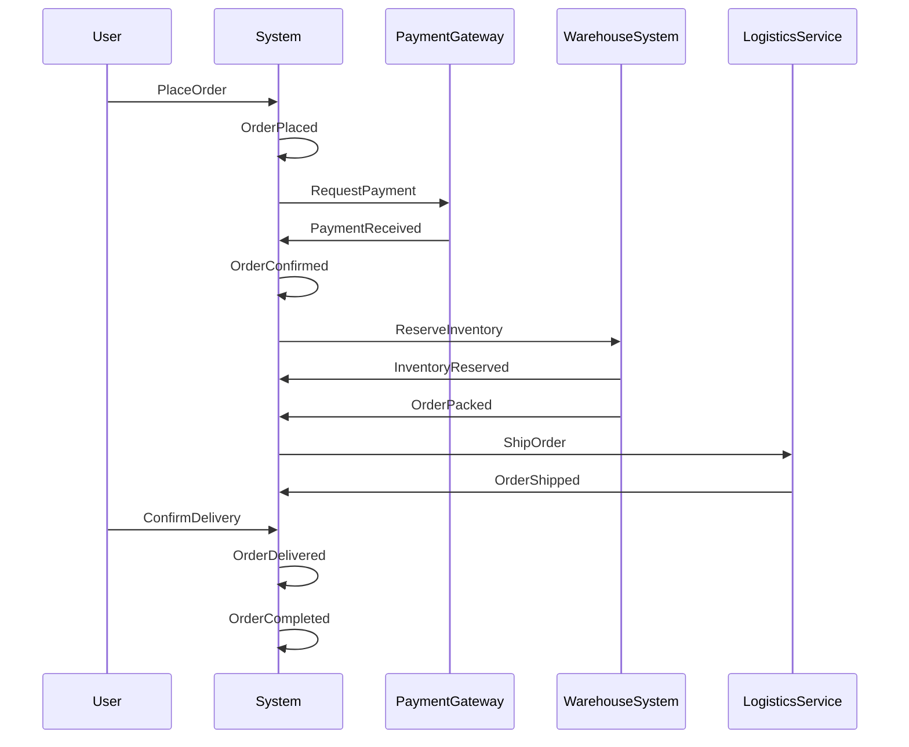

# 电商下单流程 - 事件风暴示例

这是一个完整的事件风暴案例，展示如何从零梳理电商下单流程。

---

## 业务目标

设计一个新的电商订单系统，支持用户在线下单、支付、发货、收货全流程。

---

## 领域事件清单

| 序号 | 事件 | 触发命令 | 触发角色 | 影响聚合 |
|------|------|---------|---------|---------|
| 1 | OrderPlaced | PlaceOrder | User | Order |
| 2 | PaymentReceived | ProcessPayment | PaymentGateway | Order |
| 3 | InventoryReserved | ReserveInventory | WarehouseSystem | Inventory |
| 4 | OrderPacked | PackOrder | WarehouseStaff | Shipment |
| 5 | OrderShipped | ShipOrder | LogisticsService | Shipment |
| 6 | OrderDelivered | ConfirmDelivery | User | Shipment |
| 7 | OrderCompleted | CompleteOrder | System | Order |

---

## 事件流时序图

---

## 识别的聚合（初步）

- **Order**（订单）：管理订单状态、支付信息、总金额
- **Inventory**（库存）：管理商品库存、预留、扣减
- **Shipment**（物流）：管理配送单、物流状态、签收信息

---

## 异常分支事件（待补充）

- **PaymentFailed**（支付失败）→ 取消订单或重试
- **InventoryInsufficient**（库存不足）→ 订单失败或等待补货
- **ShipmentCancelled**（配送取消）→ 退款流程

---

## 待澄清问题

- [ ] 支付超时时间是多久？超时后订单如何处理？
- [ ] 库存不足时是否允许超卖（先下单后补货）？
- [ ] 用户取消订单的截止时间点（发货前/发货后）？
- [ ] 退款流程的事件链（OrderCancelled → RefundInitiated → RefundCompleted）

---

## 下一步行动

1. 补充异常分支事件
2. 详细设计 Order 聚合（包含哪些实体和值对象）
3. 定义聚合间的通信方式（事件 vs API）
4. 生成技术 PRD（调用 prd-gen skill）

---

*本示例由 event-storming skill 生成，用于演示完整流程*
