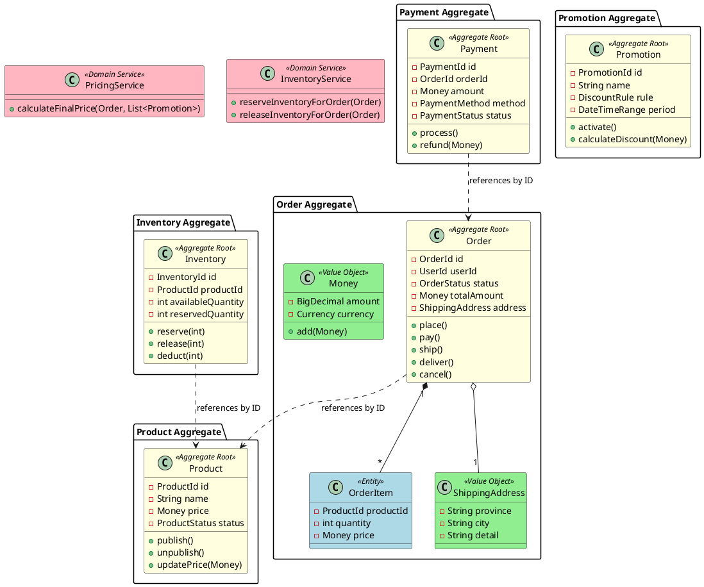

# 电商领域建模示例

本文档展示一个完整的电商系统领域建模过程和结果。

## 业务场景

一个典型的 B2C 电商平台,支持:
- 用户下单购物
- 在线支付
- 订单履约(发货、收货)
- 库存管理
- 促销优惠

## 识别聚合

### 1. Order (订单聚合)

**聚合根**: Order

**实体**:
- OrderItem: 订单明细项

**值对象**:
- ShippingAddress: 收货地址
- Money: 金额
- OrderStatus: 订单状态(枚举)

**职责**:
- 维护订单状态一致性
- 计算订单总额
- 验证订单可支付性
- 处理订单取消

**生命周期事件**:
- OrderCreated
- OrderPaid
- OrderShipped
- OrderDelivered
- OrderCancelled

**不变量**:
- 订单总额 = Σ 订单明细金额
- 已支付订单不可修改明细
- 已发货订单不可取消

**属性**:
- OrderId id
- UserId userId
- OrderStatus status
- Money totalAmount
- ShippingAddress address
- List<OrderItem> items
- DateTime createdAt

**方法**:
- place(): void
- pay(): void
- ship(): void
- deliver(): void
- cancel(): void

---

### 2. Payment (支付聚合)

**聚合根**: Payment

**实体**: 无

**值对象**:
- Money: 金额
- PaymentMethod: 支付方式(枚举)
- PaymentStatus: 支付状态(枚举)

**职责**:
- 处理支付请求
- 记录支付结果
- 处理退款

**生命周期事件**:
- PaymentInitiated
- PaymentSucceeded
- PaymentFailed
- RefundInitiated
- RefundCompleted

**不变量**:
- 支付金额必须大于 0
- 已成功的支付不可重复支付
- 退款金额不可超过原支付金额

**属性**:
- PaymentId id
- OrderId orderId
- Money amount
- PaymentMethod method
- PaymentStatus status
- DateTime paidAt

**方法**:
- process(): void
- refund(Money amount): void

---

### 3. Product (商品聚合)

**聚合根**: Product

**实体**: 无

**值对象**:
- Money: 价格
- ProductStatus: 商品状态(枚举)

**职责**:
- 维护商品信息
- 管理商品上下架

**生命周期事件**:
- ProductCreated
- ProductPublished
- ProductUnpublished
- PriceUpdated

**不变量**:
- 价格必须大于 0
- 已下架商品不可购买

**属性**:
- ProductId id
- String name
- String description
- Money price
- ProductStatus status
- int stockQuantity

**方法**:
- publish(): void
- unpublish(): void
- updatePrice(Money newPrice): void

---

### 4. Inventory (库存聚合)

**聚合根**: Inventory

**实体**: 无

**值对象**:
- ProductId: 商品 ID
- int quantity: 数量

**职责**:
- 管理商品库存
- 处理库存预占和释放
- 处理库存扣减

**生命周期事件**:
- InventoryReserved
- InventoryReleased
- InventoryDeducted
- InventoryReplenished

**不变量**:
- 库存数量不可为负数
- 预占库存不可超过可用库存

**属性**:
- InventoryId id
- ProductId productId
- int availableQuantity
- int reservedQuantity

**方法**:
- reserve(int quantity): void
- release(int quantity): void
- deduct(int quantity): void
- replenish(int quantity): void

---

### 5. Promotion (促销聚合)

**聚合根**: Promotion

**实体**: 无

**值对象**:
- DiscountRule: 折扣规则
- DateTimeRange: 时间范围

**职责**:
- 定义促销活动
- 验证促销有效性
- 计算折扣金额

**生命周期事件**:
- PromotionCreated
- PromotionActivated
- PromotionDeactivated
- PromotionExpired

**不变量**:
- 促销时间范围必须有效
- 折扣比例在 0-100% 之间

**属性**:
- PromotionId id
- String name
- DiscountRule rule
- DateTimeRange period
- bool isActive

**方法**:
- activate(): void
- deactivate(): void
- calculateDiscount(Money originalPrice): Money
- isValid(): bool

---

## 领域服务

### PricingService

**职责**: 计算订单最终价格(含促销、优惠券)

**协调的聚合**: Order, Promotion

**输入**: Order, List<Promotion>

**输出**: Money (最终价格)

**方法**:
- calculateFinalPrice(Order order, List<Promotion> promotions): Money

---

### InventoryService

**职责**: 协调订单创建和库存预占

**协调的聚合**: Order, Inventory

**输入**: Order

**输出**: bool (是否成功)

**方法**:
- reserveInventoryForOrder(Order order): bool
- releaseInventoryForOrder(Order order): void

---

## 聚合间关系

### 依赖关系

- Order → Product (通过 ProductId 引用)
- Order → Payment (通过 OrderId 关联)
- Inventory → Product (通过 ProductId 引用)
- Promotion → Product (通过 ProductId 引用,可选)

### 事件驱动关系

- OrderCreated → InventoryService.reserve()
- OrderPaid → Inventory.deduct()
- OrderCancelled → Inventory.release()
- PaymentSucceeded → Order.pay()

---

## PlantUML 类图

---

## 设计决策说明

### 为什么 OrderItem 是实体而不是值对象?

虽然 OrderItem 没有独立的业务标识,但它属于 Order 聚合内部,且数量可变(下单前可调整),因此设计为实体更合适。

### 为什么 Payment 是独立聚合?

支付流程有独立的生命周期和事务边界,且可能涉及外部支付系统的异步回调,因此设计为独立聚合,通过 OrderId 引用订单。

### 为什么需要 InventoryService?

库存预占涉及 Order 和 Inventory 两个聚合,且需要在单次事务中完成(或通过 Saga 模式处理),因此用领域服务来协调。

### 为什么 Promotion 不直接关联 Order?

促销规则是独立的业务概念,订单只需要记录最终折扣金额,不需要直接持有 Promotion 对象。通过 PricingService 来协调计算。

---

## 实现建议

### 技术栈建议

- 聚合根和实体: JPA Entity 或 DDD 框架(如 Axon Framework)
- 值对象: Java Record 或 Immutable Class
- 领域服务: Spring Service (但不要依赖基础设施)
- 事件驱动: Spring Event 或消息队列(RabbitMQ/Kafka)

### 持久化建议

- 每个聚合对应一个数据库表(或表组)
- 聚合间通过 ID 引用,不用外键约束
- 使用乐观锁(version 字段)保证并发安全

### 事件驱动建议

- 聚合发布领域事件(如 OrderPaid)
- 其他聚合或服务订阅事件并响应
- 使用最终一致性,避免分布式事务

---

**版本**: v1.0  
**日期**: 2026-05-22
