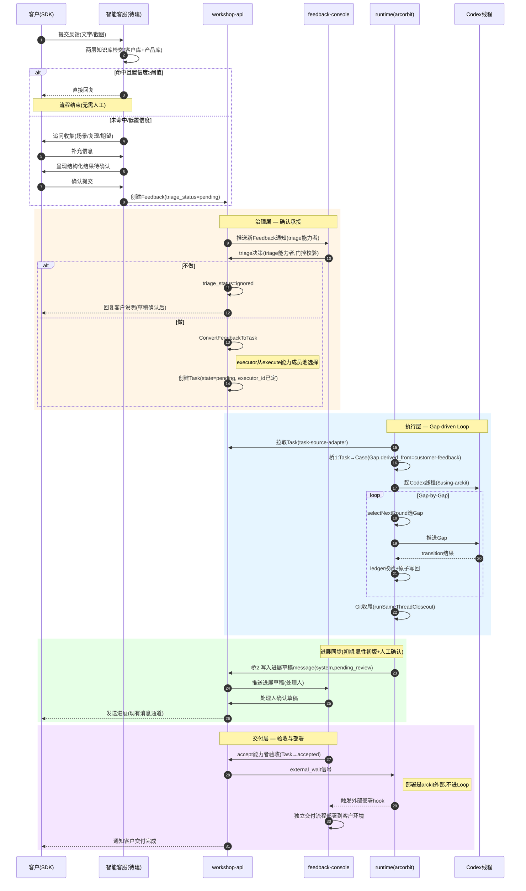
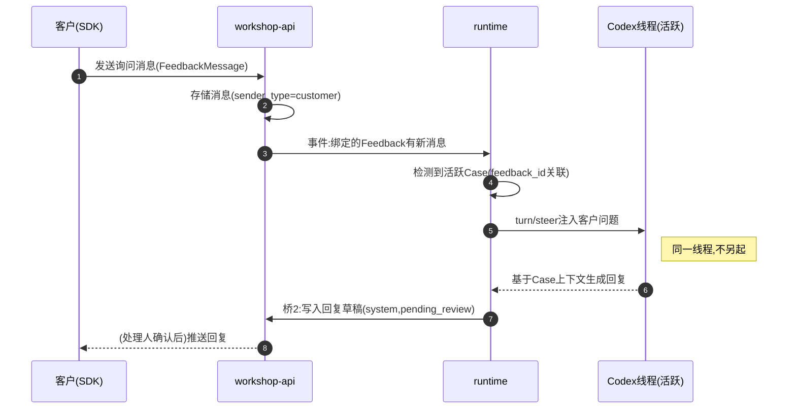
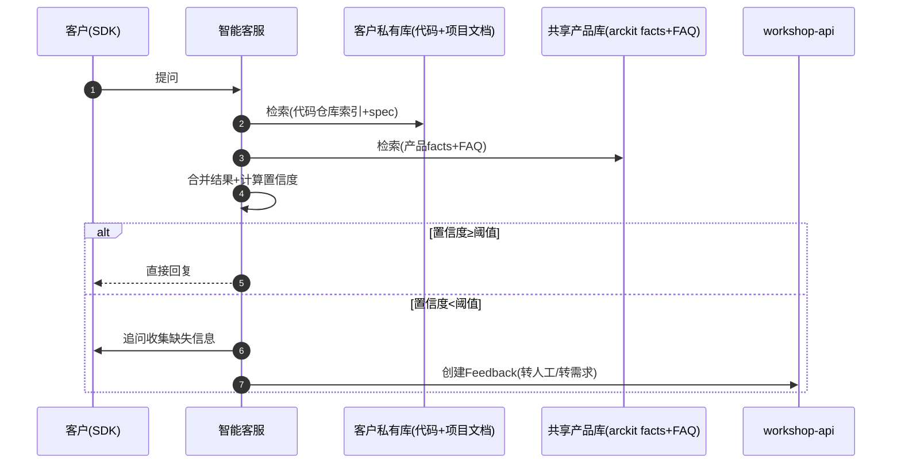

# 客户支持通道 — 整体方案计划与时序设计

> 本文是 `customer-support-channel-design.md` 的替代方案（权威实现版本）。原设计在已部分建成的系统上重新描述了一套平行设计（卡片系统、编排画布、四个新 Skill、arckit 层自动分配），与真实实现走向冲突。本文以系统真实状态为基线，重新定义治理层、执行层、反馈层的关系，并给出落地步骤与时序。
>
> **配套文档**（2026-09-08 补充，基于已确定的产品定位，位于迭代版本/【1】20260904/）：
> - [`customer-support-sequence-diagrams.md`](../迭代版本/【1】20260904/customer-support-sequence-diagrams.md) — 环节时序图说明（主流程/桥3/两层知识库检索 + 状态机）
> - [`customer-support-prd.md`](../迭代版本/【1】20260904/customer-support-prd.md) — 产品需求文档（PRD-FEAT-customer-support-v1.0）
>
> **2026-09-08 定位校正**：arc 核心是需求开发 loop（coding agent 接需求目标后自主开发到达成）；本期给 loop 接对客入口（智能客服+SDK）与对客出口（产物交付）。代码仓库托管在 Arckit 团队侧（每客户独立），交付客户的是构建产物（非部署）。相对本文的更新：步骤0（workspace 绑客户代码目录）已补入时序图；步骤7 由"部署 external_wait"改为"产物交付 artifact_url 回写"；智能客服降级为检索辅助人工（高置信直答/低置信转工单）；capabilities 试点不建用 role 兜底；桥3 加硬关联门控。详见时序图文档第 6 节。

文档日期：2026-09-04（2026-09-08 补充配套文档与定位校正）

---

## 一、现状基线（事实层）

以下为代码核实结果，非设计假设。

| 层 | 已实现 | 关键文件 |
|---|---|---|
| SDK 反馈通道 | V1+V2 提交、状态时间线、双向消息、通知、OSS 附件、WebSocket 推送、SDK Bridge | `packages/feedback-sdk-web/` |
| 后端工单/反馈 | Feedback / FeedbackMessage / FeedbackNotification / Task / FeedbackTaskLink 完整模型，转待办、分诊状态、realtime | `services/workshop-api/models/` |
| 管理控制台 | 项目/任务/反馈/组织/成员，完整 | `apps/feedback-console/` |
| Runtime 编排 | Gap-driven Loop（`selectNextRound` + `runStateDrivenSession`），Case/Gap 状态机，同一 Codex 线程贯穿 | `runtime/arcorbit/src/state-driven-runner.mjs` |
| Task 状态机 | 7 态：`pending_review/pending/in_progress/completed/accepted/cancelled/blocked`，`executor_id/creator_id/assignee`，乐观并发 | `runtime/arcorbit/src/task-source-adapter.mjs` |
| 角色 | `current_user`(执行) / `project_admin`(验收) / `owner/admin/member` | `today-guidance.mjs` / `models/project.go` |
| Codex CLI 集成 | JSON-RPC app-server、线程管理、审批、安装管理、二进制发现、`turn/steer` | `adapters/codex-app-server-adapter.mjs` 等 |
| 智能客服/知识库/AI 分诊 | **零代码**，仅文档和类型占位 | — |

### 治理层现状（缺口核心）

| 治理环节 | 现状 | 问题 |
|---|---|---|
| 谁判断要不要做 | triage handler 的 `requireFeedbackProjectMember` 只查项目成员，**不查 role** | 任何 member 都能承接/拒绝，无"确认承接人"概念 |
| 谁能接任务开发 | `executor_id` 创建时由创建者手动指定，或留空；认领是前端 hack（调 update API 设自己为 executor），后端无 claim 端点 | 无"可接任务的人"列表/池 |
| 配置存储 | `ProjectMember` 只有 `role(owner/admin/member)` + `duty`(自由文本未结构化) + `is_external`；项目设置页只管 SDK 集成 | 无任何地方配置承接规则、分配规则、处理人池 |

### arckit 协议层约束（不可违反）

- Runtime 必须策略中性，不预设 worker roles、固定流程、capability-selection 启发式（AGENTS.md）
- capability-policy.json 只绑定 `using-arckit` + `arckit-development-ledger`
- `delivery` 是 Project State 的决策区（回答"如何发布"的问题），不是工作流环节——**部署不进 arckit Loop**
- Gap-driven Loop 不预设阶段顺序，按"当前最值得优先处理的最小 Gap"动态推进

---

## 二、方案原则

1. **治理层在 workshop-api，不在 arckit 协议层**。"谁能 triage、谁能接任务"是业务治理策略，不是协议。塞进 arckit 违反策略中性。
2. **Gap-driven Loop 不动**。执行层已成熟，治理层只负责把"可执行的 Task + 已定的 executor"递交给它。
3. **不建编排画布**。治理配置是表单（人—能力映射），不是流程拓扑。流程走向由 Loop 动态决定。
4. **智能客服两层知识库**：客户私有库（其代码仓库 + 项目文档）+ 共享产品库（arckit facts + FAQ），隔离检索。
5. **进展同步初期用"显性初版 + 人工确认"**：closeout 生成草稿 message，处理人确认后发出。不自动直发客户。
6. **部署是 arckit 外部**：runtime closeout 后发 `external_wait` 信号，由独立交付流程接手。
7. **单客户试点**：不做多租户隔离、自动分配引擎、计费模型。

---

## 三、冗余项（砍）

| 项 | 处理 | 理由 |
|---|---|---|
| 卡片系统（card: todo/in_progress/review/done） | 不建，复用 Task 7 态机 + `FeedbackTaskLink.relation_type=converted_to` | 与现有 Task 高度重叠，链路已通 |
| 四个新 Skill（arckit-customer-feedback / arckit-agent-support / arckit-card-management / arckit-confirmation-flow）塞进 `entry/skills/` | 不建 | 违反 AGENTS.md：预设固定流程、违反策略中性、capability-policy 不维护 Worker 注册表。反馈通道是产品代码 |
| 编排画布 | 不建 | 与 Gap-driven 冲突；治理配置是表单不是拓扑 |
| arckit 层自动分配策略 | 不建 | Ledger 明确不做语义路由。自动分配放 workshop-api Task 层（下期），MVP 手动指派 |
| `source: customer-feedback` 作为 Case 来源类型（文档设计的字段） | 调整为在 `Gap.derived_from` 加受控来源类型 | 不在 Case 顶层加 source 枚举，避免协议层膨胀；Gap 级引用即可 |

---

## 四、缺失项（补）

| 缺口 | 层 | 说明 |
|---|---|---|
| 治理配置能力（capabilities） | workshop-api | `ProjectMember` 加结构化能力集替代自由文本 `duty` |
| triage 门控 | workshop-api | 现有 triage handler 不查 role，权限漏洞 |
| 智能客服 + 两层知识库 | 新建（SDK + 后端 worker） | 零代码，需从零建：代码仓库索引、spec facts 检索、置信度阈值转人工 |
| 桥1：Task → arckit Case | 协议层最小扩展 + runtime | runtime 能拉 Task，但 Task 不会变 Case。需在 Gap 上加受控来源类型 |
| 桥2：Case closeout → 客户进展草稿 | runtime hook + workshop-api | runtime 推进后不写 feedback message，两条线断开 |
| 桥3：用户询问 → steer 注入 Codex 线程 | runtime + workshop-api | 客户 SDK 消息不进 Codex 线程 |
| 分诊类型区分（直接回复 vs 转需求） | workshop-api | 现有 `triage_status` 不够，需显式分诊类型 |
| 部署外部 hook | 外部 | arckit 外部交付流程 |

---

## 五、分层架构

```
┌─────────────────────────────────────────────────────────────┐
│  反馈层（SDK）                                                │
│  智能客服（待建）= 两层知识库检索 + 置信度阈值                  │
│    ├─ 命中 → 直接回复客户（现有消息通道）                      │
│    └─ 未命中 → 追问收集 → 创建 Feedback（现有）                │
└──────────────────────────┬──────────────────────────────────┘
                           ▼
┌─────────────────────────────────────────────────────────────┐
│  治理层（workshop-api + feedback-console）  ★ 主要缺口         │
│  分诊（待建 AI 辅助 + 人工确认）                                │
│    ├─ 类型A 直接回复（question/consultation）                  │
│    └─ 类型B 转需求（issue/suggestion）                         │
│         ├─ triage 门控：capabilities 含 triage                 │
│         ├─ ConvertFeedbackToTask → Task（executor 从 execute 池选）│
│         └─ 成员能力配置页（新增）                                │
└──────────────────────────┬──────────────────────────────────┘
                           ▼
┌─────────────────────────────────────────────────────────────┐
│  执行层（runtime arcorbit，已有不动）                          │
│  task-source-adapter 拉取 Task                                 │
│    → 桥1：Task → Case（Gap.derived_from 加来源类型）           │
│    → Gap-driven Loop（起 Codex 线程 → 推进 → Git 收尾）        │
│    → 桥2：closeout → 进展草稿 message（pending_review）        │
│    → 桥3：用户询问 → turn/steer 注入同一线程                    │
└──────────────────────────┬──────────────────────────────────┘
                           ▼
┌─────────────────────────────────────────────────────────────┐
│  交付层（arckit 外部）                                         │
│  accept 能力者验收 → Task accepted                             │
│    → external_wait → 外部部署 hook → 部署到客户环境             │
└─────────────────────────────────────────────────────────────┘
```

### 角色映射（对齐现有字段，不新造角色）

| 治理角色 | 现有映射 | capabilities | 落点 |
|---|---|---|---|
| 确认承接 | owner/admin 默认 | `triage` | Feedback 是否转 Task，用现有 `triage_status` 字段 |
| 认领开发 | member 默认 | `execute` | Task 分配，单客户试点手动指派 executor_id |
| 需求验收 | owner/admin 默认 | `accept` | Task `pending_review → accepted`，现有 7 态机已覆盖 |
| 部署 | arckit 外部 | — | runtime closeout 后 external_wait，独立交付流程 |

---

## 六、时序图

### 6.1 完整主流程：从客户反馈到部署交付



**说明**：
- 步骤 4-11 是智能客服 MVP，命中知识库则不进治理层，降低人工负载。
- 步骤 13-15 是治理层，`triage` 能力者做承接决策，门控当前缺失（任何 member 都能 triage），需补。
- 步骤 19-25 是执行层，已实现不动，仅补桥1（Task→Case）。
- 步骤 26-29 是进展同步，草稿确认机制是初期方案，积累话术后可自动化。
- 步骤 30-34 是交付层，验收用现有 Task 状态机，部署明确在 arckit 外部。

### 6.2 用户主动询问进展时（桥3）



**说明**：
- 关键是复用 runtime 已有的 `turn/steer` 能力（codex-app-server-adapter 已实现），不另起线程。
- 注入的是客户问题，但 Codex 线程持有完整 Case 上下文，回复质量有保障。
- 回复仍走桥2 草稿确认，初期不自动直发。

### 6.3 智能客服决策（两层知识库）



**说明**：
- 客户私有库隔离，每个客户索引自己的代码仓库和项目文档。
- 产品库共享，是 arckit facts + 手动维护 FAQ。
- 置信度阈值是"直接回复 vs 转人工"的分界，对应文档风险表"Agent 回答不准确"的应对。

---

## 七、步骤拆解（每步工作重点）

### 步骤 1：补 triage 门控（现有权限漏洞）

**改动面**：`services/workshop-api/handler/feedback_workflow.go`

**工作重点**：
- 升级 `requireFeedbackProjectMember` → `requireFeedbackProjectCapability(c, db, projectID, "triage")`
- 在 `IgnoreFeedback` / `RestoreFeedback` / `ConvertFeedbackToTask` 三个 handler 接入能力校验
- 现状：只查 `ProjectMember` 是否存在，不查 `role`，任何 member 都能 triage
- **MVP 阶段先用 role 兜底**：`role ∈ {owner, admin}` 才能 triage（待步骤 2 的 capabilities 字段落地后切换）

**产出**：triage 操作有 role 门控，普通 member 无法承接/拒绝反馈

**验收**：member 角色调用 ConvertFeedbackToTask 返回 403

---

### 步骤 2：治理配置能力（capabilities 字段 + 配置页）

**改动面**：
- `services/workshop-api/models/project.go`
- `services/workshop-api/handler/project.go`（成员能力 CRUD）
- `apps/feedback-console/src/pages/FeedbackProjectSettingsPage.tsx`（配置 UI）
- `apps/feedback-console/src/lib/permissions/`（前端权限）

**工作重点**：
- `ProjectMember.Duty`（自由文本）→ `Capabilities []string`（值域：`triage | execute | accept`，复数）
- 数据库 migration：保留旧 duty 数据，owner→[triage,execute,accept]、admin→[triage,accept]、member→[execute] 默认映射
- 项目设置页新增"成员与职能"区：每人勾选 [确认承接][接任务开发][需求验收]
- `ConvertFeedbackToTask` 的 executor 下拉只列 `capabilities` 含 `execute` 的成员
- Task 推进到 `accepted` 需 `capabilities` 含 `accept`
- 前端权限模块 `permissions/modules/TaskPermission.ts` 接入 capabilities 判断

**产出**：可配置"谁判断要不要做、谁能接任务、谁验收"，显式存储

**验收**：在配置页给某 member 加 `execute` 后，他出现在 convert 的 executor 下拉里；去掉后消失

---

### 步骤 3：桥1 — Task → arckit Case 语义桥

**改动面**：
- `entry/skills/arckit-development-ledger/schema/development-case-record.schema.json`
- `runtime/arcorbit/src/task-source-adapter.mjs` / `agent-orchestrator.mjs`

**工作重点**：
- 在 Gap 的 `derived_from`（现为自由字符串数组）上加受控来源类型：`customer-feedback:<feedback_id>`
- runtime 拉 Task 时，若 Task 关联 FeedbackTaskLink，自动建 Case 并绑定 feedback_id 到 Gap.derived_from
- **这是唯一需要动 arckit 协议层的地方**，保持最小扩展：只在 Gap 级加来源引用，不在 Case 顶层加 source 枚举
- 不预设"反馈来源的 Case 走特殊流程"——仍由 Gap-driven Loop 正常推进，来源仅用于追溯和桥2 的回调

**产出**：Task 转化后自动成为 Codex 可处理的 Case，feedback_id 可追溯

**验收**：ConvertFeedbackToTask 后，runtime 能拉到该 Task 并建立 Case，Case 的 Gap.derived_from 含 feedback_id

---

### 步骤 4：智能客服 MVP（两层知识库 + 置信度转人工）

**改动面**：
- 新建后端 worker（`services/workshop-api/` 或独立服务）
- `packages/feedback-sdk-web/`（客服对话 UI，复用现有消息组件）
- 外部向量检索服务接入

**工作重点**：
- **文档知识库（WeKnora 承载）**：承载项目从开始到运行周期内的全量文档，作为问答资料。客户私有库 = 该客户项目全生命周期文档；共享产品库 = arckit facts + 手动维护 FAQ
- **代码仓库索引**：不在 WeKnora 范围，采用独立选型（WeKnora 把代码当文档拉取，无符号/调用关系检索，承载不了代码语义问答）。本期支持，代码级问题由独立代码检索选型承接
- 对话入口：复用现有 SDK 消息通道，不另建 UI 框架
- 置信度阈值：低于阈值不直发，转入追问收集 → 创建 Feedback。阈值判定逻辑落在 workshop-api，WeKnora 只提供检索结果与分数
- **不把存储层塞进 arckit**：向量检索由 WeKnora 管理（可挂 pgvector/Milvus/Qdrant），对话记忆用现有 FeedbackMessage，不在 arckit 协议层建存储
- AI 分诊辅助：参考 `AI反馈分诊方案.md` v0.7 的异步 Worker 设计，做去噪/分类/优先级建议，不做可实现性判断

### 知识库承载选型：WeKnora

智能客服的文档知识库采用 [WeKnora](https://github.com/Tencent/WeKnora)（MIT，腾讯开源）作为承载平台，替代原"外部向量服务"的笼统表述。选型依据：

| B 方案要求 | WeKnora 能力 | 契合度 |
|---|---|---|
| 两层库：客户私有 + 共享产品 | Workspace + 多 KB 资源所有权 + scoped API key 按 KB 限制 | 强契合，workspace 天然对应客户隔离 |
| 隔离检索 | workspace RBAC 4 级角色、按 KB 绑定存储实例、AES-256 加密凭证 | 强契合，多租户隔离是其核心能力 |
| 文档解析+分块+重排 | anydoc/PaddleOCR/自适应 3 级分块/Volcengine rerank、块可编辑带版本回滚 | 超额满足，免去自建 RAG 管道 |
| 产品库 = arckit facts + FAQ | FAQ/Document/Wiki 三种 KB 类型、多源摄入（飞书/GitLab/Notion 等） | 契合，FAQ 类型直接对应手动维护项 |
| SDK 客服入口 | Embed Widget（域名白名单+token 交换）、REST API 360 端点、MCP | 契合，可直接给 SDK 提供检索后端 |
| 部署语言 | 后端 Go，与 `services/workshop-api/` 同语言 | 无跨语言桥接成本 |

**边界（明确不交给 WeKnora 的）**：
1. 代码仓库语义索引——独立选型，WeKnora 仅承文档
2. 置信度阈值判定——落在 workshop-api，WeKnora 只出检索结果与分数
3. 对话记忆——复用现有 FeedbackMessage
4. 协议层——WeKnora 是 arckit 外部的知识库平台，不进 Loop、不进 capability-policy

**部署定位**：WeKnora 是独立部署的知识库平台（docker compose / K8s Helm），不并入 arckit 代码仓库。引入它替代"拼 Milvus + 自建分块/解析/块编辑 UI + 召回评估"这条自建管道，是步骤 4 工程量的主要消解点。

**产出**：客户常见问题自动回复，无法回复的转 Feedback 进治理层

**验收**：客户问"如何登录"，命中产品库直接回复；问"我的自定义模块报错"，未命中客户库则转 Feedback

---

### 步骤 5：桥2 — Case closeout → 客户进展草稿

**改动面**：
- `runtime/arcorbit/src/state-driven-runner.mjs`（closeout hook）
- `services/workshop-api/handler/feedback_workflow.go`（草稿 message 接口）

**工作重点**：
- `runSameThreadCloseout` 后，runtime 调 workshop-api 写入 `FeedbackMessage(sender_type=system, message_type=status_change, state=pending_review)`
- 草稿内容：Case 推进了哪些 Gap、产出什么、下一步是什么（从 loop receipt 提取）
- 处理人在 feedback-console 看到草稿，确认/编辑后发出（现有消息发送能力）
- **初期不自动直发**：积累话术模板和准确度数据后，再逐步自动化
- 草稿状态用现有 Task 状态机的 `pending_review` 复用，不新造状态

**产出**：开发进展可同步给客户，经人工确认

**验收**：Case closeout 后 feedback-console 出现一条待确认草稿，确认后客户在 SDK 收到

---

### 步骤 6：桥3 — 用户询问 → steer 注入

**改动面**：
- `services/workshop-api/handler/feedback_workflow.go`（新消息事件）
- `runtime/arcorbit/src/state-driven-runner.mjs`（事件监听 + steer 调用）
- `adapters/codex-app-server-adapter.mjs`（`turn/steer` 已实现，接通即可）

**工作重点**：
- 客户在 SDK 发 FeedbackMessage（sender_type=customer）后，workshop-api 发事件
- runtime 检测到绑定的 feedback_id 有活跃 Case → 用 `turn/steer` 注入同一 Codex 线程
- Codex 线程持有完整 Case 上下文，基于上下文生成回复
- 回复走桥2 草稿确认流程（不直发）
- **MVP 可降级**：若 runtime 未接通，用户询问走人工回复兜底（现有消息通道即可）

**产出**：客户主动询问时能拿到基于 Case 上下文的回复

**验收**：客户在开发中询问进展，Codex 线程基于当前 Gap 状态生成回复，经确认后推送

---

### 步骤 7：部署外部 hook

**改动面**：arckit 外部，独立交付流程

**工作重点**：
- Task `accepted` 后，runtime 发 `external_wait` 信号
- 接现有 CD / 客户侧部署流程，不在 arckit Loop 内编排
- runtime 只负责"代码已交付 + Git 已收尾"，部署状态回写 Task
- 明确边界：`delivery` skill 只提供"如何发布"的决策上下文，不执行部署

**产出**：验收后可触发部署到客户环境，部署状态可追溯

**验收**：Task accepted 后外部部署流程被触发，部署结果回写

---

## 八、落地优先级与依赖

```
步骤1 triage门控 ──┐
                   ├──> 步骤3 桥1(Task→Case) ──> 步骤5 桥2(进展草稿) ──> 步骤7 部署hook
步骤2 capabilities ─┘                                              │
                                                                   │
步骤4 智能客服MVP ──────────────────────────────────────────────────┤
                                                                   │
                                                   步骤6 桥3(用户询问) 
```

| 步骤 | 依赖 | 可并行 | 说明 |
|---|---|---|---|
| 1 triage 门控 | 无 | 与 2、4 并行 | 现有权限漏洞，优先补 |
| 2 capabilities | 无 | 与 1、4 并行 | 治理配置基础 |
| 3 桥1 | 步骤 1、2 | 与 4 并行 | 接通 runtime 的关键 |
| 4 智能客服 | 无 | 与 1、2、3 并行 | 独立工作面，体量最大 |
| 5 桥2 | 步骤 3 | 与 6、7 并行 | 依赖 Case 链路通 |
| 6 桥3 | 步骤 3、5 | 与 7 并行 | 依赖 steer 和草稿机制 |
| 7 部署 hook | 步骤 5 | — | arckit 外部 |

**建议批次**：
- 第一批（治理层立起来）：步骤 1 + 步骤 2，同一改动面（workshop-api + console），先把"谁判断、谁接、谁验收"配置化。
- 第二批（接通执行）：步骤 3，让 Task 能变 Case 进 Loop。
- 第三批（客户体验）：步骤 4 智能客服 + 步骤 5 进展草稿并行。
- 第四批（完善）：步骤 6 用户询问 + 步骤 7 部署 hook。

---

## 九、边界与风险

| 风险 | 影响 | 应对 |
|---|---|---|
| 智能客服回答不准 | 客户体验差、信任损失 | 置信度阈值，低于阈值不直发；草稿确认机制；定期同步 spec 标记过期 |
| 桥1 协议层扩展过度 | 违反 arckit 策略中性 | 只在 Gap 级加来源引用，不预设特殊流程，不新增 Case source 枚举 |
| 部署塞进 Loop | 违反 AGENTS.md delivery 约束 | 明确部署在 arckit 外部，runtime 只发 external_wait |
| capabilities 与 role 耦合过深 | 灵活性下降 | 两者正交：role 管层级权限（删项目），capabilities 管职能（谁干哪类活） |
| steer 注入干扰正在进行的 Gap | Codex 线程上下文污染 | steer 作为中断提示，不改变当前 Gap 目标；回复走草稿确认 |
| 单客户试点功能过度设计 | 延期 | 自动分配、多租户、计费全部下期；MVP 只跑单客户单处理人手动指派 |

---

## 十、与原设计的差异说明

| 原设计（customer-support-channel-design.md） | 本方案 | 理由 |
|---|---|---|
| 新建卡片系统 | 复用 Task 7 态机 | 与现有 Task 重叠 |
| 四个新 Skill 进 entry/skills/ | 不建，治理在 workshop-api | 违反策略中性、capability-policy 约束 |
| 编排画布 | 配置表单 | 与 Gap-driven 冲突 |
| arckit 层自动分配 | workshop-api 层，MVP 手动 | Ledger 不做语义路由 |
| Case 加 source: customer-feedback | Gap.derived_from 加受控来源 | 协议层最小扩展 |
| 部署在 Loop 内 | arckit 外部 | delivery 是决策区不是工作流环节 |
| 知识库混为一个 | 两层：客户库 + 产品库 | 隔离需求不同 |

原设计文档建议作废或标注"已被 customer-support-orchestration-plan.md 替代"。
