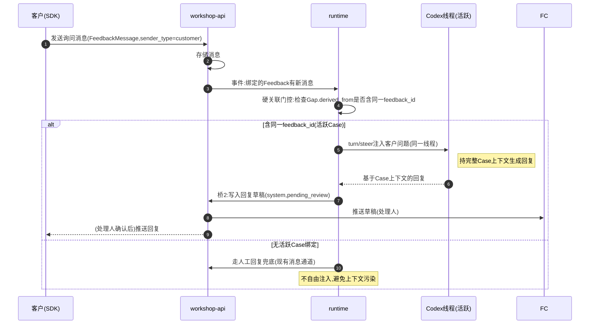
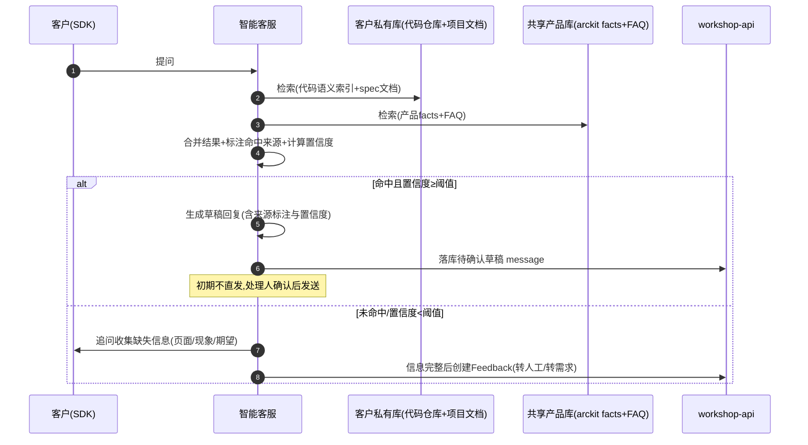

# 客户支持通道 — 环节时序图说明

> 本文档配套 [`customer-support-orchestration-plan.md`](../../产品规划/customer-support-orchestration-plan.md)（权威实现版本，位于产品规划）与 [`customer-support-prd.md`](./customer-support-prd.md)（PRD，同目录）。
> 以 2026-09-08 确定的产品定位为基线：arc 核心是需求开发 loop（coding agent 接需求后自主开发到达成目标）；本期给 loop 接对客入口（智能客服 + SDK）与对客出口（产物交付），验证 loop 在真实客户代码仓库上端到端跑通。
> 代码仓库托管在 Arckit 团队侧，每客户独立；最终交付客户的是构建产物（非代码、非部署到客户环境）。

文档日期：2026-09-08

---

## 0. 角色与分层

| 参与方 | 说明 |
|---|---|
| 客户（SDK） | 接入方企业用户；通过嵌入宿主应用的 SDK 反馈问题、查看进度、追问 |
| 智能客服 | 对客统一出入口；两层知识库检索 + 置信度阈值；初期未命中/低置信全部转人工草稿确认 |
| workshop-api | 治理层：分诊门控、ConvertFeedbackToTask、Task/Feedback 模型、草稿 message |
| feedback-console | 内部工作台：反馈治理、任务开发、进展确认、验收、知识库管理 |
| runtime（arcorbit） | 执行层：task-source-adapter 拉取 Task → Case → Gap-driven Loop → Git 收尾 |
| Codex 线程 | coding agent，同一线程贯穿 Case 全周期；接需求目标后自主开发到达成 |
| 构建产物 | 交付层：closeout 后构建，产物地址回写 Task，客户 SDK 可见"已交付" |

**分层责任**（不越界）：

- 治理层（workshop-api）：谁判断要不要做、谁能接、谁验收。试点期 role 兜底，不建 capabilities 字段。
- 执行层（runtime + Codex）：Gap-driven Loop 不动；workspace 按客户项目绑定各自本地代码仓库目录。
- 交付层：产物交付，部署不在本期；Task 加 `artifact_url` 回写。
- arckit 协议层：唯一扩展是桥1 `Gap.derived_from = customer-feedback:<feedback_id>`，守策略中性。

---

## 1. 主流程：从客户反馈到产物交付

```mermaid
sequenceDiagram
    autonumber
    participant C as 客户(SDK)
    participant K as 智能客服
    participant WA as workshop-api
    participant FC as feedback-console
    participant RT as runtime(arcorbit)
    participant CX as Codex线程

    C->>K: 提交反馈(文字/截图)
    K->>K: 两层知识库检索(客户私有库+共享产品库)

    alt 命中且置信度≥阈值
        K->>K: 生成草稿回复(标注命中来源与置信度)
        K->>WA: 落库为待确认草稿 message(system,pending_review)
        WA->>FC: 推送草稿(处理人)
        FC->>WA: 处理人确认/编辑草稿
        WA-->>C: 发送回复(现有消息通道)
        Note over C,K: 简单问题闭环,不进开发loop
    else 未命中/低置信度
        K->>C: 追问收集(页面/现象/期望)
        C->>K: 补充信息
        K->>C: 呈现结构化结果待确认
        C->>K: 确认提交
        K->>WA: 创建Feedback(triage_status=pending)
    end

    rect rgb(255,245,230)
    Note over WA,FC: 治理层 — 人工分诊确认(试点期 role 兜底)
    WA->>FC: 推送新Feedback通知(owner/admin)
    FC->>FC: AI分诊辅助展示(去噪/分类/优先级建议)
    FC->>WA: 分诊决策(role门控校验)
    alt 不做
        WA->>WA: triage_status=ignored
        WA-->>C: 回复客户说明(草稿确认后)
    else 做(进入开发)
        WA->>WA: ConvertFeedbackToTask
        Note right of WA: executor 从 execute 能力成员池手动指派(试点)
        WA->>WA: 创建Task(state=pending, executor_id已定)
    end
    end

    rect rgb(230,245,255)
    Note over RT,CX: 执行层 — Gap-driven Loop(核心验证)
    RT->>RT: workspace绑定该客户项目本地代码仓库目录(步骤0)
    RT->>WA: 拉取Task(task-source-adapter)
    RT->>RT: 桥1:Task→Case(Gap.derived_from=customer-feedback:<fb_id>)
    RT->>CX: 起Codex线程($using-arckit)
    Note right of CX: 接需求目标后自主开发,直达达成
    loop Gap-by-Gap
        RT->>RT: selectNextRound选Gap
        RT->>CX: 推进Gap
        CX-->>RT: transition结果
        RT->>RT: ledger校验+原子写回
    end
    RT->>RT: Git收尾(runSameThreadCloseout)
    end

    rect rgb(230,255,230)
    Note over RT,FC: 进展同步(草稿确认)
    RT->>WA: 桥2:写入进展草稿 message(system,pending_review)
    WA->>FC: 推送进展草稿(处理人)
    FC->>WA: 处理人确认草稿
    WA-->>C: 发送进展(现有消息通道)
    end

    rect rgb(245,230,255)
    Note over FC,WA: 交付层 — 验收与产物交付
    FC->>WA: 验收(owner/admin,Task→accepted)
    WA->>RT: closeout完成信号
    RT->>RT: 构建产物(本地打包)
    RT->>WA: 回写 artifact_url 到 Task
    WA-->>C: 通知客户交付完成+产物指向
    Note right of WA: 部署不在本期;客户自部署或人工提供产物
    end
```

**说明**：

- 步骤 4-11 是智能客服 MVP（**降级版**：检索辅助人工，初期不直发）。命中知识库也走草稿确认，不自动直发客户。
- 步骤 13-15 是治理层，试点期用 role 兜底门控（owner/admin 才能 triage），不建 capabilities 字段。
- 步骤 16-25 是执行层，**本期核心验证目标**：Codex loop 在客户代码仓库上端到端跑到 Git 收尾。步骤 17（workspace 绑客户代码目录）是 B 文档漏掉的工程前置，已补为步骤 0。
- 步骤 26-29 进展同步，草稿确认是初期方案，积累话术后可自动化。
- 步骤 30-34 交付层，交付的是**构建产物**（`artifact_url` 回写），部署明确不在本期。

---

## 2. 桥3：用户主动询问 → steer 注入（硬关联门控）



**说明**：

- 关键是复用 runtime 已有的 `turn/steer` 能力（codex-app-server-adapter 已实现），不另起线程。
- **硬关联门控**：只允许注入到 `Gap.derived_from` 含同一 `feedback_id` 的活跃 Case。Runtime 不做"该问题是否与当前 Gap 相关"的语义判断（AGENTS.md 策略中性），只做硬关联校验。
- 回复仍走桥2草稿确认，初期不自动直发。
- MVP 降级：若 runtime 未接通事件，用户询问走人工回复兜底。

---

## 3. 智能客服两层知识库检索决策



**说明**：

- 客户私有库隔离：每个客户索引自己的代码仓库 + 项目文档（代码仓库托管在 Arckit 团队侧，无跨租户访问问题）。
- 共享产品库：arckit facts + 手动维护 FAQ，所有项目共用。
- **代码语义检索是工程难点**：WeKnora 承文档（按客户 workspace 隔离），但代码仓库问答需独立选型（符号/调用关系/栈帧定位），不能把代码当文档拉进 WeKnora。本期选型必须在此明确，不留"独立选型"挂账。
- 置信度阈值初期无标注集标定，只能人工拍保守值（如规则硬匹配才算高置信）。初期等于"检索增强人工"，不是自动客服。
- 命中来源与置信度对处理人可见（草稿带来源标注），便于人工确认和话术积累。

---

## 4. 状态机

### 4.1 Feedback 状态机（对齐 models/feedback.go 7 态 + triage_status 3 态）

```
[ pending ] --分诊accepted--> [ accepted ] --ConvertFeedbackToTask--> [ converted ]
    |                              |
    | --分诊ignored-->          (流转中随Task状态回写)
    v
[ ignored ]                    [ converted ] --Task in_progress--> [ in_progress ]
                                   |
                                   --Task accepted(开发闭环)--> [ completed ]
                                   |
                                   --产物交付回写--> [ released ]
                                   |
                                   --草稿发送--> hasPendingProgress=true(客户侧"有进展")

最终态: released(已交付闭环) / ignored(不做)
```

| status | triage_status | 含义 |
|---|---|---|
| pending | pending | 已收到，待分诊 |
| accepted | accepted | 分诊通过，待转任务 |
| converted | accepted | 已转开发任务 |
| in_progress | accepted | 任务处理中 |
| completed | accepted | 开发闭环（Task accepted） |
| ignored | ignored | 不做 |
| released | accepted | 已交付（产物交付回写后的终态） |

### 4.2 Task 状态机（对齐 models/task.go 7 态）

```
[ pending_review ] --confirm_review--> [ pending ] --claim/assign--> [ in_progress ]
[ pending ] --claim--> [ in_progress ]
[ in_progress ] --开发完成(Codex loop达成)--> [ completed ] --submit_review--> [ pending_review ](待验收) --accept--> [ accepted ]
[ pending_review ] --reject--> [ in_progress ](退回)
[ in_progress ] --block--> [ blocked ] --unblock--> [ in_progress ]
任意态 --cancel--> [ cancelled ]
```

| state | 含义 | 触发 |
|---|---|---|
| pending_review | 待验收/待确认开始 | 默认 |
| pending | 待认领 | confirm_review |
| in_progress | 处理中 | claim/assign |
| completed | 已解决（开发完成，待提交验收） | Codex loop 达成 |
| accepted | 已验收 | accept |
| blocked | 已阻塞 | block |
| cancelled | 已取消 | cancel |

### 4.3 Case/Gap 推进（执行层，不动）

```
拉取Task → 建Case(Gap.derived_from=customer-feedback:<fb_id>)
  → 起Codex线程($using-arckit)
  → selectNextRound选Gap → 推进 → transition → ledger原子写回
  → (Gap-by-Gap until 达成) → runSameThreadCloseout(Git收尾)
  → 构建产物 → artifact_url回写Task
```

---

## 5. 落地步骤与依赖（含步骤0）

```
步骤0 workspace绑客户代码目录 ─┐
步骤1 triage门控(role兜底) ─────┤
步骤2 (capabilities不建,试点) ─┼──> 步骤3 桥1(Task→Case) ──> 步骤4 桥2(进展草稿) ──> 步骤6 产物交付
步骤5 智能客服MVP(检索辅助) ────┤                                              │
                                                              步骤7 桥3(用户询问,硬关联门控)
```

| 步骤 | 依赖 | 可并行 | 说明 |
|---|---|---|---|
| 0 workspace 绑客户代码目录 | 无 | 与1、5并行 | loop 跑起来的工程前置，B 漏点 |
| 1 triage 门控 | 无 | 与0、2、5并行 | role 兜底，堵权限漏洞 |
| 2 capabilities | — | — | 试点不建，下期 |
| 3 桥1 Task→Case | 步骤0、1 | 与5并行 | 接通 runtime 的关键 |
| 4 桥2 进展草稿 | 步骤3 | 与6、7并行 | 依赖 Case 链路通 |
| 5 智能客服 MVP | 无 | 与0、1、3并行 | 检索辅助人工，代码语义检索选型在此定 |
| 6 产物交付 | 步骤4 | 与7并行 | artifact_url 回写，部署不做 |
| 7 桥3 用户询问 | 步骤3、4 | — | steer + 硬关联门控 + 草稿确认 |

**建议批次**：

- 第一批（让 loop 跑起来 + 堵漏洞）：步骤 0 + 步骤 1。
- 第二批（接通反馈→loop）：步骤 3。
- 第三批（对客入口出口）：步骤 5 + 步骤 4 + 步骤 6 并行。
- 第四批（完善）：步骤 7。

---

## 6. 与原方案的差异（相对 B 文档）

| B 文档 | 本期确定 | 理由 |
|---|---|---|
| 步骤7 部署 external_wait hook | 产物交付（artifact_url 回写），部署不做 | 交付是构建产物，部署不在本期 |
| 智能客服 置信度阈值自动分界 | 降级为检索辅助人工，全部草稿确认 | 无标注集标定，初期不直发 |
| 步骤2 capabilities 字段 | 试点不建，role 兜底 | 单客户试点，capabilities 是过度设计 |
| —（无步骤0） | 新增步骤0 workspace 绑客户代码目录 | loop 跑起来的工程前置，B 漏点 |
| 桥3 自由 steer 注入 | 硬关联门控（同 feedback_id 才注入） | 守 Runtime 策略中性，避免上下文污染 |
