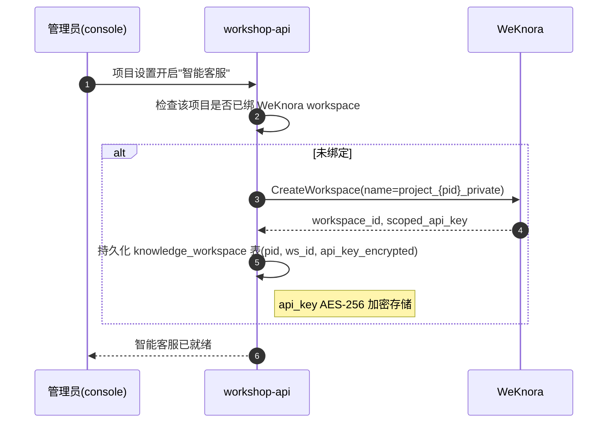
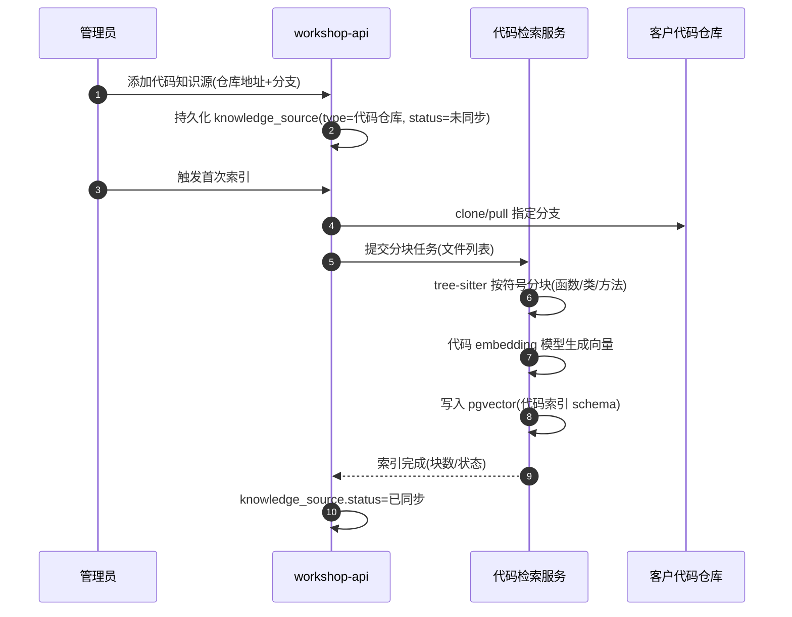

# 客户支持通道 — 知识库集成与使用说明

> 本文是 [`customer-support-prd.md`](./customer-support-prd.md) F-03/F-09 与 [`customer-support-orchestration-plan.md`](../../产品规划/customer-support-orchestration-plan.md) 步骤4 的配套落地文档，补齐 PRD 留在"待建/接口签名"层级的两件事：**知识库如何集成进系统**、**各角色用户如何使用**。
>
> 配套关系：PRD 定义"做什么"、orchestration-plan 定义"分层与步骤"、时序图定义"环节流转"、**本文定义"知识库怎么接进来、怎么用起来"**。
>
> 决策状态：Q-01（代码语义检索选型）在本文第六节给出决策，关闭 PRD 附录C 的"⏳待决策"。

文档日期：2026-09-08

---

## 0. 为什么需要本文

PRD F-03 给出了 `/retrieve` 接口签名，F-09 给出了"同步状态/重建索引/检索测试"三个功能词，orchestration-plan 步骤4 给出了 WeKnora 选型理由表。但以下落地问题全部悬空：

- WeKnora 与 workshop-api 谁调谁、workspace 何时建、知识源怎么喂进去
- 代码语义检索选型挂着"独立选型"，时序图自己又说"必须明确不留挂账"——文档自相矛盾
- 置信度分数怎么从两套检索结果合并成单一值
- 客户提问后到收到回复之间看到什么、管理员怎么加一个知识源、FAQ 在哪写、处理人草稿确认界面怎么操作

本文逐一闭合。

---

## 1. 整体集成架构

### 1.1 调用链

```
┌──────────────────────────────────────────────────────────────────┐
│ 客户(SDK)                                                         │
│  FeedbackConversationPanel(已有组件,复用)                          │
└───────────────────────────┬──────────────────────────────────────┘
                            │ POST /api/v1/projects/{pid}/feedbacks/retrieve
                            ▼
┌──────────────────────────────────────────────────────────────────┐
│ workshop-api(治理层,网关)                                         │
│  retrieve handler(待建)                                           │
│   ├─ 鉴权 + 项目隔离校验                                           │
│   ├─ 并行调用两个检索后端                                          │
│   ├─ 合并结果 + 计算置信度(本层职责,不下沉)                        │
│   ├─ 置信度≥阈值 → 生成草稿 → 落 FeedbackMessage(system)         │
│   └─ 置信度<阈值 → 返回 need_collect=true,SDK 走追问收集           │
└─────────────┬────────────────────────────────┬───────────────────┘
              │ A: 文档检索                    │ B: 代码检索
              ▼                                ▼
┌──────────────────────────────┐  ┌───────────────────────────────┐
│ WeKnora(文档知识库)           │  │ 代码检索服务(独立,待建)        │
│  ├─ 客户私有 workspace        │  │  ├─ tree-sitter 符号分块      │
│  │   (项目文档 RAG)            │  │  ├─ 代码 embedding 模型       │
│  └─ 共享产品 workspace        │  │  └─ 向量检索(复用 pgvector)   │
│      (arckit facts + FAQ)     │  │  (索引客户代码仓库)            │
└──────────────────────────────┘  └───────────────────────────────┘
```

**关键决策：workshop-api 是唯一检索网关**。SDK 不直连 WeKnora，也不直连代码检索服务。理由：

1. 鉴权与项目隔离必须在 workshop-api 收口——WeKnora 的 scoped API key 不下发给客户端，避免客户端持有可越库检索的凭证。
2. 置信度合并是业务逻辑，落在 orchestration-plan 已定的"阈值判定在 workshop-api"边界内。
3. SDK 只持有一个端点（`/retrieve`），不感知后端是 WeKnora 还是代码检索，后端可独立演进。

### 1.2 与 orchestration-plan 步骤4 边界的关系

orchestration-plan 步骤4 定的边界：

| 边界项 | 原文 | 本文落地 |
|---|---|---|
| WeKnora 仅承文档 | "代码仓库语义索引——独立选型，WeKnora 仅承文档" | **保留**：WeKnora 只索引项目文档/arckit facts/FAQ，不索引代码文件 |
| 代码检索独立选型 | "代码语义检索独立选型（符号/调用关系），不塞进 WeKnora" | **调整为**：检索管道独立，但向量存储复用 WeKnora 的 pgvector 实例（见第六节理由） |
| 置信度在 workshop-api | "阈值判定逻辑落在 workshop-api，WeKnora 只提供检索结果与分数" | **保留**：两套后端只出 hits+score，合并与阈值在 workshop-api |
| 对话记忆复用 FeedbackMessage | 不自建存储 | **保留**：草稿仍落 FeedbackMessage(sender_type=system) |
| 协议层不进 WeKnora | 不进 Loop、不进 capability-policy | **保留**：WeKnora 与代码检索都是 arckit 外部服务 |

唯一调整是"代码检索向量存储复用 pgvector"。理由在第六节，不破坏"WeKnora 仅承文档"——WeKnora 的文档索引和代码检索的代码索引是 pgvector 里两个独立的 schema/namespace，WeKnora 应用层不感知代码索引存在。

---

## 2. workspace 与项目绑定机制

### 2.1 两层 workspace 模型

| workspace | 归属 | 内容 | 创建时机 | 创建方 |
|---|---|---|---|---|
| 客户私有 workspace | 每客户项目一个 | 该客户项目全生命周期文档（spec、设计、变更记录） | 项目首次启用智能客服时 | workshop-api 自动调 WeKnora API 创建 |
| 共享产品 workspace | 全局唯一 | arckit facts（arckit-spec 等）+ 手动维护 FAQ | 系统初始化时一次性创建 | 部署时人工/脚本创建 |

### 2.2 绑定流程



**关键点**：

- workspace_id 与 project_id 一对一绑定，存入 workshop-api 新增的 `knowledge_workspace` 表（见第四节）。
- scoped API key 加密存储在 workshop-api 侧，从不下发给 SDK。WeKnora 的 workspace RBAC 保证即使 key 泄漏也只能访问该 workspace。
- 共享产品 workspace 的 scoped key 是系统级配置（环境变量），不按项目分发。

### 2.3 workspace 隔离校验

workshop-api 每次 `/retrieve` 调用前：

1. 按 project_id 查 `knowledge_workspace` 拿到该项目的 ws_id + api_key
2. 用该 api_key 调 WeKnora（WeKnora 的 scoped key 只能访问绑定的 workspace）
3. 同时用系统级 api_key 调共享产品 workspace
4. 跨项目访问天然被 WeKnora RBAC 拦截——即使 workshop-api 有 bug 传错 ws_id，WeKnora 也会拒绝

PRD 7.3"客户私有库跨客户检索返回空/403"的验收点由这条链路保证。

---

## 3. 知识源摄入管道

四类知识源，三种摄入方式：

| 知识源 | 目标库 | 摄入方式 | 触发 | 责任人 |
|---|---|---|---|---|
| 项目文档 | 客户私有 workspace | WeKnora 多源摄入连接器（GitLab/Notion/飞书）或 API 上传 | 文档变更 webhook / 手动重建 | 管理员 |
| arckit facts / spec | 共享产品 workspace | workshop-api 同步任务：监听 arckit spec 目录变更 → 推送到 WeKnora | spec 文件 commit 后定时同步 | 系统自动 |
| FAQ | 共享产品 workspace | WeKnora FAQ KB 类型，控制台直接编辑 | 手动 | 管理员/FAQ 维护者 |
| 客户代码仓库 | 代码检索服务（独立） | workshop-api 触发：git pull → tree-sitter 分块 → embedding → 写 pgvector | 代码 commit webhook / 手动重建 | 管理员 |

### 3.1 文档摄入（WeKnora 多源连接器）

WeKnora 原生支持飞书/GitLab/Notion 等多源摄入。管理员在知识库管理面板配置连接器（见第五节），WeKnora 自行拉取、解析（anydoc/PaddleOCR）、分块（自适应 3 级）、重排（Volcengine rerank）。workshop-api 不参与文档解析管道——这是 orchestration-plan 步骤4"引入 WeKnora 替代自建 RAG 管道"的工程量消解点。

### 3.2 arckit facts 同步

共享产品库的内容来源是 `definition/skills/arckit-spec/` 产出的规格文档。同步机制：

1. workshop-api 起一个定时任务（每小时），扫描 arckit spec 目录的 git log 变更
2. 变更文件通过 WeKnora REST API 上传到共享产品 workspace
3. WeKnora 自动重新分块索引受影响文档
4. 同步状态写入 `knowledge_source` 表（见第四节），管理面板可见

### 3.3 FAQ 维护

FAQ 走 WeKnora 的 FAQ KB 类型，不进 workshop-api 数据库：

- 管理员在 feedback-console 的"知识库管理"页打开 FAQ 编辑器（嵌入式 WeKnora 管理界面或 workshop-api 代理）
- 每条 FAQ = 问题 + 答案 + 标签
- FAQ 命中在检索结果里以 `type: 'faq'` 标注，置信度通常较高（精确匹配）

### 3.4 代码仓库摄入（独立管道）

代码不进 WeKnora，走独立分块+embedding 管道（详见第六节）。摄入流程：



---

## 4. 数据模型补充

对齐 PRD 6.1 的 TypeScript 接口风格，补充知识库相关表：

```typescript
// workspace 绑定（新增）
interface KnowledgeWorkspace {
  id: number;
  project_id: number;          // null = 共享产品 workspace
  weknora_workspace_id: string;
  api_key_encrypted: string;   // AES-256，不下发客户端
  scope: 'project' | 'public';
  created_at: number;
}

// 知识源（PRD 6.1 已声明，此处补字段）
interface KnowledgeSource {
  id: number;
  project_id: number | null;   // null = 公共知识源
  name: string;
  type: '代码仓库' | '项目文档' | 'FAQ' | '公共知识';
  status: '已同步' | '索引中' | '未同步' | '同步失败';
  scope: 'project' | 'public';
  // 代码仓库特有
  repo_url?: string;
  branch?: string;
  last_indexed_at?: number;
  last_index_error?: string;
  // 文档源特有（WeKnora 连接器）
  weknora_connector_id?: string;
  created_at: number;
}

// 检索命中（PRD 6.1 已声明，补 source 维度）
interface RetrievalHit {
  source: 'customer_doc' | 'product_faq' | 'product_facts' | 'customer_code';
  type: 'doc' | 'faq' | 'code';
  title: string;
  snippet: string;
  score: number;               // 0-1，原始检索分
  source_ref?: string;         // 代码:文件:行 / 文档路径 / FAQ id
}
```

**与现有模型的关系**：

- `KnowledgeWorkspace` 是 workshop-api 新增表，不触碰 arckit 协议层
- `KnowledgeSource` 落在 workshop-api，对应 PRD F-09 管理面板的数据源
- `RetrievalHit.source` 细化 PRD 的 `customer_lib/product_lib` 为四值，让命中来源对处理人更可读

---

## 5. 各角色使用流程

### 5.1 客户：提问与等待

客户在 SDK 内的提问交互（复用现有 `FeedbackConversationPanel` 组件）：

| 阶段 | 客户看到 | 系统行为 | 客户可操作 |
|---|---|---|---|
| 提问 | 输入框 placeholder："描述你的问题" | — | 输入文字/发截图 |
| 检索中 | 客服气泡："正在查找相关资料…" + typing 指示 | workshop-api 并行检索两套库 | 等待 |
| 命中（高置信） | 客服气泡：草稿回复内容（经处理人确认后） | 草稿落库 pending_review，推处理人 | 等待处理人确认 |
| 未命中（低置信） | 客服气泡："我需要更多信息，帮你记录转团队" + 结构化整理卡（位置/现象/期望） | 转 F-01 对话式反馈收集 | 补充信息 → 确认提交 |

**关键边界**：客户提问后**不直接收到机器回复**。即使高置信命中，草稿也先经处理人确认（orchestration-plan 步骤4 降级决策：初期检索辅助人工，不直发）。对客户的体验差异在于：

- 普通反馈：客户提交后等"是否受理"的分诊结果
- 提问命中：客户提问后等"带来源标注的解答"，通常更快（处理人只需确认而非从零写回复）

客户在"我的反馈"里看到的状态时间线不变，提问和反馈共用 Feedback 记录（提问未命中转反馈时复用 F-01 链路）。

### 5.2 管理员：知识源管理

F-09 知识库管理面板的操作流程展开：

#### 添加知识源

```
知识库管理页
  ├─ 知识源列表（表格：名称/类型/状态/最后同步时间）
  ├─ [添加知识源] 按钮
  │     ├─ 类型选择：代码仓库 / 项目文档 / FAQ / 公共知识
  │     │
  │     ├─ 代码仓库 → 表单：仓库名/SSH或HTTPS地址/分支/（可选）忽略路径
  │     ├─ 项目文档 → 选择 WeKnora 连接器：飞书/GitLab/Notion/手动上传
  │     ├─ FAQ      → 跳转 FAQ 编辑器（WeKnora FAQ KB）
  │     └─ 公共知识 → 仅 owner/admin 可加（写入共享产品 workspace）
  │
  └─ 保存后 status=未同步，待首次索引
```

#### 重建索引

| 操作 | 触发 | 反馈 |
|---|---|---|
| 单源重建 | 点某行"重建"按钮 | status→索引中，进度条（块数/总块数），完成→已同步 |
| 失败查看 | 点"同步失败"状态 | 展开错误详情（last_index_error） |
| 全量重建 | 项目设置页按钮（慎用） | 所有源重新索引，期间检索降级（见第七节） |

#### 检索测试

```
检索测试面板
  输入框：输入测试问题
  [检索] → 展示：
    ├─ 命中列表（每条：来源/类型/标题/snippet/原始分数）
    ├─ 合并后置信度
    └─ 判定：高置信会生成草稿 / 低置信转收集
```

检索测试不经过草稿确认，直接返回原始检索结果，供管理员评估索引质量和阈值合理性。

### 5.3 FAQ 维护者

FAQ 不在 workshop-api 维护，落在 WeKnora FAQ KB：

1. 管理员在知识库管理页点"FAQ" → 跳转嵌入式 FAQ 编辑器
2. FAQ 编辑器（WeKnora 提供，workshop-api 代理鉴权）：
   - 新增 FAQ：问题 + 答案 + 标签
   - 编辑/删除已有 FAQ
   - FAQ 带版本回滚（WeKnora 原生）
3. FAQ 变更后 WeKnora 自动重建 FAQ 索引，无需手动触发

**职责边界**：FAQ 维护者只管"问题—答案"对的内容，不碰代码仓库和文档源。FAQ 是高置信命中源（精确匹配），质量直接影响智能客服的直答率。

### 5.4 处理人：草稿确认

检索命中生成的草稿进入处理人的草稿确认界面（对齐 PRD 3.2 `retrieval-result` 组件）：

```
草稿确认面板
  ├─ 客户原始问题
  ├─ 检索命中（retrieval-result 卡片）：
  │     ├─ 命中来源标签（客户文档/产品FAQ/产品facts/客户代码）
  │     ├─ 每条命中的 snippet + 置信度分数
  │     └─ 原始来源链接（可点开核实）
  ├─ 草稿回复内容（可编辑文本区）
  └─ [批准发送] / [驳回重试] / [转人工回复]
```

| 操作 | 效果 |
|---|---|
| 批准发送 | 草稿 state pending_review→sent，客户在 SDK 收到回复 |
| 驳回重试 | 重新触发检索或人工改写草稿 |
| 转人工回复 | 放弃草稿，处理人手写回复（现有消息通道） |

处理人能看到命中来源和置信度，这是 orchestration-plan"命中来源与置信度对处理人可见，便于人工确认和话术积累"的落地。积累的草稿/批准数据后续用于 Q-03（置信度阈值标定回测）。

---

## 6. 代码语义检索选型（Q-01 决策）

### 6.1 选型结论

**采用轻量代码 RAG 管道，不引入 Sourcegraph/OpenGrok 等代码搜索平台。**

| 组件 | 选型 | 理由 |
|---|---|---|
| 分块 | tree-sitter 按符号分块（函数/类/方法粒度） | 代码 RAG 的关键差异：按语义单元而非固定行数分块，召回质量高 |
| Embedding 模型 | BGE-M3（开源可自部署）或 Voyage code-3 | 代码专用 embedding 优于通用文本 embedding；BGE-M3 可自部署避免代码外泄 |
| 向量存储 | 复用 WeKnora 的 pgvector 实例（独立 schema） | 不另起向量服务；代码索引与文档索引在 pgvector 里物理隔离 |
| 检索 | 向量相似度 + 可选 BM25 混合 | 代码标识符精确匹配（BM25）+ 语义匹配（向量）互补 |
| 符号导航 | 不做（本期） | 智能客服需求是 RAG 不是 go-to-definition，SCIP 编译器级索引工程量不值得 |

### 6.2 为什么不选 Sourcegraph/OpenGrok

调研结论（2025 年现状）：

| 方案 | 否决理由 |
|---|---|
| Sourcegraph | 2024 源码私有化、2025 商业化频繁调整（Cody Free/Pro 取消、Amp 分拆）；部署是"运营承诺"（微服务+DB）；核心价值是跨仓库符号导航和 Batch Changes，智能客服用不上；单客户试点成本不对等 |
| OpenGrok | Ctags 词法级符号，无语义理解；适合 C/Java 遗留代码库；Arckit 客户以 TypeScript/Go/Swift 为主，Ctags 对类型推导/重载准确度有限 |
| Zoekt/Hound | 纯文本正则搜索，无符号无语义，连 RAG 都不是 |

**核心判断**：智能客服的代码检索需求是"自然语言问题 → 相关代码片段"（RAG），不是"符号 → 定义/引用"（导航）。Sourcegraph 系工具解决的是后者，套到客服检索后端是错配。

### 6.3 为什么向量存储复用 pgvector（突破 orchestration-plan 边界）

orchestration-plan 步骤4 写"代码检索独立选型，不塞进 WeKnora"。本文的调整是：**检索管道独立，但向量存储复用 WeKnora 已部署的 pgvector 实例**。

| 维度 | 独立向量服务 | 复用 pgvector（本文方案） |
|---|---|---|
| 运维成本 | 多一套向量服务部署+监控 | 零增量（WeKnora 已部署 pgvector） |
| 隔离性 | 物理隔离 | schema/namespace 隔离（代码索引独立 schema，WeKnora 应用层不感知） |
| 工程量 | 高（部署+运维+备份） | 低（建表+管道） |
| 风险 | 代码索引故障不影响文档 | 共享 DB 实例，需配资源隔离（独立表空间/连接池） |

**不破坏"WeKnora 仅承文档"**：WeKnora 应用层仍然只索引文档，不碰代码。代码检索管道直接写 pgvector 的独立 schema，绕过 WeKnora 应用。两者共享的是 DB 进程，不是应用逻辑。

如果试点期资源隔离成为问题，可后续拆出独立 pgvector 实例——架构上是一行连接串的变更。

### 6.4 代码索引 schema（pgvector 独立 schema）

```sql
-- 独立 schema，与 WeKnora 文档索引物理隔离
CREATE SCHEMA IF NOT EXISTS code_index;

CREATE TABLE code_index.code_chunks (
  id          BIGSERIAL PRIMARY KEY,
  project_id  BIGINT NOT NULL,          -- 项目隔离
  source_id   BIGINT NOT NULL,          -- 关联 knowledge_source.id
  file_path   TEXT NOT NULL,
  symbol_type TEXT,                     -- function/class/method
  symbol_name TEXT,
  start_line  INT,
  end_line    INT,
  chunk_text  TEXT NOT NULL,            -- 代码原文
  embedding   VECTOR(1024) NOT NULL,    -- BGE-M3 维度
  commit_sha  TEXT,
  created_at  TIMESTAMPTZ DEFAULT NOW()
);

CREATE INDEX ON code_index.code_chunks USING ivfflat (embedding vector_cosine_ops);
CREATE INDEX ON code_index.code_chunks (project_id, file_path);
```

检索时 `WHERE project_id = ?` 保证项目隔离，与 WeKnora 的 workspace 隔离双保险。

### 6.5 关闭 Q-01

PRD 附录C Q-01 状态由"⏳待决策"改为"✅已决策：轻量代码 RAG（tree-sitter 分块 + BGE-M3 embedding + pgvector 独立 schema），不引入代码搜索平台"。时序图第3节"本期选型必须在此明确"的矛盾闭合。

---

## 7. 置信度合并算法

两套检索后端各自返回 hits + score，workshop-api 合并：

### 7.1 合并步骤

1. **归一化**：WeKnora 文档分数和代码 embedding 余弦相似度各自归一化到 [0,1]（各自 min-max 或用已知的分数分布标定）
2. **来源加权**：

   ```
   weight = {
     product_faq:      1.2,  // 精确匹配，可信度高
     product_facts:    1.0,  // arckit spec，权威
     customer_doc:     0.9,  // 项目文档，可能过时
     customer_code:    0.8,  // 代码片段，需处理人核实
   }
   ```

3. **置信度计算**：

   ```
   confidence = max(hit.score * weight[hit.source]) for each hit
   ```

   取最高加权分而非平均——智能客服只需一个"够不够自信直答"的判断，最强的命中决定。

4. **阈值**（初期人工拍保守值，对应 PRD 附录 Q-03）：

   | 阈值 | 值 | 行为 |
   |---|---|---|
   | 高置信 | ≥0.75 | 生成草稿，推处理人确认 |
   | 低置信 | <0.75 | 转追问收集，创建 Feedback |

   初期 0.75 是保守值（规则硬匹配/FAQ 精确匹配才能到），等 Q-03 标注集回测后调整。

### 7.2 两库冲突处理

PRD F-03 边界条件"客户库命中但产品库冲突，以客户库为准"落地为：客户实际实现优先于产品通用文档。冲突判定 = 两库命中同一问题但答案矛盾（初期靠处理人在草稿确认界面人工判断，不做自动矛盾检测）。

### 7.3 检索降级

| 场景 | 降级行为 | 用户感知 |
|---|---|---|
| WeKnora 超时（>10s） | 仅用代码检索结果（或反之） | 客户无感，结果可能质量下降 |
| 两套都超时 | 转 F-01 追问收集 | 客服："我先帮你记录下来转团队跟进" |
| 全量重建索引中 | 检索返回空，转追问收集 | 客户无感，走反馈链路 |

---

## 8. 索引同步触发机制

| 知识源 | 触发方式 | 延迟 | 实现 |
|---|---|---|---|
| 项目文档 | WeKnora 连接器 webhook（飞书/GitLab/Notion 变更推送） | 秒级 | WeKnora 原生 |
| arckit facts | workshop-api 定时任务扫描 spec git log | 小时级 | workshop-api 新增 cron |
| FAQ | 编辑后即时 | 秒级 | WeKnora 原生 |
| 代码仓库 | git webhook（push 事件）→ 增量分块 | 分钟级 | workshop-api webhook handler + 代码检索服务 |

代码仓库增量索引：webhook 收到 push → workshop-api 拉取 diff 文件列表 → 代码检索服务只对变更文件重新分块+embedding → 更新 pgvector（按 file_path 删除旧块插入新块）。全量重建只在首次或分支切换时触发。

---

## 9. 接口补充定义

### 9.1 检索接口（补全 PRD 5.2 的实现细节）

`POST /api/v1/projects/{projectId}/feedbacks/retrieve` 已在 PRD 定义签名。补充内部实现：

**workshop-api 内部流程**：

```go
// 伪代码
func RetrieveHandler(c *gin.Context) {
    pid := c.Param("projectId")
    query := body.Query

    // 1. 查 workspace 绑定
    ws := db.GetKnowledgeWorkspace(pid)
    if ws == nil {
        // 项目未启用智能客服
        respondNeedCollect(c)
        return
    }

    // 2. 并行检索
    docHits, codeHits := parallel(
        weknora.Search(ws.ApiKey, ws.WorkspaceID, query),
        weknora.Search(productApiKey, productWorkspaceID, query),
        codeIndex.Search(pid, query),
    )

    // 3. 合并 + 置信度
    hits := mergeAndNormalize(docHits, codeHits)
    confidence := computeConfidence(hits)

    // 4. 阈值判定
    if confidence >= 0.75 {
        draft := generateDraft(hits, query)
        db.CreateFeedbackMessage(sender_type=system, state=pending_review, content=draft, metadata=hits)
        respondDraft(c, draft, hits, confidence)
    } else {
        respondNeedCollect(c)  // SDK 走 F-01 追问收集
    }
}
```

### 9.2 知识源管理接口（新增，对应 F-09）

| 方法 | 路径 | 说明 | 鉴权 |
|---|---|---|---|
| GET | `/api/v1/projects/{projectId}/knowledge/sources` | 列知识源 | owner/admin |
| POST | `/api/v1/projects/{projectId}/knowledge/sources` | 添加知识源 | owner/admin |
| DELETE | `/api/v1/projects/{projectId}/knowledge/sources/{sourceId}` | 删除知识源 | owner/admin |
| POST | `/api/v1/projects/{projectId}/knowledge/sources/{sourceId}/reindex` | 触发重建索引 | owner/admin |
| POST | `/api/v1/projects/{projectId}/knowledge/retrieve-test` | 检索测试（返回原始 hits，不经草稿） | owner/admin |
| GET | `/api/v1/projects/{projectId}/knowledge/workspace` | 查看 workspace 绑定状态 | owner/admin |

---

## 10. 落地优先级

对齐时序图第5节的步骤拆解，知识库相关工作的内部优先级：

```
步骤5 智能客服 MVP 拆解：
  5a workspace 绑定机制 + knowledge_workspace 表 ──┐
  5b WeKnora 文档检索接入(客户私有+共享产品) ───────┤
  5c 代码 RAG 管道(tree-sitter+BGE-M3+pgvector) ───┼──> 5e 置信度合并 + 阈值
  5d 知识源管理面板(F-09) ─────────────────────────┘       │
                                                            ▼
                                                    5f 检索接口 /retrieve
                                                    5g 草稿确认界面
```

| 子步骤 | 依赖 | 说明 |
|---|---|---|
| 5a workspace 绑定 | 无 | 基础，先做 |
| 5b WeKnora 文档检索 | 5a | 复用 WeKnora 管道，工程量小 |
| 5c 代码 RAG 管道 | 5a | 工程量最大，可与 5b 并行 |
| 5d 知识源管理面板 | 5a | 前端工作，与 5b/5c 并行 |
| 5e 置信度合并 | 5b、5c | 两套检索都通了才能合 |
| 5f 检索接口 | 5e | 对外端点 |
| 5g 草稿确认界面 | 5f | 复用现有消息组件 |

**建议**：5a + 5b 先跑通文档检索闭环（WeKnora 为主），5c 代码 RAG 作为第二批——因为文档检索覆盖大部分 question/consultation 类，代码检索主要服务 issue 类的"我的模块报错"场景，优先级可后置。

---

## 11. 边界与风险

| 风险 | 影响 | 应对 |
|---|---|---|
| 代码 embedding 模型选型不当 | 代码检索召回差 | BGE-M3/Voyage code 先用代码评测集验证再上线；降级走文档检索 |
| pgvector 共享实例资源争抢 | 代码索引拖慢文档检索 | 配独立连接池 + 表空间；必要时拆独立 pgvector（连接串变更） |
| workspace 绑定失败未感知 | 客户提问静默转收集 | knowledge_workspace 创建失败告警；管理面板显示"智能客服未就绪" |
| FAQ 质量差导致直答率低 | 客户体验差 | 检索测试面板 + 草稿驳回率监控；FAQ 维护者定期清理 |
| 置信度阈值 0.75 拍脑袋 | 误转收集或误直答 | Q-03 标注集回测；初期保守（宁转收集不误直答） |
| 代码仓库增量索引漏文件 | 代码过时 | commit_sha 记录到 code_chunks，检索时可提示"基于 N 天前代码" |
| WeKnora 单点故障 | 文档检索全挂 | 降级走代码检索或转收集；WeKnora 高可用部署（下期） |

---

## 12. 待决策事项更新

对齐 PRD 附录C：

| 事项ID | 原状态 | 本文后状态 |
|---|---|---|
| Q-01 代码语义检索选型 | ⏳待决策 | ✅已决策：轻量代码 RAG（tree-sitter+BGE-M3+pgvector 独立 schema） |
| Q-02 产物构建是否走线上打包平台 | ⏳待决策 | 不变（与知识库无关） |
| Q-03 置信度阈值标定方法 | ⏳待决策 | 初期人工拍保守值 0.75，待草稿批准/驳回数据积累后回测 |
| Q-04 capabilities 是否本期建 | ✅已决策：不建 | 不变 |

---

## 附录：与现有文档的差异校正

| 文档 | 原文 | 本文调整 | 理由 |
|---|---|---|---|
| orchestration-plan 步骤4 | "代码检索独立选型，不塞进 WeKnora" | 检索管道独立，向量存储复用 WeKnora 的 pgvector | 避免多部署一套向量服务；schema 隔离不破坏边界 |
| orchestration-plan 步骤4 | "WeKnora 把代码当文档拉取，无符号/调用关系检索，承载不了代码语义问答" | 保留判断，代码走独立 tree-sitter 分块管道 | 代码 RAG 需符号粒度分块，WeKnora anydoc 分块不适合 |
| PRD F-03 | RetrievalHit.source = customer_lib/product_lib | 细化为 customer_doc/product_faq/product_facts/customer_code | 四值让命中来源对处理人更可读 |
| PRD F-09 | "同步状态/重建索引/检索测试"三词 | 第五节展开为完整操作流程 | 闭合"用户怎么使用"缺口 |
| 时序图第3节 | "代码语义检索选型必须在此明确，不留独立选型挂账" | 第六节给出选型，矛盾闭合 | 关闭 Q-01 |
