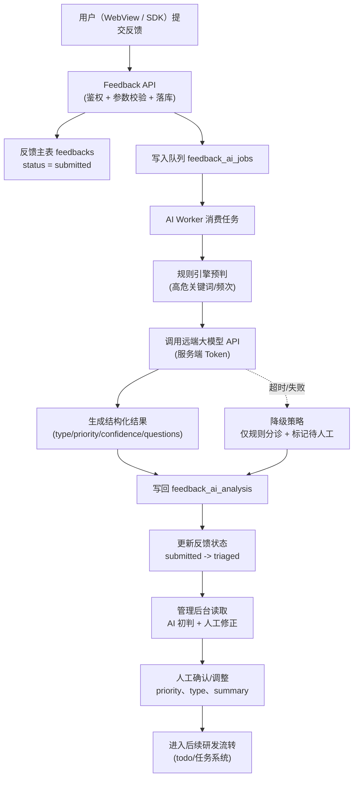
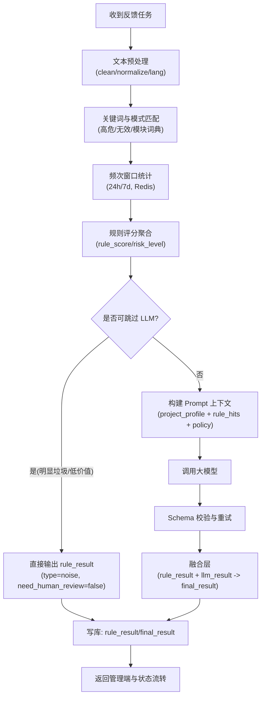

# Feedback AI 分诊方案（持续迭代版）

**文档定位**：反馈组件与管理后台的 AI 能力总方案（需求、边界、架构、接口、评估、迭代计划）  
**文档状态**：Draft v0.7（可进入 MVP 研发）  
**最后更新**：2026-03-15  
**维护方式**：后续关于本需求的讨论统一合并到本文件，不再散落在聊天记录中。

---

## 1. 背景与问题定义

当前反馈组件中的 AI 仅为占位能力，需求方希望“着力 AI”。  
实际讨论后，核心分歧在于：

1. AI 是否要判断“这个需求能不能开发完成”。
2. AI 是否需要接入方提供代码仓库（如 Git 地址）才能工作。

结论：**第一版不做“可实现性评审 AI”，只做“反馈分诊 AI”**。  
原因：AI 在无代码上下文情况下，无法稳定判断工程可实现性；但可以稳定做文本去噪、结构化、优先级建议与补充提问。

---

## 2. 产品目标与非目标

### 2.1 目标（MVP）

1. 对用户反馈做自动去噪与分类。
2. 输出结构化结论，降低人工筛选成本。
3. 给出优先级建议（P0-P3）与理由。
4. 对信息不足反馈生成补充问题。
5. 在管理后台支持人工修正并沉淀可追踪记录。

### 2.2 非目标（MVP 不做）

1. 不自动生成代码、不自动改代码。
2. 不做“是否能开发完成”的强判断。
3. 不依赖接入方上传完整代码仓库。
4. 不替代产品经理/研发评审的最终决策权。

### 2.3 MVP 是什么

MVP = **Minimum Viable Product（最小可行产品）**。  
在本项目里，MVP 的定义是：

1. 能完成“提交反馈 -> 自动分诊 -> 管理端人工确认 -> 进入流转”最小闭环。
2. AI 能稳定输出结构化字段（类型、优先级建议、置信度、补充问题）。
3. 出现模型故障时系统可降级，不阻断反馈主流程。

---

## 3. 统一口径（对需求方/业务方）

AI 在反馈系统中的角色是：**智能分诊助手**，不是**技术评审专家**。

它负责：

1. 过滤无效反馈。
2. 把有效反馈整理成可读、可分发、可追踪的数据结构。
3. 给出优先级建议，辅助人工决策。

它不负责：

1. 对接入方代码进行可实现性证明。
2. 直接判断研发排期可行性。

---

## 4. 能力范围设计

### 4.1 AI 输入（可用上下文）

1. `content`：用户反馈文本。
2. `attachments`：图片 URL（如有）。
3. `meta`：设备、系统、App 版本、页面路由、时间、语言。
4. `project_context`：项目名称、模块词典、业务标签（可选）。

### 4.2 AI 输出（结构化）

1. `type`：`bug | feature | question | noise`
2. `summary`：一句话摘要
3. `clarity_score`：表达清晰度（0-100）
4. `impact_score`：影响范围（0-100）
5. `urgency_score`：紧急度（0-100）
6. `priority_suggestion`：`P0 | P1 | P2 | P3`
7. `actionability`：`high | medium | low`
8. `need_more_info`：是否需要补充信息
9. `followup_questions`：补充问题列表
10. `reasoning_brief`：简要理由（给管理端看）
11. `confidence`：置信度（0-1）

---

## 5. 架构方案（服务端执行）

### 5.1 原则

1. AI 调用仅在服务端执行。
2. 组件端不持有模型调用能力与密钥。
3. 提交与 AI 分析解耦，采用异步队列。

### 5.2 流程

1. 组件提交反馈到后端（先落库）。
2. 后端写入 `feedback_ai_jobs` 队列。
3. AI Worker 异步消费并生成结构化结果。
4. 结果写入 `feedback_ai_analysis`。
5. 管理后台展示“AI 初判 + 置信度 + 理由 + 人工修正入口”。

---

## 6. 优先级策略（规则 + AI 混合）

不能仅依赖 LLM。建议采用“规则兜底 + AI 评分”混合策略：

### 6.1 规则兜底（高优先硬规则）

命中以下关键词/模式直接提升为高优先候选：

1. 崩溃、无法登录、支付失败、数据丢失、核心流程阻断。
2. 高频同类反馈（近 24h/7d 激增）。

### 6.2 AI 评分

根据语义理解输出：

1. 影响面（impact）
2. 紧急性（urgency）
3. 可行动性（actionability）

### 6.3 综合分（示例）

`PriorityScore = 0.4 * impact + 0.3 * urgency + 0.2 * frequency + 0.1 * business_fit`

映射建议（可调）：

1. `>=85` => `P0`
2. `70-84` => `P1`
3. `50-69` => `P2`
4. `<50` => `P3`

若 `confidence < 0.6`，强制进入“待人工确认”。

---

## 7. 接口与数据契约（MVP 草案）

### 7.1 反馈提交接口（已有能力上扩展）

请求中补充：

1. `attachment_urls`（可选）
2. `custom_user_id`（建议）
3. `client_meta`（设备/版本/页面）

### 7.2 AI 结果查询接口

返回：

1. `ai_status`：`pending | done | failed`
2. `ai_result`：第 4.2 节结构化字段
3. `review_state`：`unreviewed | accepted | adjusted`

### 7.3 管理端人工修正接口

支持：

1. 修改 `priority`、`type`、`summary`
2. 记录修正人与修正时间
3. 保留 AI 原始结果用于评估

---

## 8. 评估指标（上线前必须定义）

### 8.1 质量指标

1. 分类准确率（type accuracy）>= 80%
2. 优先级建议采纳率 >= 60%
3. 低质反馈识别准确率 >= 85%
4. 补充提问有效率 >= 60%

### 8.2 效率指标

1. 人工分拣时间下降 >= 40%
2. 从提交到可分派状态耗时下降 >= 50%

### 8.3 稳定性指标

1. AI 作业成功率 >= 99%
2. P95 分析耗时 <= 10s（异步可放宽）

---

## 9. 研发实施计划

### Phase 1（MVP）

1. 完成服务端异步分析链路（落库、队列、Worker、结果表）。
2. 打通管理端展示 AI 初判与人工修正。
3. 上线规则 + AI 混合优先级。

### Phase 2（增强）

1. 引入项目词典/历史反馈样本，提高分类准确率。
2. 增加“相似反馈聚类”和重复单合并建议。
3. 增加“需补充信息”自动追问模板。

### Phase 3（进阶）

1. 引入项目知识上下文（接口文档、模块边界、历史发布说明）。
2. 逐步试点“可实现性提示”（不是硬判断）。

---

## 10. AI 调用方式选型（关键决策）

### 10.1 方案对比

1. **本地 CLI 调远端大模型（仅开发调试）**  
   适用：Prompt 调试、离线验证。  
   不适用：生产链路（密钥暴露、不可审计、不可稳定扩容）。

2. **客户端直连模型厂商 API（不建议）**  
   风险：API Key 泄露、请求不可控、成本不可控、无法做统一策略。

3. **服务端 AI 中台调用模型 API（推荐）**  
   优点：密钥安全、可审计、可限流、可切模型、可灰度、可降级。

结论：**生产必须走服务端 AI 中台 + Worker 异步调用**。

### 10.2 统一实现口径

1. 移动端/WebView/SDK 只调用你的业务后端，不直接调用模型厂商。
2. 模型 Token 仅存放在服务端密钥管理中。
3. 通过后端策略控制模型、温度、超时、重试与成本上限。

---

## 11. 部署方案（服务器怎么搭）

### 11.1 最小可用部署（MVP）

1. `feedback-api`（现有服务）  
   负责提交反馈、查询结果、管理端操作。
2. `queue`（Redis Stream 或消息队列）  
   负责 AI 任务排队。
3. `ai-worker`（新服务）  
   从队列消费任务，调用模型 API，写回分析结果。
4. `mysql/postgres`（现有或新增表）  
   存反馈主表 + AI 结果表 + 审核记录。

### 11.2 生产标准部署（推荐）

1. `api-service` 与 `ai-worker` 分离部署（独立扩缩容）。
2. 增加 `rate-limit + circuit-breaker + retry`。
3. 增加 `prompt/version` 管理与 A/B 配置。
4. 增加可观测：任务成功率、耗时、token 成本、错误分布。
5. 增加降级策略：模型超时时仅返回规则分诊结果。

### 11.3 部署形态建议

1. **起步版（快）**：2 台 ECS/云主机  
   一台 `api + db`，一台 `worker + redis`。
2. **标准版（稳）**：容器化（K8s/ACK）  
   `api`、`worker`、`queue`、`db` 分组件管理。

---

## 12. 与接入方代码上下文问题的解释口径

“用户反馈打不通 app 代码”的意思是：

1. 反馈文本与工程实现之间缺乏直接可计算映射。
2. 没有代码/架构上下文时，AI 不能准确评估实现难度与可行性。

因此第一版设计必须把目标收敛为“分诊与结构化”，而不是“技术可行性裁决”。

---

## 13. 风险与应对

1. **风险**：AI 误判优先级  
   **应对**：规则兜底 + 人工复核 + 置信度阈值。

2. **风险**：用户反馈过短、信息不足  
   **应对**：自动生成补充提问并在组件中二次收集。

3. **风险**：业务方期待过高（当成自动 PM/自动研发）  
   **应对**：明确 MVP 边界与阶段目标，先证明分诊价值。

---

## 14. 当前未决问题（后续讨论入口）

1. `callback_url` 的语义是否用于“反馈状态回传接入方业务系统”，还是仅内部管理流转。
2. 管理端状态变更后，组件侧“我的反馈”状态同步的实时性要求（轮询/推送）。
3. 多语言反馈场景下的模型与提示词策略。

---

## 15. 会话更新记录（持续追加）

### 2026-03-13（v0.1）

1. 明确 AI 第一版定位为“分诊助手”，不做可实现性判断。
2. 确定服务端异步架构（组件提交 -> 后端落库 -> AI Worker -> 管理端复核）。
3. 确定优先级方案为“规则 + AI 混合”。
4. 输出 MVP 字段契约、评估指标、分阶段实施计划。

### 2026-03-15（v0.2）

1. 新增 AI 调用方式选型，明确生产环境不使用本地 CLI 或客户端直连模型。
2. 明确“服务端 AI 中台 + 异步 Worker”作为唯一推荐实现。
3. 新增部署方案：MVP 最小可用部署与标准生产部署两套。
4. 新增 MVP 端到端流程图（组件提交 -> 队列 -> AI Worker -> 管理端复核）。

### 2026-03-15（v0.3）

1. 新增“规则引擎与 Prompt 约束方案”章节，明确两者职责分工。
2. 明确模型上下文由项目画像、评分口径、规则命中、反馈载荷与输出 schema 组成。
3. 明确输出强约束（JSON schema、低温度、校验失败重试）与结果融合策略。

### 2026-03-15（v0.4）

1. 新增 MVP 概念定义与本项目 MVP 闭环说明。
2. 新增 `project_profile` 字段级解释（字段含义、示例、来源）。
3. 新增规则引擎技术方案（Go + DB 配置 + Redis 频次窗口）与规则数据模型建议。
4. 新增“规则引擎流程图”用于研发评审与任务拆解。

### 2026-03-15（v0.5）

1. 新增“实现难度澄清”章节，明确 MVP 阶段不需要重算法团队。
2. 明确规则引擎核心是工程化配置与可观测，不是复杂机器学习建模。

### 2026-03-15（v0.6）

1. 新增“规则引擎 MVP 具体实现（可直接开发）”章节。
2. 补充规则格式、处理流水线、阈值策略、正则示例、Go 伪代码与示例输入输出。

### 2026-03-15（v0.7）

1. 新增“normalize/match/frequency 业界实现细节”章节。
2. 明确词典需要“人工维护 + 数据驱动增量”混合机制，而非纯手工或纯自动。
3. 新增词典与正则的初始化来源、运维流程、Redis 频次实现建议。

---

## 16. 使用说明（团队协作）

1. 后续所有关于本需求的新增观点、决策、分歧、变更，统一更新本文件。
2. 每次更新至少改动两处：正文对应章节 + `会话更新记录`。
3. 若出现策略变化（例如从“分诊”扩展到“可实现性提示”），需新增版本小节并标注生效范围。

---

## 17. 端到端流程图（MVP）



---

## 18. 规则引擎与 Prompt 约束方案（核心实现）

### 18.1 设计原则

1. 规则引擎负责“确定性判断”和“成本控制”。
2. 大模型负责“语义理解与结构化补全”。
3. 任何高风险结论都必须可追溯（命中规则 + 模型理由 + 置信度）。

### 18.2 规则引擎做什么

1. **高危硬规则**：崩溃/登录失败/支付失败/数据丢失等直接提权。
2. **无效反馈识别**：纯情绪、无信息短句、广告/灌水初筛。
3. **频次信号**：同项目同模块在时间窗口内重复激增时加权提优先级。
4. **路由控制**：  
   明显垃圾反馈可不调用大模型，直接 `noise`（节省成本）。  
   高风险或模糊反馈进入大模型深度分析。

### 18.3 给大模型的“上下文”怎么组织

模型不需要代码仓库，MVP 上下文由以下部分组成：

1. `project_profile`：项目名、业务类型、关键模块词典。
2. `classification_rubric`：类型定义和评分标准（bug/feature/question/noise）。
3. `priority_policy`：P0-P3 判定口径（影响、紧急、频次、业务匹配）。
4. `rule_hits`：规则引擎命中结果（例如 `crash_keyword_hit=true`）。
5. `feedback_payload`：用户原始反馈 + 图片 OCR 摘要（可选）+ 客户端元信息。
6. `output_schema`：必须返回的 JSON 结构（字段、类型、取值范围）。

### 18.4 Prompt 约束（防跑偏）

1. System Prompt 固化角色：仅做“反馈分诊助手”，禁止做研发承诺。
2. 明确非目标：不得输出“已确认可开发/不可开发”结论。
3. 强制结构化输出：只允许 JSON，字段必须匹配 schema。
4. 设置低创造参数：温度建议 `0.1 ~ 0.3`，减少漂移。
5. 校验失败重试：JSON 不合法或越界时自动重试一次。

### 18.5 结果融合策略（Rule + LLM）

1. 模型先给 `type/score/priority/confidence`。
2. 融合层再应用硬规则覆盖：
   例如命中“支付失败 + 高频”时，最低提到 `P1`。
3. 若 `confidence < 0.6` 或规则与模型冲突，标记 `need_human_review=true`。
4. 最终落库包含三份数据：`rule_result`、`llm_result`、`final_result`。

### 18.6 推荐实现骨架（伪结构）

```text
analyzeFeedback(feedback):
  rule_result = runRules(feedback)
  if rule_result.skip_llm == true:
      return buildFinalFromRules(rule_result)

  prompt = buildPrompt(
      project_profile,
      classification_rubric,
      priority_policy,
      rule_result,
      feedback_payload,
      output_schema
  )
  llm_result = callModel(prompt)
  final_result = merge(rule_result, llm_result)
  return final_result
```

### 18.7 项目画像（project_profile）字段解释

项目画像不是“代码仓库信息”，而是帮助模型理解业务语境的结构化字典。  
建议字段如下：

| 字段 | 含义 | 示例 | 来源 |
|---|---|---|---|
| `project_id` | 项目 ID | `85` | 项目表 |
| `project_name` | 项目名 | `Hoewo Feedback` | 项目表 |
| `domain` | 业务域 | `todo / content / community` | 项目配置 |
| `target_users` | 目标用户 | `创作者、普通用户` | 项目配置 |
| `key_modules` | 核心模块列表 | `搜索、编辑器、上传` | 项目配置 |
| `module_aliases` | 模块同义词 | `搜索=查找=检索` | 运营维护 |
| `critical_flows` | 核心路径 | `登录->创建->发布` | 产品定义 |
| `priority_baseline` | 默认优先级策略 | `支付/登录故障最低P1` | 规则配置 |
| `forbidden_promises` | 禁止结论 | `不得承诺排期和上线时间` | Prompt 策略 |

使用原则：

1. 画像内容控制在“短而稳定”，不要喂过长文档。
2. 以结构化字段为主，避免纯自然语言堆砌。
3. 由产品/运营维护词典，研发维护关键流程与优先级基线。

---

## 19. 规则引擎实现方案（技术落地）

### 19.1 推荐技术栈（基于现有服务端）

结合你们当前服务端（Go）建议：

1. 规则执行服务：`Go`（与现有后端同语言，便于复用鉴权与数据模型）。
2. 规则配置存储：`MySQL/PostgreSQL`（版本化管理，可灰度发布）。
3. 高频计数窗口：`Redis`（ZSET/Hash + TTL，实现 24h/7d 频次）。
4. 规则表达：  
   MVP 先用“数据库配置 + 内置判断函数”，不引入复杂 DSL。  
   迭代期可引入 `CEL`（Common Expression Language）做可配置表达式。
5. 文本匹配：`regexp + 关键词词典`（MVP 足够），后续可升级 Aho-Corasick。

### 19.2 规则数据模型（建议）

建议新增三类配置表：

1. `feedback_rule_config`：规则主表（开关、优先级、版本、生效范围）。
2. `feedback_rule_keyword`：关键词/短语、权重、语言、模块范围。
3. `feedback_priority_policy`：P0-P3 阈值、硬覆盖策略、冲突策略。

运行时输出统一结构：

1. `rule_hits[]`：命中明细（rule_id、reason、weight）。
2. `rule_score`：规则总分。
3. `risk_level`：`high | medium | low`。
4. `skip_llm`：是否跳过模型。
5. `forced_priority_floor`：优先级下限（例如 `P1`）。

### 19.3 规则执行流程（MVP）

1. 预处理：文本清洗、语言识别、简易分词、去噪符号。
2. 关键词/模式匹配：命中高危与无效规则。
3. 频次计算：按 `project + module + normalized_text` 统计窗口频次。
4. 规则评分：聚合权重得到 `rule_score` 与风险等级。
5. 路由决策：  
   明显垃圾反馈 `skip_llm=true`。  
   高危或模糊反馈进入 LLM。  
6. 结果融合：将 `rule_result` 与 `llm_result` 合并为 `final_result`。

### 19.4 为什么这套适合 MVP

1. 实现简单，1-2 周可上线最小版本。
2. 规则可解释，便于和业务方对齐。
3. 可逐步增强，不阻碍后续引入更强表达式引擎。

---

## 20. 规则引擎流程图



---

## 21. 实现难度澄清（常见误区）

### 21.1 不是“很强算法”才能做

MVP 阶段不需要自研复杂算法或训练模型，核心是：

1. 规则配置可维护（可开关、可版本化、可灰度）。
2. 规则执行可解释（命中原因可追踪）。
3. 与 LLM 融合可控（冲突处理、置信度阈值、人工兜底）。

### 21.2 数据库是否必须自建

不需要“单独新建一套数据库集群”，一般做法是：

1. 复用现有业务数据库，新增规则配置表与结果表。
2. 复用现有 Redis（或新增一个逻辑库）做频次窗口统计。
3. 只有当规模增长明显时再拆分独立存储。

### 21.3 真正难点是什么

真正难点主要在工程治理，不在算法本身：

1. 规则质量与迭代流程（谁维护、如何回滚）。
2. Prompt 与输出 Schema 稳定性。
3. 成本与性能控制（调用量、超时、降级）。
4. 人工复核闭环（误判如何快速纠正并反哺规则）。

### 21.4 研发投入预估（MVP）

一个务实的投入模型：

1. 后端工程师 1-2 人（API/Worker/规则执行）。
2. 前端工程师 1 人（管理端结果展示与修正）。
3. 产品/运营 0.5 人（规则词典与项目画像维护）。

在现有架构基础上，通常可在 2-4 周内跑通第一版闭环。

---

## 22. 规则引擎 MVP 具体实现（可直接开发）

你问的核心点：MVP 不用重算法，那到底怎么做。  
答案：**不是“全靠大量正则”**，而是四类能力组合：

1. 词典匹配（主力，约 60%）
2. 正则模式（辅助，约 20%）
3. 频次统计（约 20%）
4. 明确阈值与路由策略（决定是否进 LLM）

### 22.1 规则配置格式（建议）

先用数据库配置，不上复杂 DSL。每条规则包含：

1. `id`：规则 ID
2. `enabled`：开关
3. `scope`：生效范围（project/module/lang）
4. `match_type`：`keyword | regex | length | frequency`
5. `match_expr`：匹配表达式（词、正则、阈值）
6. `weight`：权重（0-100）
7. `action`：`set_tag | add_score | set_floor_priority | set_noise | skip_llm | require_human`
8. `action_params`：动作参数（JSON）

### 22.2 处理流水线（每条反馈）

1. **normalize**：清洗文本（小写化、去 URL、去表情噪声、同义词归一）。
2. **match**：跑关键词词典 + 正则模板。
3. **frequency**：按窗口统计重复度（Redis）。
4. **score**：汇总规则分数，得出 `risk_level`。
5. **route**：根据阈值决定 `skip_llm` 或 `call_llm`。
6. **merge**：与 LLM 结果融合，输出 `final_result`。

### 22.3 路由阈值（可直接用的初版）

1. `noise_score >= 80` 且 `risk_level = low` => `skip_llm = true`，直接 `type=noise`。
2. 命中高危规则（如 crash/payment/data_loss）=> 必进 LLM，且 `forced_priority_floor=P1`。
3. `frequency_24h >= 10` 且同模块 => 必进 LLM，`require_human=true`。
4. LLM 返回 `confidence < 0.6` => `require_human=true`。

### 22.4 关键词与正则示例（MVP）

高危关键词示例：

1. 崩溃类：`闪退`、`崩溃`、`crash`、`卡死`
2. 登录类：`无法登录`、`登录失败`、`验证码收不到`
3. 支付类：`支付失败`、`扣款`、`订单失败`
4. 数据类：`数据丢失`、`内容没了`、`同步丢失`

正则示例（Go）：

```regex
(闪退|崩溃|crash|卡死)
(无法登录|登录失败|验证码.*(收不到|错误))
(支付失败|扣款(成功)?但(未到账|失败)|订单.*失败)
(数据丢失|内容(没了|消失)|同步.*丢失)
^(测试|test|111+|啊+|\.{3,}|？{3,})$
```

### 22.5 频次统计怎么做（不靠算法团队）

Redis Key 设计示例：

1. `fb:freq:24h:{project_id}:{module}:{fingerprint}`
2. `fb:freq:7d:{project_id}:{module}:{fingerprint}`

`fingerprint` 的 MVP 做法：

1. 对归一化文本去停用词。
2. 提取前 N 个关键词（如 5 个）。
3. 按字典序拼接后做 `sha1`。

这不是高深算法，但足够支持第一版“同类问题激增”识别。

### 22.6 Go 伪代码（接近可实现）

```go
type RuleResult struct {
    Hits                []RuleHit
    NoiseScore          int
    RiskLevel           string // low/medium/high
    SkipLLM             bool
    ForcedPriorityFloor string // "", "P1", "P0"
    RequireHuman        bool
}

func AnalyzeMVP(f FeedbackInput, profile ProjectProfile) FinalResult {
    norm := Normalize(f.Content, profile.ModuleAliases)
    hits := MatchRules(norm, f.Meta, profile)
    freq := CountFrequency(norm, f.ProjectID, f.Module) // redis 24h/7d
    rule := ScoreAndRoute(hits, freq)

    if rule.SkipLLM {
        return BuildRuleOnlyResult(rule, f)
    }

    prompt := BuildPrompt(profile, rule, f)
    llm := CallLLM(prompt)
    llm = ValidateOrRetry(llm)
    return Merge(rule, llm)
}
```

### 22.7 示例：输入到输出

输入：

1. 文本：`更新后一直闪退，登录页点进去就崩溃`
2. 元信息：`app_version=1.5.2, module=login`
3. 24h 同类反馈：`15`

规则结果：

1. 命中 `crash` + `login`
2. `risk_level=high`
3. `forced_priority_floor=P1`
4. `skip_llm=false`

最终输出（融合后）：

1. `type=bug`
2. `priority_suggestion=P0`
3. `actionability=high`
4. `need_human_review=true`（因高风险且频次高）

### 22.8 关键结论

MVP 规则引擎的本质是“配置化判断系统”，不是“算法研究项目”。  
先把可解释、可维护、可回滚做对，再逐步增强即可。

---

## 23. normalize / match / frequency 业界实现细节

你问的这 3 步是对的，行业里通常就是这条路径。下面是“真实可落地”版本。

### 23.1 normalize（文本归一化）怎么做

业界常见做法是“轻 NLP + 规则清洗”，不是复杂模型：

1. 统一字符：
   - 全角/半角统一
   - 英文转小写（中文不受影响）
   - Unicode 归一（NFKC）
2. 噪声替换：
   - URL -> `<URL>`
   - 邮箱 -> `<EMAIL>`
   - 手机号 -> `<PHONE>`
3. 表情和无效符号清理：
   - 去 emoji
   - 连续标点压缩（`？？？？` -> `？`）
4. 同义词归一：
   - `闪退=崩溃`
   - `卡死=无响应`
   - `登录不上=无法登录`
5. 输出两份文本：
   - `raw_text`（原文保留）
   - `norm_text`（用于规则与频次）

### 23.2 match（词典 + 正则）怎么做

#### 1) 一开始要不要建词典？

要，MVP 就要。  
但不是追求“大而全词库”，而是先有一版可用词典（200-500 条核心词）。

#### 2) 词典是谁维护？

业界通常是“人工维护 + 数据驱动增量”：

1. 初始词典：产品/研发/客服共建（1-2 天可完成）
2. 周期维护：每周看误判样本，补词或调权重
3. 自动建议：系统把“高频未命中词”推给运营审核后入库

这意味着：**是人工维护，但不是纯手工拍脑袋维护**。

#### 3) 词典与正则各自职责

1. 词典：覆盖业务术语、模块词、风险词（主力）
2. 正则：覆盖结构化模式（验证码、支付、错误码、垃圾文本）

#### 4) 推荐的词典表（最小）

1. `feedback_lexicon`
   - `term`（命中词）
   - `canonical_term`（归一词）
   - `category`（crash/login/payment/noise...）
   - `weight`
   - `lang`
   - `module`
   - `enabled`
2. `feedback_regex_rule`
   - `pattern`
   - `category`
   - `weight`
   - `action`
   - `enabled`

#### 5) 运行时实现建议

1. 词典加载到内存（每 5 分钟或配置变更后热更新）
2. 关键词匹配优先用多模式匹配（Aho-Corasick，后续可上）
3. MVP 可先用 `contains + regexp` 起步

### 23.3 frequency（重复度窗口）怎么做

业界常见是 Redis 计数，不上重算法：

1. 生成 `fingerprint`（基于 `norm_text`）
2. Redis 维护窗口计数：
   - `INCR key_24h` + `EXPIRE 86400`
   - `INCR key_7d` + `EXPIRE 604800`
3. 需要去重用户时可加：
   - `HLL` 或 `SET`（记录 unique user）
4. 输出：
   - `freq_24h`
   - `freq_7d`
   - `unique_users_24h`（可选）

### 23.4 你们项目的建议起步参数（可直接用）

1. 初始词典：300 条左右（崩溃/登录/支付/数据/上传/搜索/噪声）
2. 初始正则：30-50 条（高危 + 垃圾模式）
3. 频次阈值：
   - `freq_24h >= 10` 标记热点
   - `freq_7d >= 30` 标记持续问题
4. 维护节奏：每周一次规则回顾会（30-60 分钟）

### 23.5 一句话结论

MVP 的正确实现不是“纯正则”，而是：
**归一化 + 小词典 + 少量正则 + Redis 窗口计数 + 人工复盘**。
