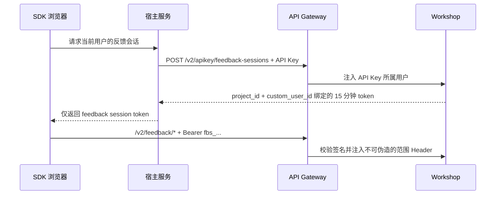

# Feedback SDK V2 接入文档

本文是 SDK、宿主服务和控制台共同遵守的 V2 接口契约。V1 保持可用；不要通过修改控制台全局 `VITE_API_URL` 将现有 V1 流量切到 V2。

## 发布状态与边界

- V2 使用现有 Workshop 服务、数据库和 OSS Bucket，不新增 ECS 或 OSS 资源。
- V1 Web SDK、iOS SDK、既有控制台继续使用 V1，不受 V2 开关影响。
- V2 支持两种互斥的 SDK 鉴权模式：宿主服务换取短期 token，或客户端直连 API Key。两种模式的反馈、消息和附件能力保持一致。
- 宿主服务模式的 SDK 仅使用短期、单用户、单项目的反馈会话 token；token 仅能访问 `/workshop/v2/feedback/*`。
- 直连 API Key 模式接受将 API Key 打包进客户端的风险，不要求客户端创建、保存或刷新反馈会话 token。
- 控制台开发者继续走 `/workshop/v2/user/*`，拥有项目成员权限。SDK 不使用 WebSocket，采用拉取刷新。

生产基础地址：

```text
https://api.feitianchengzi.com/workshop/v2
```

本地基础地址：

```text
http://localhost:8081/workshop/v2
```

## 鉴权模式



### 1. 宿主服务换取会话 token（默认安全模式）

这是安全模式下唯一允许使用 API Key 的接口，必须由宿主应用服务端调用。

```http
POST /workshop/v2/apikey/feedback-sessions
Authorization: Bearer <server-held-workshop-api-key>
Content-Type: application/json

{
  "project_id": 78,
  "custom_user_id": "stable-user-id"
}
```

前置条件：API Key 所属的 Workshop 用户必须仍是该项目成员；否则接口返回 `403`。`custom_user_id` 必填、最大 128 个字符，应使用业务用户稳定 ID 或持久化的匿名 UUID，不能使用邮箱、手机号等明文 PII。

成功响应：

```json
{
  "code": "OK",
  "data": {
    "token": "fbs_<payload>.<signature>",
    "token_type": "Bearer",
    "project_id": 78,
    "custom_user_id": "stable-user-id",
    "expires_at": "2026-07-15T12:15:00Z"
  }
}
```

token 固定有效期为 15 分钟。SDK 在过期前刷新；收到 `401` 后只刷新一次并重试原请求一次。不要把 token 写入持久化存储、日志、错误上报或 URL。

已登录的反馈控制台可走等价的 `POST /workshop/v2/user/feedback-sessions`，使用控制台 JWT 而非 API Key。它仅用于控制台自身的项目开关灰度，不能替代第三方宿主服务的 token 交换端点。

#### SDK 调用反馈会话接口

SDK 仅使用：

```http
Authorization: Bearer <feedback-session-token>
```

浏览器请求中不传 `project_id` 或 `custom_user_id`。网关从 token 注入范围，服务端始终以该范围为准。传入不匹配的 `custom_user_id` 会返回 `403`，不会扩大访问范围。

| 能力 | 方法 | 路径 |
| --- | --- | --- |
| 签发附件上传策略 | POST | `/workshop/v2/feedback/upload-policies` |
| 获取受限只读 OSS 凭证 | GET | `/workshop/v2/feedback/oss/credentials` |
| 获取会话指定附件凭证 | GET | `/workshop/v2/feedback/feedbacks/:id/attachments/:attachment_id/oss/credentials` |
| 创建反馈与首条消息 | POST | `/workshop/v2/feedback/feedbacks` |
| 查询我的反馈 | GET | `/workshop/v2/feedback/feedbacks` |
| 查询会话消息 | GET | `/workshop/v2/feedback/feedbacks/:id/messages` |
| 用户追加消息 | POST | `/workshop/v2/feedback/feedbacks/:id/messages` |

这些接口均不能枚举其他项目或其他 `custom_user_id` 的数据。

### 2. 客户端直连 API Key（风险接受模式）

该模式适用于希望以 V1 相同的简单配置接入 V2 的 WebView、移动端和 Web SDK。SDK 直接保留 API Key、`project_id` 与稳定的 `custom_user_id`，调用方不需要理解 token 或处理刷新。

```ts
window.FeedbackSDK.configure({
  feedbackV2Enabled: true,
  feedbackV2AuthMode: 'apiKey',
  apiKey: 'ak_<project-scoped-key>',
  projectId: 78,
  customUserId: 'stable-high-entropy-install-or-user-id',
  gatewayUrl: 'https://api.feitianchengzi.com',
})
```

| 能力 | 方法 | 路径 | 额外范围字段 |
| --- | --- | --- | --- |
| 创建反馈与首条消息 | POST | `/workshop/v2/apikey/feedbacks` | body: `project_id`、`custom_user_id` |
| 查询我的反馈 | GET | `/workshop/v2/apikey/feedbacks` | query: `project_id`、`custom_user_id` |
| 查询会话消息 | GET | `/workshop/v2/apikey/feedbacks/:id/messages` | query: `custom_user_id` |
| 用户追加消息 | POST | `/workshop/v2/apikey/feedbacks/:id/messages` | body: `custom_user_id` |
| 签发附件上传策略 | POST | `/workshop/v2/apikey/feedbacks/upload-policies` | body: `project_id`、`custom_user_id` |
| 获取只读附件凭证 | GET | `/workshop/v2/apikey/feedbacks/oss/credentials` | query: `project_id`、`custom_user_id` |
| 获取会话指定附件凭证 | GET | `/workshop/v2/apikey/feedbacks/:id/attachments/:attachment_id/oss/credentials` | query: `custom_user_id` |

所有请求使用 `Authorization: Bearer <api-key>`。网关验证 API Key 后，Workshop 再验证 API Key 所属用户仍是项目成员。创建反馈时 `data` 保持 API Key 基础接口的兼容格式，为 JSON 字符串；官方 SDK 会自动处理这个格式差异。

API Key 打包在客户端中不是秘密。此模式必须由接入方显式选择，建议使用项目专用、可轮换的 Key，并配置限流、吊销与滥用监控。没有宿主服务身份时，`custom_user_id` 应是本地持久化的高熵随机 ID，不能使用可猜测的账号编号或明文 PII。

## 功能接口

### 创建反馈

```http
POST /workshop/v2/feedback/feedbacks
Authorization: Bearer <feedback-session-token>
Content-Type: application/json

{
  "title": "无法提交表单",
  "content": "点击提交后没有任何反应",
  "data": {"source": "feedback-sdk-v2", "channel": "web"},
  "attachments": []
}
```

`title` 必填且最多 200 字符，`content` 必填。服务端在同一数据库事务中创建 `feedback` 和一条 `customer` 首条消息，消息的 `metadata.source` 固定为 `feedback_initial`。因此创建后立即拉取消息列表必定能看到反馈正文。

### 查询我的反馈

```http
GET /workshop/v2/feedback/feedbacks?page=1&page_size=50
Authorization: Bearer <feedback-session-token>
```

按 `created_at DESC, id DESC` 返回，只包含 token 绑定用户的反馈。不要带全局项目筛选条件；项目范围来自 token。

### 查询消息

```http
GET /workshop/v2/feedback/feedbacks/10/messages?page=1&page_size=50
Authorization: Bearer <feedback-session-token>
```

按 `created_at ASC, id ASC` 返回。开发者消息、系统状态消息与用户消息均在同一时间线中。SDK 应在进入会话、窗口重新获得焦点、发送成功后刷新；活跃会话可每 30 秒轮询，非活跃会话不要持续轮询。控制台订阅项目 WebSocket 的 `feedback.*` 事件并立即刷新，同时以可见页轮询作为断线兜底。

### 追加用户消息与幂等

```http
POST /workshop/v2/feedback/feedbacks/10/messages
Authorization: Bearer <feedback-session-token>
Content-Type: application/json

{
  "content": "补充：Safari 17 也会复现。",
  "client_message_id": "01J2T0A2MDETERMINISTICID",
  "metadata": {"sdk_version": "2.0.0"},
  "attachments": []
}
```

`content` 和附件至少提供一个。`client_message_id` 必填、最大 128 字符，推荐 UUID/ULID；同一 `feedback_id + custom_user_id + client_message_id` 重试返回原消息而不重复创建。首次成功返回 `201`，幂等重试返回 `200`。

## 附件上传与读取

### 支持范围

| 类型 | MIME | 单附件上限 |
| --- | --- | --- |
| `image` | `image/jpeg`、`image/png`、`image/webp`、`image/gif` | 10 MiB |
| `file` | PDF、纯文本、CSV、ZIP、DOCX、XLSX、PPTX | 20 MiB |
| `url` | 有效的 `https` URL | 无文件上传 |

每条消息最多 10 个附件，总大小最多 20 MiB。附件 object key 位于 `OSS_ROOT_PATH/feedbacks/v2/<project>/<sha256(custom_user_id)>/`，不暴露原始用户标识。

### 1. 申请单文件上传策略

```http
POST /workshop/v2/feedback/upload-policies
Authorization: Bearer <feedback-session-token>
Content-Type: application/json

{
  "type": "image",
  "file_name": "screen.png",
  "mime_type": "image/png",
  "size": 120034
}
```

返回数据包括 `upload_url`、服务端生成的 `object_key` 和 `fields`。该策略有效期 10 分钟，签名精确限制 bucket、object key、MIME、文件字节数及成功响应码；浏览器没有可写的 OSS 凭证。

### 2. 浏览器直传 OSS

SDK 用 `multipart/form-data` POST 到 `upload_url`：先写入 `fields` 的全部键值，再把文件作为最后一个字段 `file` 写入。文件的浏览器 MIME 必须等于申请策略中的 `mime_type`，成功时 OSS 返回 `201`。

```ts
const form = new FormData()
for (const [key, value] of Object.entries(policy.fields)) form.append(key, value)
form.append('file', file, file.name)
const result = await fetch(policy.upload_url, { method: 'POST', body: form })
if (result.status !== 201) throw new Error('attachment upload failed')
```

上传成功后，创建反馈或消息时只提交 `object_key` 及原申请的 `type`、`file_name`、`mime_type`、`size`。服务端再次校验 object key 是否属于当前会话范围。

直连 API Key 模式调用 `/workshop/v2/apikey/feedbacks/upload-policies`，并在请求体中增加 `project_id` 与 `custom_user_id`；返回和上传方式完全相同。服务端用同一项目/用户哈希前缀校验后续消息附件。

### 3. 读取私有附件

`GET /feedback/oss/credentials` 返回的 STS 凭证只允许当前用户范围内的 `GetObject`，有效期不超过 15 分钟。直连 API Key 模式使用 `/apikey/feedbacks/oss/credentials?project_id=...&custom_user_id=...`，权限范围相同。SDK 可使用该凭证为用户上传的 `object_key` 生成短期 HTTPS 访问 URL。不得调用 `put`、不得缓存 STS 密钥，也不得把对象键拼成公开 URL。

开发者上传的附件可能位于控制台专用 OSS 路径，不属于用户前缀。读取任意消息附件时，SDK 应优先使用消息响应中的 `feedback_id`、附件 `id` 与 `object_key` 调用精确凭据接口：

```text
GET /workshop/v2/feedback/feedbacks/:feedback_id/attachments/:attachment_id/oss/credentials
GET /workshop/v2/apikey/feedbacks/:feedback_id/attachments/:attachment_id/oss/credentials?custom_user_id=...
```

该凭据仅允许读取一个 object key；SDK 可据此生成临时 HTTPS URL。图片应直接预览，PDF 应在内嵌阅读器中打开，其他文件保留下载或新窗口打开。

外链附件不经 OSS，必须是 HTTPS URL。

## V1 兼容与迁移

- V2 迁移会把已有 `feedbacks.content` 回填为一条首条消息，标识为 `metadata: {"source":"feedback_initial","legacy":true}`；同一迁移可重复执行。
- 历史记录缺少 `custom_user_id` 时没有可靠的最终用户归属，不能通过 V2 SDK 会话 token 访问；仍可由控制台处理。
- 新建 V2 API Key 创建接口同样要求 `custom_user_id`；V1 保持原样，避免影响 iOS 和现有 Web SDK。
- 回滚只删除幂等字段和索引；首条消息回填是前向数据迁移，必须依赖部署前的数据库备份恢复，不能删除用户已看到或已回复的会话历史。

## 灰度接入

SDK 与控制台各自增加独立的 V2 feedback client，不改全局 API client。建议项目级开关：

```ts
type FeedbackV2Config =
  | { enabled: true; authMode: 'session'; getSessionToken: () => Promise<string> }
  | { enabled: true; authMode: 'apiKey'; apiKey: string; projectId: number; customUserId: string }
```

1. 先在独立测试项目启用，分别验证安全 token 与直连 API Key 模式。
2. SDK 启用后仅该项目使用 V2 路径；V1 SDK/iOS/控制台默认路径不变。
3. 验证创建、首条消息、跨用户隔离、附件策略、幂等重试、开发者回复和待办状态回写。
4. 观察错误率与轮询负载后，按项目逐步放量。关闭开关即可停止新增 V2 SDK 请求，不涉及数据库回滚。

## 部署前置条件

网关与 Workshop 服务必须配置相同的 `FEEDBACK_SESSION_SIGNING_KEY`，长度至少 32 字节，例如：

```bash
openssl rand -base64 48
```

两端还必须配置相同、且与签名密钥不同的 `FEEDBACK_GATEWAY_SHARED_SECRET`（至少 32 字节）。网关在验证 token 后注入它，Workshop 只在该密钥匹配时接受反馈范围 Header，防止绕过网关直连服务端口伪造身份。

还需部署网关对 `feedback` 认证级别的校验逻辑，并检查 OSS Bucket 现有 CORS 已允许 SDK 域名对 bucket endpoint 发起 `POST`。RAM/AccessKey 权限应仅允许服务端签发策略和受限读访问；浏览器不持有可写 AccessKey。
