# Feedback V2 JWT / Scoped Token 鉴权设计

> 状态：已实现并可灰度发布
> 适用范围：Feedback SDK、宿主服务、API Gateway、Workshop、反馈控制台
> 目标：在不破坏 V1 接入的前提下，为 V2 的反馈、消息、附件和待办状态闭环提供清晰、可扩展的鉴权边界。

## 1. 一页结论

Feedback V2 同时支持两种明确、互不自动降级的接入模式：

1. **反馈会话模式，默认安全方案**：宿主服务保存 Workshop API Key，为当前已认证用户换取 15 分钟、仅绑定一个项目和一个 `custom_user_id` 的反馈会话 token。浏览器或移动端只拿到这个短期 token。
2. **直连 API Key 模式，显式风险接受方案**：客户端携带项目 API Key、`project_id` 和稳定的 `custom_user_id`，直接调用 V2 API。它保留 V1 的低门槛接入体验，但 API Key 不再是秘密。

控制台开发者始终使用原有 Workshop 用户 JWT，拥有项目成员权限；客户会话 token 不会获得控制台、待办或其他 Workshop 业务权限。

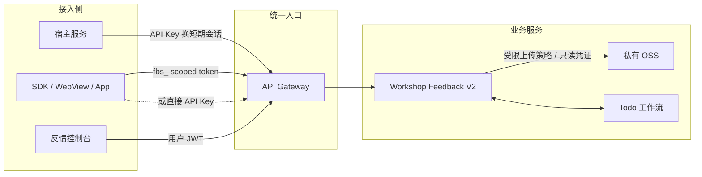

## 2. 设计问题与决策

| 问题 | 设计决策 | 原因 |
| --- | --- | --- |
| 浏览器不能安全保存项目 API Key | 安全模式把 API Key 留在宿主服务，仅下发 15 分钟会话 token | 泄露后的权限窗口和能力范围更小 |
| 很多移动端、WebView 没有宿主后端 | 保留 V2 直连 API Key 模式 | 不牺牲 V2 消息、附件能力，也不强迫这类接入回退到 V1 |
| `custom_user_id` 容易被客户端伪造 | 会话模式把它写进签名 token，后续请求不再信任 body/query 的范围 | 服务端以不可篡改的范围做数据过滤 |
| 业务服务信任网关 Header，但 Header 可被绕过网关伪造 | 网关注入内部共享密钥，Workshop 用常量时间比较后才接受范围 Header | 形成网关验签和业务服务二次确认 |
| 反馈要支持图片、文件、后续回复 | 上传策略和读取凭证都按反馈会话范围签发 | 不公开 OSS，也不让客户端拿到长期写权限 |
| V1 已有大量接入 | V1 路由和 SDK 默认行为不变，V2 独立路由和项目开关灰度 | 可以随时停止 V2 新流量，不要求数据库回滚 |

## 3. 概念与信任边界

### 3.1 三种身份不是一回事

| 身份 | 代表谁 | 典型凭证 | 可做什么 |
| --- | --- | --- | --- |
| Workshop 开发者 | 项目成员、控制台操作员 | 普通用户 JWT | 查看项目反馈、回复、判断、流转待办、管理优先级 |
| 反馈客户 | 接入方自己的最终用户 | `fbs_` 会话 token | 仅访问一个项目中属于自己的反馈、消息和附件 |
| 接入应用 | API Key 的所有者 | `ak_...` API Key | 换取客户会话，或在直连模式下代表客户端调用 V2 API |

`custom_user_id` 是接入方对最终用户的稳定标识，不是 Workshop 登录用户 ID。安全会话模式下，宿主服务必须先完成自身用户认证，再决定映射成哪个 `custom_user_id`。

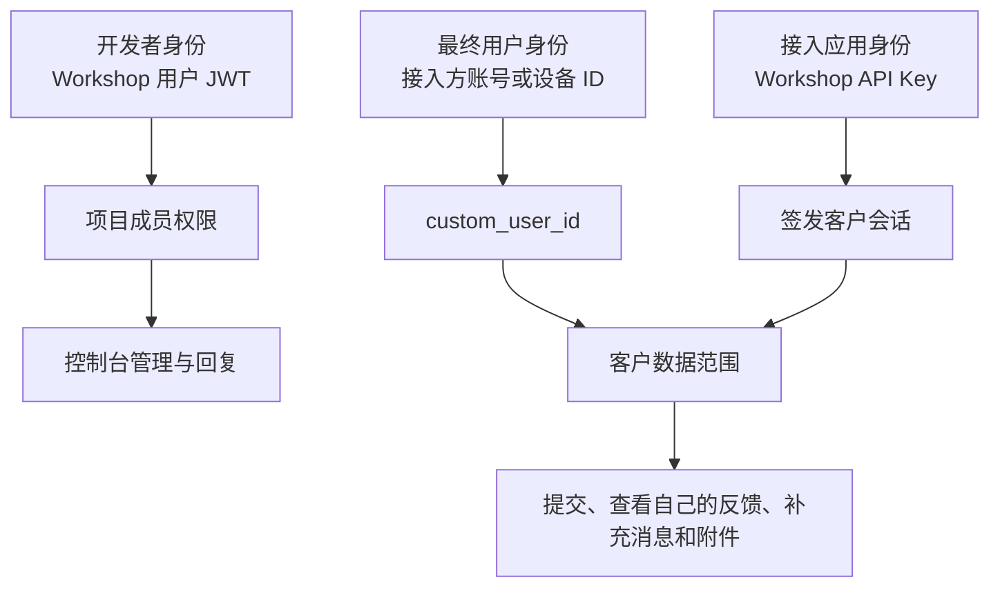

### 3.2 凭证存放图

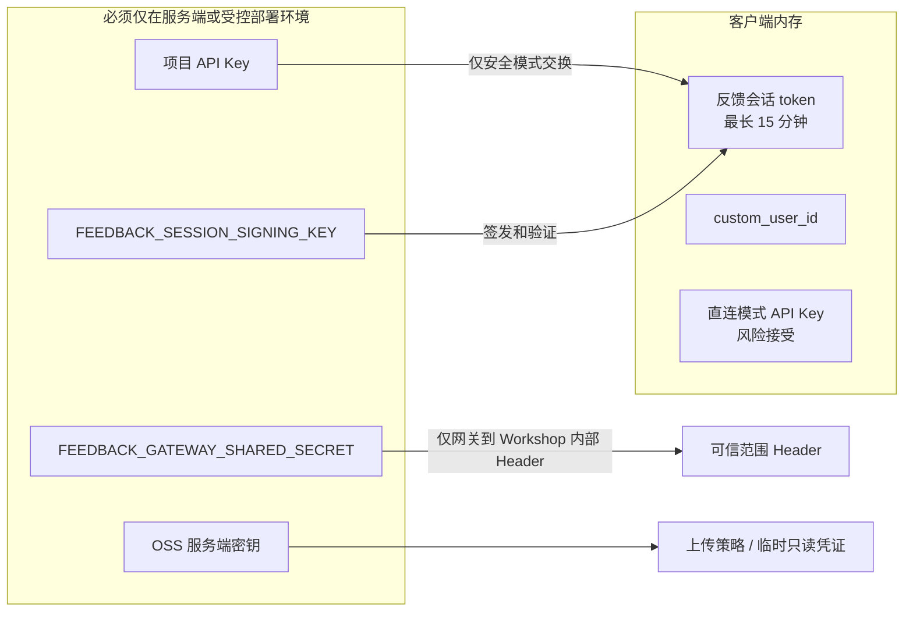

**关键解释**：安全模式不让 API Key 到达浏览器、SDK Bundle、URL、日志或错误上报。直连模式则明确承认 API Key 会被客户端提取，它只能作为项目级客户端标识，不能被当作最终用户身份或高价值密钥。

## 4. 会话 token 的真实格式与语义

为方便业务沟通，本文把 `fbs_` 称为“反馈 JWT / scoped token”。但当前代码实现**不是 RFC 7519 的标准三段 JWT**：没有 JWT Header，也没有 `alg` 协商；其格式为：

```text
fbs_<base64url(JSON claims)>.<base64url(HMAC-SHA256(payload))>
```

它是 HMAC 签名、无服务端会话存储的短期范围令牌。payload 可被解码但不可被篡改，因此不得包含邮箱、手机号、姓名或其他 PII。

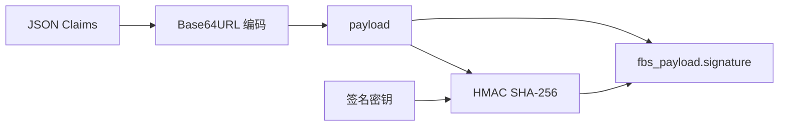

### 4.1 Claims

| Claim | 示例 | 用途 |
| --- | --- | --- |
| `v` | `1` | 协议版本，避免未来格式混淆 |
| `iss` | `workshop-feedback` | 仅接受本反馈体系签发的 token |
| `aud` | `workshop-v2` | 仅能用于 Workshop V2 |
| `jti` | UUID | 会话关联 ID，便于排障和审计 |
| `project_id` | `78` | 不可变项目范围 |
| `custom_user_id` | 稳定用户或设备 ID | 不可变最终用户范围 |
| `iat` | Unix 秒 | 签发时间 |
| `exp` | Unix 秒 | 过期时间，最长 15 分钟 |

### 4.2 不包含什么

- 不包含 Workshop 项目成员角色。
- 不包含 API Key 或 API Key 所有者信息。
- 不包含可泛化到其他业务的权限。
- 不包含 PII。
- 不包含数据库会话状态或单 token 吊销标记。

**设计含义**：`fbs_` token 只是一张“项目 A 的客户 B 可以使用 Feedback V2 客户接口”的短期通行证。它不能读取 `/workshop/v2/user/*`，不能管理项目，也不能直接访问 Todo。

## 5. 两种 SDK 接入模式

### 5.1 模式 A：宿主服务交换反馈会话，默认推荐

适用于有后端、已有登录态或可可靠识别最终用户的接入方。

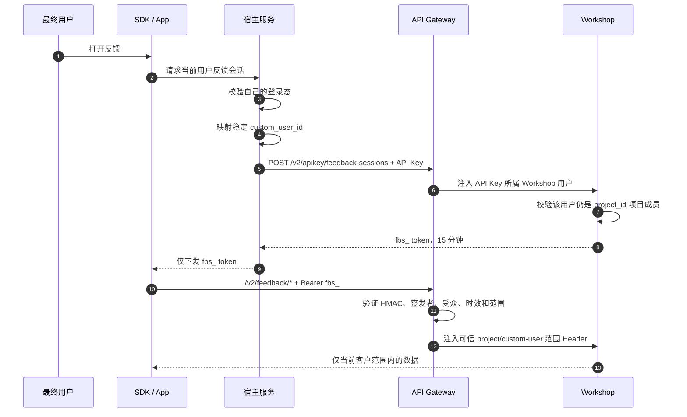

宿主服务调用：

```http
POST /workshop/v2/apikey/feedback-sessions
Authorization: Bearer ak_<server-held-key>
Content-Type: application/json

{
  "project_id": 78,
  "custom_user_id": "stable-high-entropy-user-id"
}
```

宿主服务应只把响应的 `token` 和 `expires_at` 交给 SDK。`project_id` 和 `custom_user_id` 此后已被签名绑定，SDK 的 `/v2/feedback/*` 请求不需要、也不应依赖这两个范围参数。

### 5.2 模式 B：客户端直连 API Key，显式风险接受

适用于没有服务端的 WebView、移动端、纯前端嵌入或追求 V1 同等简单配置的接入方。

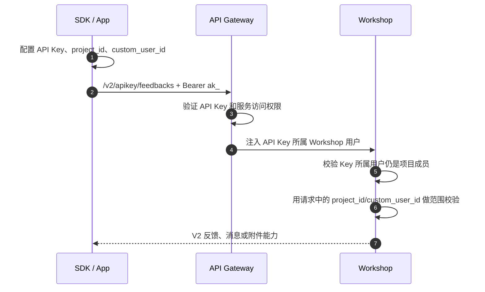

SDK 配置：

```ts
window.FeedbackSDK.configure({
  feedbackV2Enabled: true,
  feedbackV2AuthMode: 'apiKey',
  apiKey: 'ak_<project-scoped-key>',
  projectId: 78,
  customUserId: 'stable-high-entropy-install-or-user-id',
  gatewayUrl: 'https://api.feitianchengzi.com',
})
```

### 5.3 模式比较

| 项目 | 会话模式 | 直连 API Key 模式 |
| --- | --- | --- |
| API Key 出现位置 | 仅宿主服务 | 客户端包或运行时配置 |
| 最终用户身份来源 | 宿主服务已认证用户 | 客户端配置的 `custom_user_id` |
| SDK 是否刷新 token | 是，401 时只刷新并重试一次 | 否 |
| 客户端是否自行处理会话 | 否，宿主注入 token | 否，无 token 概念 |
| 抵御猜测其他用户 ID | 强，范围由签名 token 固定 | 有限，依赖高熵 `custom_user_id` 和 API Key 保护 |
| 适合场景 | 有宿主服务的正式用户业务 | 无后端、移动端、WebView、快速接入 |
| 功能能力 | V2 全量 | V2 全量 |

**不可自动降级**：SDK 不会在会话模式失败时偷偷改用 API Key，也不会在直连模式失败时退回 V1。这样可以防止安全配置错误被掩盖，也保证接入方能明确控制风险。

## 6. 网关到 Workshop 的纵深防御

### 6.1 路由层隔离

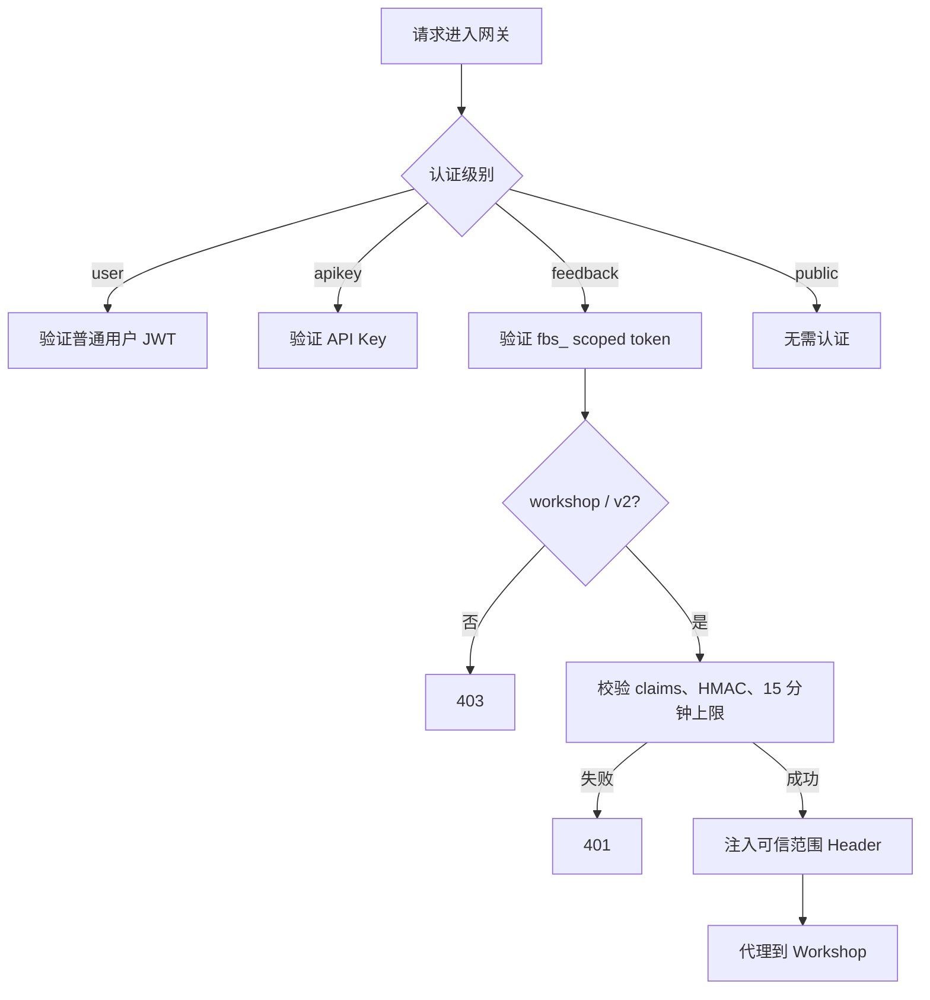

网关仅在路由认证级别为 `feedback` 时接受 `fbs_` token。它拒绝：

- 非 `workshop/v2` 服务路径。
- 缺少 `fbs_` 前缀的 Bearer token。
- HMAC 不匹配、payload 解析失败、`iss/aud/v` 不匹配的 token。
- 空项目、空 `custom_user_id`、超过 128 字符、空 `jti` 的 token。
- 已过期、未来签发时间超过 1 分钟、有效期超过 15 分钟的 token。

### 6.2 可信 Header 协议

网关验签成功后，会向上游请求注入：

| Header | 值 | Workshop 用途 |
| --- | --- | --- |
| `X-Feedback-Project-ID` | claim `project_id` | 项目范围 |
| `X-Feedback-Custom-User-ID` | claim `custom_user_id` | 客户范围 |
| `X-Feedback-Session-ID` | claim `jti` | 请求关联与范围完整性 |
| `X-Auth-Type` | `feedback_session` | 明确认证类型 |
| `X-Feedback-Gateway-Secret` | 网关内部共享密钥 | 证明 Header 来自受信任网关 |

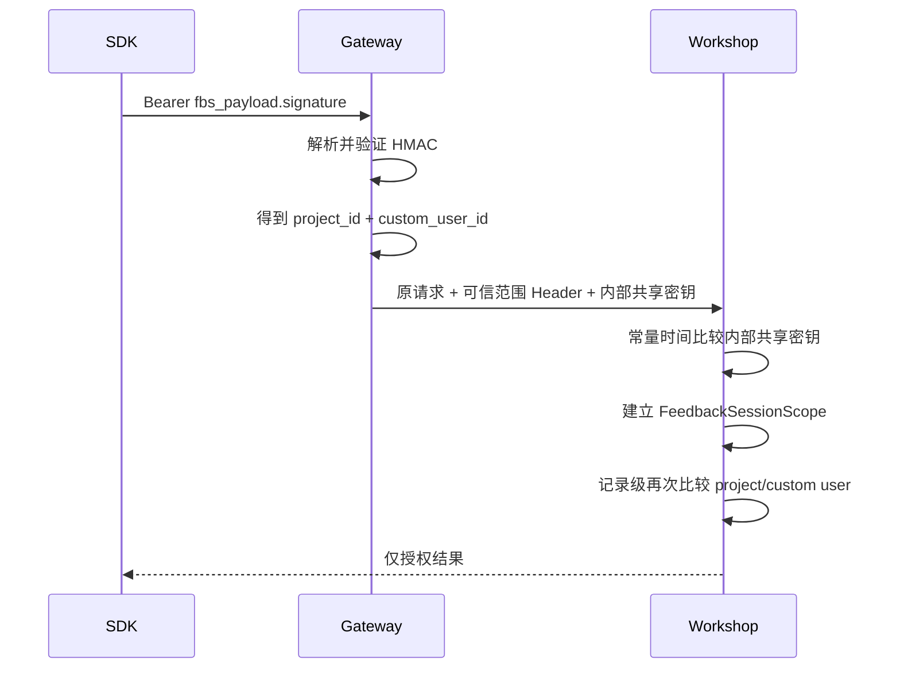

### 6.3 为什么仍需 Workshop 二次校验

网关 Header 不能被业务代码无条件信任。若有人绕过网关直接请求 Workshop 容器端口，就可以伪造普通 Header。Workshop 只在下面条件同时满足时创建 `FeedbackSessionScope`：

1. `X-Auth-Type` 等于 `feedback_session`。
2. `X-Feedback-Gateway-Secret` 与本地环境变量一致。
3. 共享密钥长度不少于 32 字节，且使用常量时间比较。
4. `project_id`、`custom_user_id`、`session_id` 的格式完整。

这不是网络隔离的替代品。生产环境仍应只向网关开放 Workshop 服务入口，禁止互联网或不受控容器网络直连业务端口。

## 7. 数据访问范围规则

### 7.1 会话模式的强范围

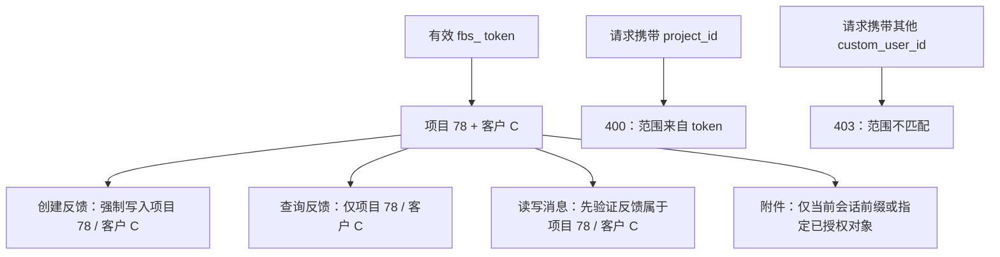

会话路径的记录级授权条件是：

```text
feedback.project_id == scope.project_id
AND feedback.custom_user_id == scope.custom_user_id
```

即使攻击者猜到一个反馈 ID，也无法访问其他客户的消息或附件。

### 7.2 直连模式的边界

直连 API Key 模式每次请求都会显式携带 `project_id` 和/或 `custom_user_id`。Workshop 会先验证 API Key 所属 Workshop 用户仍是该项目成员，再按 `custom_user_id` 做数据过滤。

但是 API Key 已在客户端，且 Workshop 无法证明传入的 `custom_user_id` 真正属于当前设备或账号。因此该模式的隔离强度取决于：

- API Key 是否为项目专用、可轮换、可吊销。
- `custom_user_id` 是否高熵且不可猜测。
- 是否避免使用邮箱、手机号、递增用户 ID 等 PII 或低熵标识。
- 网关限流、异常监控和 API Key 泄露响应是否到位。

## 8. API 面与权限矩阵

| 访问面 | 认证 | 范围来源 | 典型调用者 | 是否可管理项目/待办 |
| --- | --- | --- | --- | --- |
| `/workshop/v2/feedback/*` | `fbs_` 会话 token | token claims | 安全模式 SDK | 否 |
| `/workshop/v2/apikey/feedback-sessions` | API Key | body + API Key 所属项目成员 | 宿主服务 | 仅签发客户会话 |
| `/workshop/v2/apikey/feedbacks*` | API Key | 请求参数 + API Key 所属项目成员 | 直连 SDK | 否 |
| `/workshop/v2/user/feedbacks*` | 普通用户 JWT | Workshop 项目成员身份 | 反馈控制台 | 是，受成员权限约束 |
| `/workshop/v2/user/feedback-sessions` | 普通用户 JWT | body + 项目成员身份 | 控制台内部灰度测试 | 仅签发客户会话 |

客户会话路径可用的功能：

| 功能 | 方法和路径 |
| --- | --- |
| 申请上传策略 | `POST /workshop/v2/feedback/upload-policies` |
| 获取客户范围只读 OSS 凭证 | `GET /workshop/v2/feedback/oss/credentials` |
| 创建反馈和首条消息 | `POST /workshop/v2/feedback/feedbacks` |
| 查询我的反馈 | `GET /workshop/v2/feedback/feedbacks` |
| 查询会话消息 | `GET /workshop/v2/feedback/feedbacks/:id/messages` |
| 追加客户消息 | `POST /workshop/v2/feedback/feedbacks/:id/messages` |
| 获取单附件临时读取凭证 | `GET /workshop/v2/feedback/feedbacks/:id/attachments/:attachment_id/oss/credentials` |

## 9. token 生命周期、刷新和失效

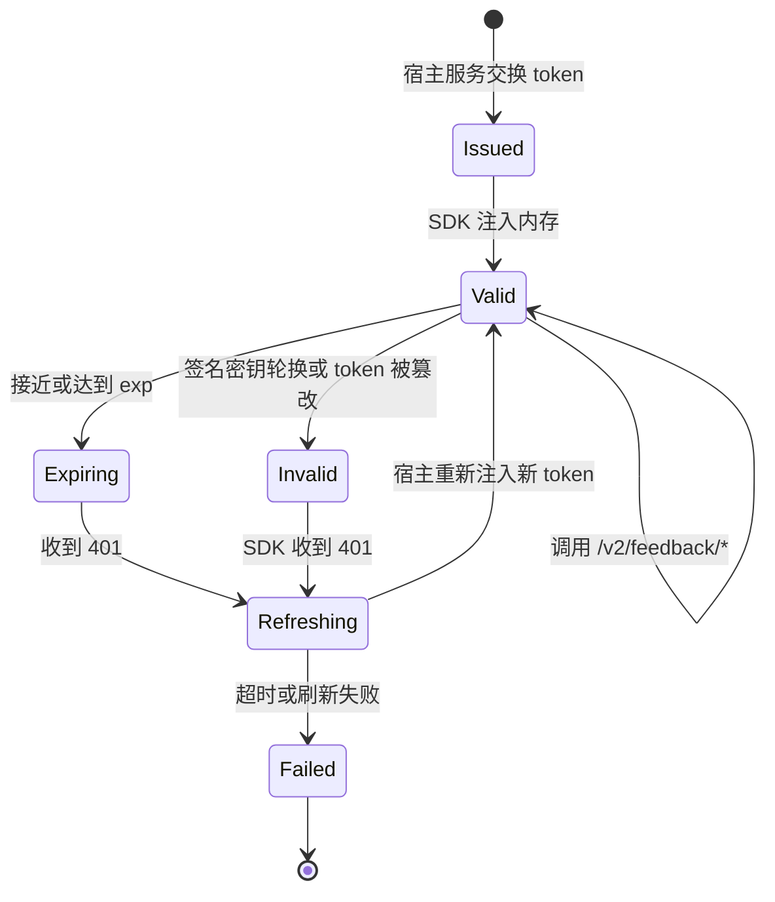

### 9.1 SDK 刷新协议

1. SDK 使用会话模式请求 V2 客户接口。
2. 收到 `401` 时，仅触发一次刷新请求。
3. iframe SDK 通过 `postMessage` 通知宿主刷新会话。
4. 宿主重新交换 token，再用 `configure` 注入 SDK。
5. SDK 对原请求重试一次；仍失败则将错误展示给用户，不循环重试。

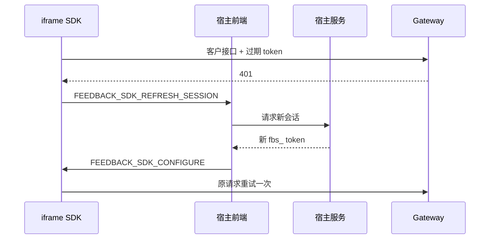

SDK 只应将 token 放在运行时内存中。不要写入 `localStorage`、`sessionStorage`、Cookie、URL、埋点、错误上报或控制台日志。SDK 对来自父页面的配置消息会校验受信任的父页面来源；部署时必须正确配置允许的嵌入域名。

### 9.2 当前撤销能力与限制

当前 token 为无状态 HMAC token，`jti` 未写入服务端撤销表。因此：

- 单个 token 不能即时撤销。
- 最长暴露窗口为 15 分钟。
- 删除或轮换 API Key 不会让已签发的 `fbs_` 立即失效。
- 更换 `FEEDBACK_SESSION_SIGNING_KEY` 会让旧 token 立即失效，但也会影响所有活跃会话。

这是有意选择的简单性和运营成本权衡。若未来需要“用户登出立即撤销”“设备封禁立即生效”，应增加基于 `jti` 的短期撤销列表，或把 token 改为带会话版本的可验证声明。

## 10. 附件权限设计

### 10.1 上传

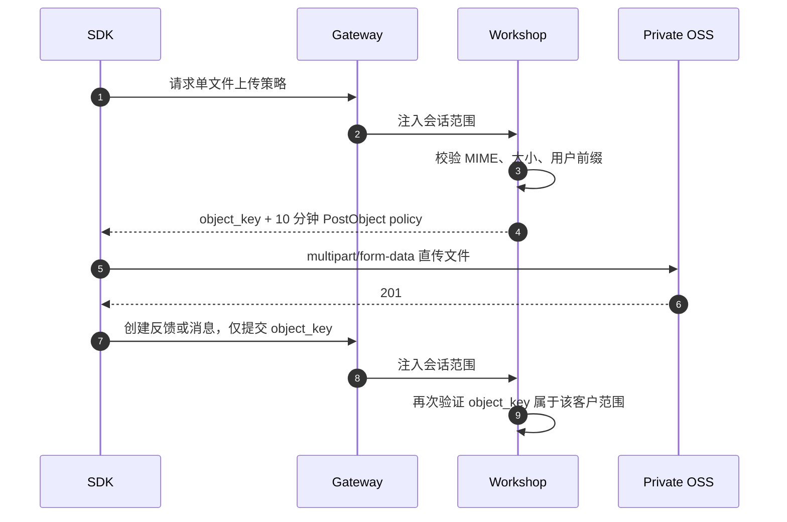

上传策略约束精确到 bucket、object key、MIME、文件大小和成功状态码。客户附件路径为：

```text
<OSS_ROOT_PATH>/feedbacks/v2/<project_id>/<sha256(custom_user_id)>/<uuid>.<extension>
```

路径中不直接写入 `custom_user_id`，但 SHA-256 不是 PII 加密。因此 `custom_user_id` 本身仍应避免使用邮箱、手机号等可枚举值。

### 10.2 读取

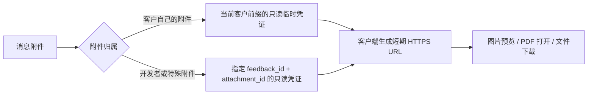

读取凭证只允许 `oss:GetObject`，不授予写入权限。读取任意消息附件优先使用精确的附件凭据接口，尤其是开发者回复附件，因为它们不在客户对象前缀下。

客户端不得：

- 把 `object_key` 拼成公开 URL。
- 缓存 STS `AccessKeySecret` 或 `SecurityToken`。
- 用读凭证上传或删除文件。
- 绕过服务端附件归属校验。

## 11. 密钥配置与轮换

### 11.1 必需配置

| 环境变量 | 部署位置 | 职责 | 要求 |
| --- | --- | --- | --- |
| `FEEDBACK_SESSION_SIGNING_KEY` | Workshop 和 Gateway | Workshop 签发，Gateway 验签 | 两端相同，至少 32 字节 |
| `FEEDBACK_GATEWAY_SHARED_SECRET` | Workshop 和 Gateway | Gateway 证明可信 Header 来源 | 两端相同，至少 32 字节，且必须与签名密钥不同 |
| 项目 API Key | 宿主服务，或直连 SDK | 会话交换或兼容直连 | 项目专用、可轮换、不可写入日志 |
| OSS 服务端密钥 / RAM 角色 | Workshop | 签发上传策略和临时读取权限 | 仅服务端持有，最小权限 |

### 11.2 当前轮换方式

当前实现是单活 HMAC key，没有 `kid` 和多密钥验证环。因此主动轮换是**人工受控发布操作**，不是自动轮换。

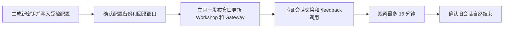

轮换期间的实际表现：

- 新旧密钥切换不原子时，可能出现短暂的 token 验签失败。
- 已发出的旧 token 会在 Gateway 使用新 key 后收到 `401`。
- SDK 会请求宿主刷新 token；直连 API Key 模式不受会话签名 key 轮换影响。
- 因 token 最长 15 分钟，安全模式的影响窗口有上界。

后续若需要无感轮换，应演进为 `kid + key ring`：Workshop 使用新 key 签发，Gateway 在最长 15 分钟内同时接受新旧 key，观察结束后移除旧 key。该能力目前尚未实现。

## 12. 主要失败场景

| 场景 | 返回 | 用户侧处理 | 运维检查 |
| --- | --- | --- | --- |
| token 缺失、过期、篡改 | `401` | 会话模式刷新一次 | 检查 token 生命周期和时钟 |
| token claims 不完整或超 15 分钟 | `401` | 不重试篡改 token | 检查签发逻辑 |
| 访问非 Workshop V2 的 feedback 路由 | `403` | 修正调用路径 | 检查网关路由 |
| 伪造范围 Header 直连业务服务 | `401` | 无 | 检查共享密钥和服务网络隔离 |
| API Key 所属用户不再是项目成员 | `403` | 宿主服务提示授权失效 | 检查项目成员和 API Key 归属 |
| 访问其他客户的反馈 ID | `403` | 无 | 检查范围映射与攻击告警 |
| 上传 MIME、大小或 object key 不匹配 | `400` | 重新选择支持的附件 | 检查 SDK 上传流程 |
| OSS 上传跨域失败 | 浏览器错误 | 提示重试 | 检查 OSS Bucket CORS 的 `POST` 规则 |
| `FEEDBACK_*` 密钥缺失或长度不足 | `500` | 稍后重试 | 阻断发布，补齐受控环境变量 |

## 13. 日志、监控与隐私

建议记录：认证模式、路由、HTTP 状态、项目 ID、哈希后的 `custom_user_id`、`jti`、错误码、耗时。建议避免记录：

- 完整 API Key。
- 完整 `fbs_` token 或其 payload。
- STS 临时凭证。
- 原始 `custom_user_id`，尤其是可能包含 PII 时。
- 附件私有签名 URL 中的查询参数。

建议指标：

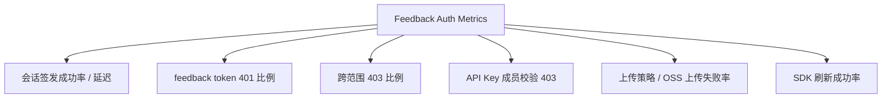

突然升高的跨范围 `403`、同一 API Key 的大量不同 `custom_user_id`、异常的附件读取或上传策略申请，都应进入安全告警或限流策略。

## 14. V1 兼容、灰度和回滚

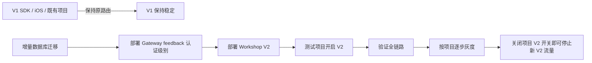

发布原则：

1. 数据库仅新增表、字段和索引；历史反馈可回填首条消息。
2. 先保证 Gateway 已识别 `feedback` 认证级别，再部署 Workshop；只部署 Workshop 时，安全会话模式不会通过网关。
3. V1 API、iOS 和既有 SDK 不切换全局 API 地址。
4. 控制台和 SDK 分别使用独立 V2 client，并通过项目开关启用。
5. 关闭开关可以停止新增 V2 流量，不需要立即做数据库回滚。

数据库回滚仅能删除可逆的索引或字段。历史首条消息回填和真实用户会话属于前向数据，不能在生产真实数据后直接删除；需要恢复到迁移前只能在受控窗口使用部署前备份。

## 15. 上线验收清单

| 验证项 | 会话模式 | 直连模式 | 预期结果 |
| --- | --- | --- | --- |
| 创建会话 | 是 | 不适用 | API Key 只在宿主服务出现，返回 15 分钟 token |
| 创建反馈 | 是 | 是 | 原子创建反馈和首条 customer 消息 |
| 我的反馈列表 | 是 | 是 | 仅能看到当前 `custom_user_id` 的记录 |
| 猜测其他反馈 ID | 是 | 是 | `403`，不得泄露消息或附件 |
| 用户补充消息 | 是 | 是 | `client_message_id` 重试不重复创建 |
| 开发者回复 | 控制台 JWT | 控制台 JWT | SDK 刷新消息后可见 |
| 图片、文件上传 | 是 | 是 | 策略受 MIME、大小、对象键约束 |
| 附件预览 | 是 | 是 | 私有对象通过临时只读权限读取 |
| token 过期 | 是 | 不适用 | SDK 只刷新一次并重试一次 |
| 待办状态回写 | 是 | 是 | SDK 与控制台展示新状态和系统消息 |
| V1 回归 | 不适用 | 不适用 | 旧 SDK / iOS 不受 V2 开关影响 |

## 16. 代码与文档索引

| 内容 | 位置 |
| --- | --- |
| 会话 token 签发 | [handler/feedback_session.go](../handler/feedback_session.go) |
| 客户会话范围校验和客户接口 | [handler/feedback_session_handlers.go](../handler/feedback_session_handlers.go) |
| Workshop 二次确认可信 Header | [middleware/feedback_session.go](../middleware/feedback_session.go) |
| V2 三类路由注册 | [router/router.go](../router/router.go) |
| 附件策略、对象前缀和只读凭证 | [handler/feedback_session_oss.go](../handler/feedback_session_oss.go) |
| 消息幂等和附件模型 | [models/feedback_workflow.go](../models/feedback_workflow.go) |
| Gateway `feedback` 认证和 token 验签 | `gateway/nebula-auth/services/api-gateway/main.go` |
| Gateway scoped token 测试 | `gateway/nebula-auth/services/api-gateway/feedback_session_test.go` |
| SDK 两模式请求与 401 刷新 | `feedback-sdk-web/src/lib/feedback/v2.ts` |
| SDK 宿主桥接和来源校验 | `feedback-sdk-web/src/lib/sdk/bridge.ts` |
| SDK 详细接口契约 | [feedback-sdk-v2-integration.md](./feedback-sdk-v2-integration.md) |
| V2 发布与数据库回滚流程 | [feedback-v2-deployment-runbook.md](./feedback-v2-deployment-runbook.md) |

## 17. 后续演进边界

本设计已满足 V2 当前的反馈会话、双向消息、附件、待办状态回写和两种接入方式。后续可以在不改变主边界的前提下扩展：

1. `kid + key ring`，实现无感签名密钥轮换。
2. 基于 `jti` 的短期撤销列表，实现单会话即时失效。
3. API Key 项目级限流、异常检测和可视化吊销。
4. 消息未读、已读回执和开发者回复通知。
5. 将本设计沉淀为 V2 接入 Skill，覆盖 Web、iOS、Android、宿主服务和直连模式的自动化验收。

以上演进不应把客户 scoped token 扩展成通用 Workshop 登录凭证。每个新业务若需要客户态访问，都应定义自己的受限 audience、资源范围、接口面和审计规则。
